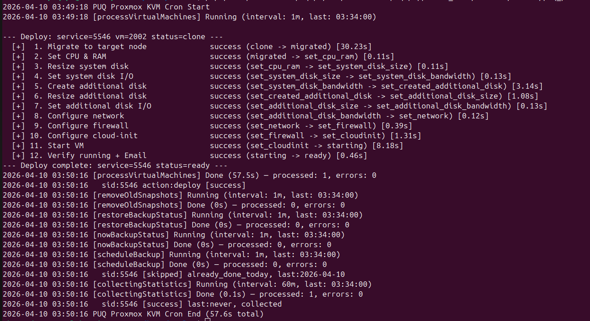
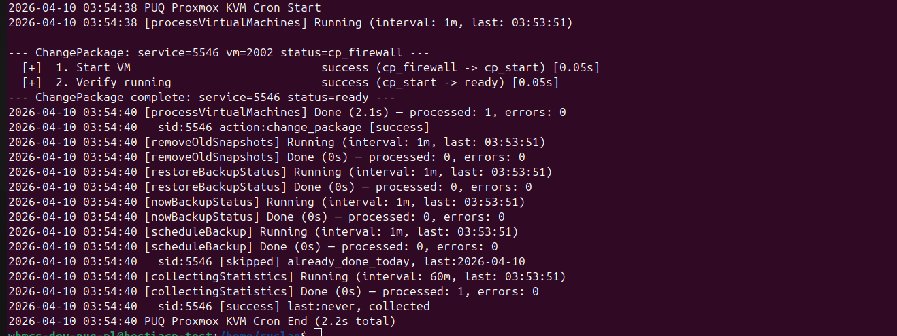
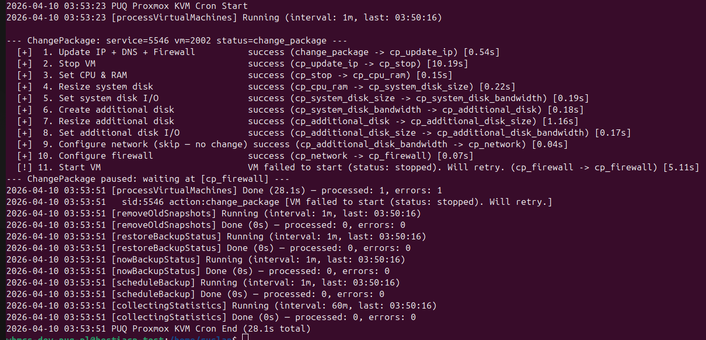

# Basic concepts and requirements

### Proxmox KVM module **[WHMCS](https://puqcloud.com/link.php?id=77)**
#####  [Order now](https://puqcloud.com/whmcs-module-proxmox-kvm.php) | [Download](https://download.puqcloud.com/WHMCS/servers/PUQ_WHMCS-Proxmox-KVM/) | [FAQ](https://faq.puqcloud.com/)

## System Requirements

| Requirement | Supported Versions |
|-------------|---------------|
| WHMCS | 8.x, 9.x |
| PHP | 7.4, 8.1, 8.2 |
| Proxmox VE | 7.x, 8.x |
| ionCube Loader | v13 or newer |

## Required PHP Extensions

The following PHP extensions must be enabled on the WHMCS server:

- **cURL** (`curl`) — required for API communication with Proxmox
- **JSON** (`json`) — required for parsing API responses

## Network Requirements

The WHMCS server must be able to reach the Proxmox API over the network on **port 8006** (HTTPS). Ensure that any firewalls between the WHMCS server and the Proxmox host allow outbound TCP connections on this port.

## Module Components

The PUQ Proxmox KVM module consists of **two components**. Both are **required** and must be installed for the module to function.

| Component | Type | Directory |
|-----------|------|-----------|
| Server Module | `puqProxmoxKVM` | `modules/servers/puqProxmoxKVM/` |
| Addon Module | `puq_proxmox_kvm` | `modules/addons/puq_proxmox_kvm/` |

The **Server Module** handles VM provisioning, client area interface, admin service management, and all direct Proxmox API operations.

The **Addon Module** manages IP address pools, DNS zones, VM management dashboard, cron task orchestration, and global settings. The server module depends on the addon module for IP allocation, cron processing, and centralized configuration.

> **Note:** The **PUQ Customization** addon module is **no longer required**. All functionality previously provided by PUQ Customization has been replaced by the built-in addon module (`puq_proxmox_kvm`). If you are upgrading from a version prior to v3.0, you may safely remove PUQ Customization after installing the new addon module.

## Proxmox Requirements

- API access enabled on the Proxmox host (enabled by default)
- A user account with appropriate permissions for VM management (e.g., `root@pam` or a dedicated API token user)
- At least one storage configured for VM disks
- At least one network bridge configured (e.g., `vmbr0`)
- Cloud-init support on VM templates (recommended)

## WHMCS Requirements

- Administrator access to the WHMCS admin area
- File upload permissions to the WHMCS installation directory
- A valid PUQ Proxmox KVM license key
- WHMCS cron job properly configured (for automated provisioning)

## Supported Languages

The module includes translations for 25 languages:

| | | | | |
|---|---|---|---|---|
| Arabic | Azerbaijani | Catalan | Chinese | Croatian |
| Czech | Danish | Dutch | English | Estonian |
| Farsi | French | German | Hebrew | Hungarian |
| Italian | Macedonian | Norwegian | Polish | Romanian |
| Russian | Spanish | Swedish | Turkish | Ukrainian |

## Additional operational requirements

- **Continuous and stable network connectivity** between the WHMCS host, the Proxmox cluster and the VNCproxy host. Brief network drops cause deployments to pause and resume on the next cron tick — in v3.0 that's handled by the state machine, but a persistently flaky network will stall provisioning.
- **Static IPs** — if you use static IPv4/IPv6, you need the required number of free IP addresses reserved for virtual machines.
- **DHCP** — if the VM network uses a DHCP server, it must be configured correctly. When the module is set to DHCP, it does **not** manage IP allocation or firewall rules, only bandwidth, bridge and VLAN on the network card.
- **VLANs** — if the network uses VLANs, your internal networking must carry the VLAN to every node of the cluster.
- **noVNC WEB console** — requires a separate VNCproxy installation with access both to the internet and to the Proxmox cluster's VNC port range (5900–5999). See the [VNCproxy / noVNC](06-vncproxy-novnc.md) chapter.
- **DNS synchronization** — for forward/reverse DNS sync you need a supported DNS provider (in v3.0: **Cloudflare**, **HestiaCP** or **PowerDNS**, configured in the addon). For legacy setups a DNS API proxy / external automation against the `dns.php` endpoint is still supported.
- **Single-node installs** — a **Directory** or **NFS** datastore is required for VM disks.
- **ISO storage** — ISO images can live on a separate network storage configured as ISO storage in the product.
- **Backup storage** — backups also need network storage that is reachable from every node. Proxmox Backup Server is supported. Make sure the datastore intended for backups does **not** aggressively rotate copies, or that its rotation is aligned with the backup count defined in the client's package.
- **Anti-spoofing firewall** — if you want firewall rules that protect against IP spoofing, the firewall on the Proxmox server/cluster must be preconfigured with an incoming/outgoing **DENY** policy. The module then adds permissive rules matching the VM's own IP.

## The logic of the module

This section is a high-level overview of what happens for each lifecycle operation. In v3.0 every stage is driven by a **state machine** with resume-on-failure semantics; in v2.x the same steps were executed as one monolithic cron call.

### Creating a new virtual machine

1. After the client orders and pays for a virtual machine service, WHMCS calls the `CreateAccount` function.
2. An available IP address is selected from the server's IP pool. *Note: IPs of **Terminated** services are recycled back into the free pool and may be reused.*
3. A free virtual machine **VMID** is chosen — unique both in WHMCS and in Proxmox.
4. The hostname and VM name are generated from the package template (`<prefix>-<client_id>-<service_id>`).
5. The module starts cloning the virtual machine from the configured template.
6. The client is notified by email that the virtual machine is being created (**Welcome email**).
7. From this point the internal **cron** takes over and walks the VM through the deploy state machine. Each run of cron advances one or more steps depending on what's ready.

> **Changed in v3.0.** The deploy pipeline is a proper state machine — on any failure the VM stays in the last successful state and the next cron tick resumes from there. Earlier versions ran all steps in one go and would stall the whole service on a single transient error.

Deploy steps (v3.0):

1. `VMSetDedicatedIp` — allocate a free IP from the pool
2. `VMSetDNSRecords` — create forward/reverse DNS records (non-blocking — a failed DNS provider does not stop deployment)
3. `VMClone` — clone from the template (always on the template node)
4. **`migrateToTargetNode`** *(new in v3.0)* — offline migrate the freshly cloned VM to the target node / target storage
5. `VMSetCpuRam`
6. `VMSetSystemDiskSize`
7. `VMSetSystemDiskBandwidth`
8. `VMSetCreatedAdditionalDisk` (skipped if additional disk is not configured)
9. `VMSetAdditionalDiskSize`
10. `VMSetAdditionalDiskBandwidth`
11. `VMSetNetwork` — bridge, VLAN, MAC, bandwidth
12. `VMSetFirewall` — options, anti-spoofing IPSet, policies *(extended in v3.0 via the new `VMFirewall` class)*
13. `VMSetCloudinit` — user, password, network config, hostname
14. `VMStart`
15. **Verify running + `ServiceSendEmailVMReady`** — success email with access parameters (IP, user, password)

Example of a successful cron run (v3.0 output format):



```
2026-04-10 03:49:18 PUQ Proxmox KVM Cron Start
2026-04-10 03:49:18 [processVirtualMachines] Running (interval: 1m, last: 03:34:00)
--- Deploy: service=5546 vm=2002 status=clone ---
[+]  1. Migrate to target node      success (clone -> migrated)                                [30.23s]
[+]  2. Set CPU & RAM                success (migrated -> set_cpu_ram)                         [0.11s]
[+]  3. Resize system disk           success (set_cpu_ram -> set_system_disk_size)             [0.12s]
[+]  4. Set system disk I/O          success (set_system_disk_size -> set_system_disk_bandwidth) [0.13s]
[+]  5. Create additional disk       success (set_system_disk_bandwidth -> set_created_additional_disk) [3.14s]
[+]  6. Resize additional disk       success (set_created_additional_disk -> set_additional_disk_size)  [1.08s]
[+]  7. Set additional disk I/O      success (set_additional_disk_size -> set_additional_disk_bandwidth)[0.13s]
[+]  8. Configure network            success (set_additional_disk_bandwidth -> set_network)    [0.12s]
[+]  9. Configure firewall           success (set_network -> set_firewall)                     [0.39s]
[+] 10. Configure cloud-init         success (set_firewall -> set_cloudinit)                   [1.31s]
[+] 11. Start VM                     success (set_cloudinit -> starting)                       [8.18s]
[+] 12. Verify running + Email       success (starting -> ready)                               [0.46s]
--- Deploy complete: service=5546 status=ready ---
2026-04-10 03:50:16 [processVirtualMachines] Done (57.5s) — processed: 2, errors: 0
2026-04-10 03:50:16   sid:5546 action:deploy result:success
2026-04-10 03:50:16 PUQ Proxmox KVM Cron End (57.6s total)
```

Key things to notice in the v3.0 format:

- Every cron tick is wrapped between `PUQ Proxmox KVM Cron Start` / `... Cron End` lines, so you can see exactly which tick did what.
- Each deploy is introduced by `--- Deploy: service=<sid> vm=<vmid> status=<current_status> ---` and terminated by `--- Deploy complete: ... status=ready ---`.
- Every step prints a human label (`1. Migrate to target node`, `2. Set CPU & RAM`, ...), the `success` keyword, a **state transition** (`clone -> migrated`) and the **duration in seconds** in square brackets. This makes it trivial to spot the one step that is slow.
- After the deploy block the cron task summary is printed: `[processVirtualMachines] Done (X.Xs) — processed: N, errors: M`. Non-zero `errors` means at least one VM ran into a problem — look at the per-sid lines directly below.
- At the end every task's structured result (`processed`, `errors`) is rolled up into a short single line — useful for external monitors that tail `stdout`.

> **Changed in v3.0.** The v1.x–v2.x output was a flat list like `VMSetCpuRam: success`. It is gone entirely — if you see that format anywhere, you are running an older version.

### Changing the package of an existing virtual machine

Package upgrades and downgrades (WHMCS → client or admin → *Upgrade/Downgrade*) use the **same state machine pattern as deploy** — they walk the VM through a separate set of `cp_*` states, one per change to apply. See also the [`change_package` admin section](../05-admin-area/02-service-management.md) for the full step list and state values.

Every `change_package` step also:

- checks whether the new package value actually differs from what the VM has right now and **skips the step if there is no change** (you will see `skip — no change` in the output),
- prints its own timing and transition in the same bracketed `[x.xxs]` format as deploy,
- stops the VM once at the beginning (`cp_stop`) and starts it again at the end (`cp_start`) — this is the only part of the pipeline that is guaranteed to happen.

Example of a successful change-package cron run:



```
2026-04-10 03:54:38 PUQ Proxmox KVM Cron Start
2026-04-10 03:54:38 [processVirtualMachines] Running (interval: 1m, last: 03:53:45)
--- ChangePackage: service=5546 vm=2002 status=cp_firewall ---
[+] 1. Configure firewall   success (cp_firewall -> cp_start) [0.05s]
[+] 2. Verify VM            success (cp_start -> ready)       [0.05s]
--- ChangePackage complete: service=5546 status=ready ---
2026-04-10 03:54:40 [processVirtualMachines] Done (2.1s) — processed: 2, errors: 0
2026-04-10 03:54:40   sid:5546 action:change_package result:success
2026-04-10 03:54:40 PUQ Proxmox KVM Cron End (2.2s total)
```

This second run only does two steps because the **previous** cron tick had already performed the heavy part of the change (`cp_cpu_ram`, `cp_system_disk_*`, `cp_additional_disk_*`, `cp_network`) and the state machine stopped at `cp_firewall`. On resume it picks up from exactly where it was — which is the whole point of the state machine.

Example of a change-package that partially failed and is scheduled for retry:



```
2026-04-10 03:53:23 PUQ Proxmox KVM Cron Start
2026-04-10 03:53:23 [processVirtualMachines] Running (interval: 1m, last: 03:50:16)
--- ChangePackage: service=5546 vm=2002 status=change_package ---
[+]  1. Update IP + DNS + Firewall            success (change_package -> cp_stop)                             [0.54s]
[+]  2. Stop VM                               success (cp_stop -> cp_cpu_ram)                                 [10.19s]
[+]  3. Set CPU & RAM                         success (cp_cpu_ram -> cp_system_disk_size)                     [0.22s]
[+]  4. Resize system disk                    success (cp_system_disk_size -> cp_system_disk_bandwidth)       [0.19s]
[+]  5. Set system disk I/O                   success (cp_system_disk_bandwidth -> cp_additional_disk)        [0.22s]
[+]  6. Create additional disk                success (cp_additional_disk -> cp_additional_disk_size)         [1.16s]
[+]  7. Resize additional disk                success (cp_additional_disk_size -> cp_additional_disk_bandwidth)[0.17s]
[+]  8. Set additional disk I/O               success (cp_additional_disk_bandwidth -> cp_network)            [0.04s]
[+]  9. Configure network (skip — no change)  success (cp_network -> cp_firewall)                             [0.07s]
[+] 10. Configure firewall                    success (cp_firewall -> cp_start)                               [ ... ]
[+] 11. Start VM                              VM failed to start (status: stopped). Will retry.               [5.11s]
--- ChangePackage paused: waiting at (cp_firewall) ---
2026-04-10 03:53:51 [processVirtualMachines] Done (28.1s) — processed: 2, errors: 1
2026-04-10 03:53:51   sid:5546 action:change_package VM failed to start (status: stopped). Will retry. (cp_firewall -> cp_start) [5.11s]
2026-04-10 03:53:51 PUQ Proxmox KVM Cron End (28.1s total)
```

Things to notice in this retry run:

- Step 9 printed `(skip — no change)` because the product's network bridge/VLAN did not actually change — the state machine still advances the status (`cp_network -> cp_firewall`) but does not touch Proxmox at all.
- Step 11 failed on `VM failed to start`. Instead of rolling back the whole change, the state machine **pauses** and the overall cron summary ends with `ChangePackage paused: waiting at (cp_firewall)` + `errors: 1`.
- On the next cron tick the module picks up at `cp_firewall` and runs steps 10–11 again. That is exactly the previous successful run shown above.

> **Changed in v3.0.** `change_package` was an atomic single-shot operation in v1.x–v2.x — a failure during the resize or the start step would leave the VM in an inconsistent half-changed state and the admin had to fix it by hand. The v3.0 state machine makes the whole thing idempotent and recoverable on the next cron tick.

### Reinstalling the virtual machine

The reinstallation procedure removes the VM and recreates it using the current package parameters while keeping the original IP, MAC address, VLAN and VMID.

1. Snapshots are deleted. **Backups are kept intact** — you can still restore a backup from the pre-reinstall state.
2. The VM is removed.
3. A fresh clone is started from the template chosen during the reinstall action (can be a different OS than before).
4. The state machine then runs through: `VMSetCpuRam → VMDeleteDNSRecords → VMSetDNSRecords → VMSetSystemDiskSize → VMSetSystemDiskBandwidth → additional disk steps → VMSetNetwork → VMSetFirewall → VMSetCloudinit → VMStart`.
5. A success email is sent to the client with the access parameters.

### Snapshots

- The client can create, delete and restore snapshots of their VM from the client area.
- The number of snapshots is limited in the package configuration.
- Snapshot lifetime is configured per-product (1–10 days maximum).
- A cron task automatically deletes snapshots older than the configured lifetime.

### Backups

- The client can create, delete and restore backups directly from the client area.
- The number of backups is limited in the package configuration.
- **Automatic backups**: the client selects the days on which the backup should run. The exact time-of-day is assigned automatically and randomly by the cron system each time the schedule is saved — this is done to spread the backup load across your Proxmox storage.
- On each cron tick, the module:
  1. Checks whether today's schedule entry for this VM is due (i.e. the target time is in the past compared to "now").
  2. Checks whether a backup for today already exists.
  3. Checks whether the backup slot limit has been reached — if yes, deletes the oldest backup to make room.
  4. Creates the new backup.

### Backup recovery

- The VM must be **powered off** before the backup restore runs.
- Once the restore completes, the module:
  - Re-applies CPU/RAM if the package values differ from the restored VM.
  - Re-applies disk size and bandwidth.
  - Re-creates additional disks if needed.
  - Re-applies network configuration (bridge, VLAN, bandwidth, MAC).
  - Starts the VM.
  - Sends the **Backup restored** email to the client.
- If the restore fails, the client is given the option to retry the restore or to reinstall the VM.
- While a backup is being created or restored, **all other management operations on the VM are suspended**.

### Reset password

The password reset procedure relies on cloud-init — it works only if the `cloud-init` packages have not been removed from the VM (see the [Virtual Machine Templates](05-virtual-machine-templates.md) chapter).

1. The VM must be **powered off**.
2. A new random password is generated and saved in the WHMCS service settings.
3. Cloud-init is rewritten with the new credentials.
4. The VM is started.
5. The **Reset password** email is sent to the client with the new access parameters.

### Mounting an ISO image

ISO images are stored on Proxmox in the usual way (shared storage in clusters; directory storage is fine on single nodes). Upload ISOs to Proxmox in advance.

To make the selection easier in the client UI, the module groups ISO images by the part of the filename **before the first `-` character**:

- `Debian-12.5.0-amd64-netinst.iso` → group **Debian**
- `Ubuntu-22.04.4-live-server-amd64.iso` → group **Ubuntu**
- `proxmox-ve_8.1-2.iso` → group **proxmox** (no dash → the `_` separator is **not** used, so this file lands in the **OTHER** group — rename your files accordingly)
- `myfile.iso` (no dash) → group **OTHER**

Pay attention to your file naming conventions when uploading ISOs.
