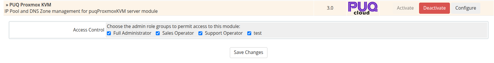

# WHMCS Installation and Update

### Proxmox KVM module **[WHMCS](https://puqcloud.com/link.php?id=77)**
##### [Order now](https://puqcloud.com/whmcs-module-proxmox-kvm.php) | [Download](https://download.puqcloud.com/WHMCS/servers/PUQ_WHMCS-Proxmox-KVM/) | [Community](https://community.puqcloud.com/)

## System requirements

| Requirement | Minimum |
|-------------|---------|
| **WHMCS** | 8.x+, 9.x+. |
| **PHP** | 7.4, 8.1, 8.2, 8.3, 8.4 |
| **ionCube Loader** | v15+ |

> **Note:** The module uses ionCube encoding. Make sure ionCube Loader is installed and active on your server.

---

## Download

> **Note:** The module now uses **ionCube 15**, which provides universal out-of-the-box support for all encodings across modern PHP runtimes.
>
> All versions and releases can be found at:
> `https://download.puqcloud.com/WHMCS/servers/PUQ_WHMCS-Proxmox-KVM/`
>
> Older module versions for WHMCS 8 are available in the archive directory:
> `https://download.puqcloud.com/WHMCS/servers/PUQ_WHMCS-Proxmox-KVM/archive/`

The module is distributed as a single ZIP archive containing both the **Server (Provisioning)** module (`puqProxmoxKVM`) and the **Addon (Management)** module (`puq_proxmox_kvm`).

Download the latest version directly to your server:

```bash
wget -O PUQ_WHMCS-Proxmox-KVM-latest.zip https://download.puqcloud.com/WHMCS/servers/PUQ_WHMCS-Proxmox-KVM/PUQ_WHMCS-Proxmox-KVM-latest.zip
```

---

## Installation

### Step 1: Unpack the Archive

Extract the downloaded archive in your terminal or locally prior to uploading:

```bash
unzip PUQ_WHMCS-Proxmox-KVM-latest.zip
```

The archive extracts into two module directories:
- `puqProxmoxKVM/` — Server (Provisioning) module
- `puq_proxmox_kvm/` — Addon (Management) module

### Step 2: Copy the Server Module

Copy the `puqProxmoxKVM` folder to your WHMCS server modules directory:

```bash
cp -r puqProxmoxKVM /path/to/whmcs/modules/servers/
```

### Step 3: Copy the Addon Module

Copy the `puq_proxmox_kvm` folder to your WHMCS addon modules directory:

```bash
cp -r puq_proxmox_kvm /path/to/whmcs/modules/addons/
```

### Step 4: Verify Directory Structure

Verify that the files reside in the correct WHMCS directory paths:

```text
whmcs/
├── modules/
│   ├── servers/
│   │   └── puqProxmoxKVM/          # Server module
│   │       ├── puqProxmoxKVM.php
│   │       ├── lib/
│   │       ├── lang/
│   │       └── templates/
│   └── addons/
│       └── puq_proxmox_kvm/        # Addon module
│           ├── puq_proxmox_kvm.php
│           ├── lib/
│           ├── lang/
│           └── templates/
```

### Step 5: Proceed to Configuration

All files are now in place. Proceed to [Addon Module Setup](03-addon-setup.md) to activate the addon, enter your license key, and configure administrator access permissions.

---

## Update

To update an existing module installation to a newer release:

1. Download the latest version archive from the download repository:
   ```bash
   wget -O PUQ_WHMCS-Proxmox-KVM-latest.zip https://download.puqcloud.com/WHMCS/servers/PUQ_WHMCS-Proxmox-KVM/PUQ_WHMCS-Proxmox-KVM-latest.zip
   ```
2. Unpack the archive:
   ```bash
   unzip PUQ_WHMCS-Proxmox-KVM-latest.zip
   ```
3. In the WHMCS Admin Area, go to **System Settings > Addon Modules** and click **Deactivate** next to **PUQ Proxmox KVM**.
4. Replace the server module files:
   ```bash
   cp -r puqProxmoxKVM /path/to/whmcs/modules/servers/
   ```
5. Replace the addon module files:
   ```bash
   cp -r puq_proxmox_kvm /path/to/whmcs/modules/addons/
   ```
6. Return to **System Settings > Addon Modules** and click **Activate** next to **PUQ Proxmox KVM**. This automatically runs database migrations and schema upgrades.
7. Verify that the version displayed in the module dashboard matches the new release.

> **Important:** All database tables, configurations, IP pools, DNS zones, and VM settings are safely preserved during the deactivation/reactivation cycle.


*addon-activation-access-control.png*
