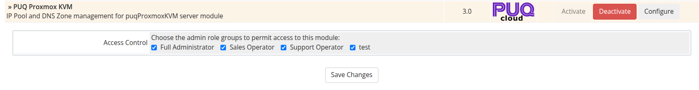

# WHMCS Module Installation and Update

### Proxmox KVM module **[WHMCS](https://puqcloud.com/link.php?id=77)**
#####  [Order now](https://puqcloud.com/whmcs-module-proxmox-kvm.php) | [Download](https://download.puqcloud.com/WHMCS/servers/PUQ_WHMCS-Proxmox-KVM/) | [FAQ](https://faq.puqcloud.com/)

## Download

The module is distributed as a single ZIP archive. A separate build is published for each supported PHP major version — pick the one that matches the PHP runtime used by your WHMCS installation.

All versions and historical builds are available in the index:

- [https://download.puqcloud.com/WHMCS/servers/PUQ_WHMCS-Proxmox-KVM/](https://download.puqcloud.com/WHMCS/servers/PUQ_WHMCS-Proxmox-KVM/)

### Direct "latest" downloads

#### PHP 8.2

```bash
wget https://download.puqcloud.com/WHMCS/servers/PUQ_WHMCS-Proxmox-KVM/php82/PUQ_WHMCS-Proxmox-KVM-latest.zip
```

#### PHP 8.1

```bash
wget https://download.puqcloud.com/WHMCS/servers/PUQ_WHMCS-Proxmox-KVM/php81/PUQ_WHMCS-Proxmox-KVM-latest.zip
```

#### PHP 7.4

```bash
wget https://download.puqcloud.com/WHMCS/servers/PUQ_WHMCS-Proxmox-KVM/php74/PUQ_WHMCS-Proxmox-KVM-latest.zip
```

> Not sure which PHP version your WHMCS runs on? Check **Utilities > System > PHP Info** in the WHMCS admin area.

## Installation

### Step 1: Unzip the Archive

On your WHMCS server (or locally, before uploading):

```bash
unzip PUQ_WHMCS-Proxmox-KVM-latest.zip
```

The archive extracts into a `PUQ_WHMCS-Proxmox-KVM/` directory containing two module folders: `puqProxmoxKVM` (server module) and `puq_proxmox_kvm` (addon module).

### Step 2: Copy the Server Module

Copy and replace `puqProxmoxKVM` from the extracted `PUQ_WHMCS-Proxmox-KVM/` directory to your WHMCS installation:

```
PUQ_WHMCS-Proxmox-KVM/puqProxmoxKVM  →  WHMCS_WEB_DIR/modules/servers/puqProxmoxKVM/
```

Example:

```bash
cp -r PUQ_WHMCS-Proxmox-KVM/puqProxmoxKVM /var/www/html/whmcs/modules/servers/
```

### Step 3: Copy the Addon Module

Copy and replace `puq_proxmox_kvm` from the extracted directory to your WHMCS installation:

```
PUQ_WHMCS-Proxmox-KVM/puq_proxmox_kvm  →  WHMCS_WEB_DIR/modules/addons/puq_proxmox_kvm/
```

Example:

```bash
cp -r PUQ_WHMCS-Proxmox-KVM/puq_proxmox_kvm /var/www/html/whmcs/modules/addons/
```

### Step 4: Activate the Addon Module

1. Log in to the WHMCS admin area
2. Navigate to **Setup > Addon Modules**
3. Find **PUQ Proxmox KVM** in the list
4. Click **Activate**
5. Enter your license key
6. Configure access control to grant the appropriate admin roles access to the addon



### Step 5: Verify Installation

After activation, navigate to **Addons > PUQ Proxmox KVM** in the admin menu. You should see the addon dashboard confirming a successful installation.

## File Structure

After installation, the module files should be located at:

```
whmcs/
├── modules/
│   ├── servers/
│   │   └── puqProxmoxKVM/          # Server module
│   │       ├── puqProxmoxKVM.php
│   │       └── ...
│   └── addons/
│       └── puq_proxmox_kvm/        # Addon module
│           ├── puq_proxmox_kvm.php
│           └── ...
```

## Update Procedure

To update the module to a newer version:

1. **Deactivate** the addon module in **Setup > Addon Modules**
2. Download the latest module archive from puqcloud.com
3. Upload and overwrite the server module files in `modules/servers/puqProxmoxKVM/`
4. Upload and overwrite the addon module files in `modules/addons/puq_proxmox_kvm/`
5. **Reactivate** the addon module in **Setup > Addon Modules**

> **Important:** Database tables and all configuration data are preserved during the deactivate/reactivate cycle. Your IP pools, DNS zones, VM records, and settings will remain intact.

> **Tip:** Always back up your WHMCS installation before performing an update.
