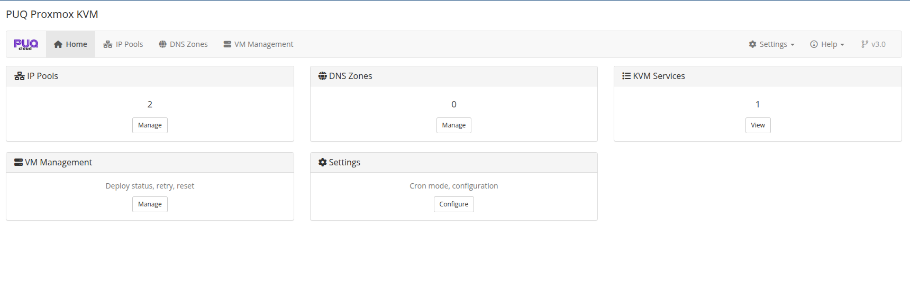

# Addon Module Setup

### Proxmox KVM module **[WHMCS](https://puqcloud.com/link.php?id=77)**
#####  [Order now](https://puqcloud.com/whmcs-module-proxmox-kvm.php) | [Download](https://download.puqcloud.com/WHMCS/servers/PUQ_WHMCS-Proxmox-KVM/) | [FAQ](https://faq.puqcloud.com/)

## After Activation

When the addon module is activated for the first time, it automatically:

- Creates all required database tables
- Sets default values for all settings
- Initializes the cron system

No manual database setup is required.

## Accessing the Addon

Navigate to **Addons > PUQ Proxmox KVM** in the WHMCS admin menu. The addon dashboard provides a centralized management interface.

## Addon Features

The addon module provides:

- **IP Pools** — Manage IPv4 and IPv6 address pools per server, with automatic allocation during VM deployment
- **DNS Zones** — Configure Cloudflare and HestiaCP integration for forward and reverse DNS automation
- **VM Management** — Overview of all provisioned VMs with deploy logs and status tracking
- **Cron Tasks** — Configure cron intervals, view task status, and manage lock files
- **Settings** — Global module settings including API timeouts, migration behavior, and cron configuration

## PUQ Customization Addon No Longer Required

Starting from v3.0, the PUQ Proxmox KVM module includes its own dedicated addon module (`puq_proxmox_kvm`). The old PUQ Customization addon with the ModulePuqProxmoxKVM extension is **no longer needed**.

If you are upgrading from an earlier version that used PUQ Customization:

1. Install and activate the new standalone addon module
2. Existing data (IP pools, DNS zones) will be migrated automatically on activation
3. Verify that all IP pools and DNS zones are present in the new addon
4. You can then safely deactivate the ModulePuqProxmoxKVM extension in PUQ Customization

> **Note:** The server module supports both the new standalone addon and the old PUQ Customization addon simultaneously during the migration period, so there is no downtime during the transition.
