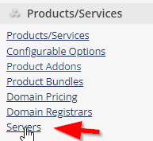
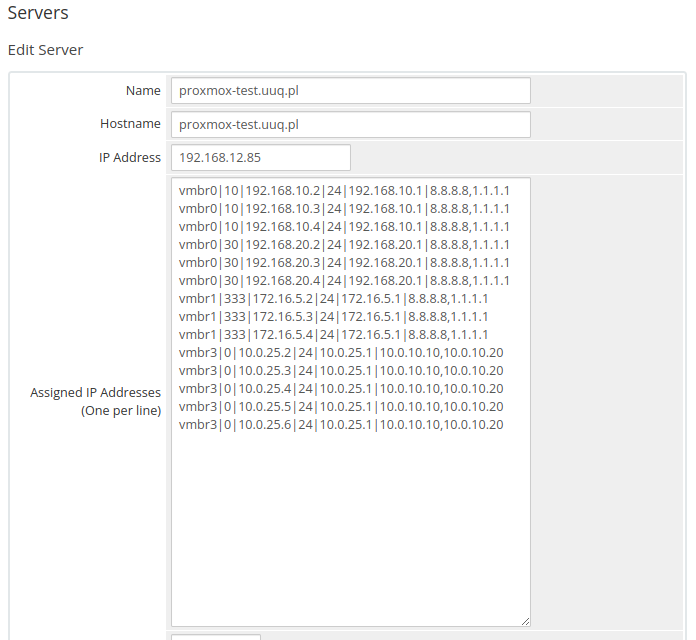
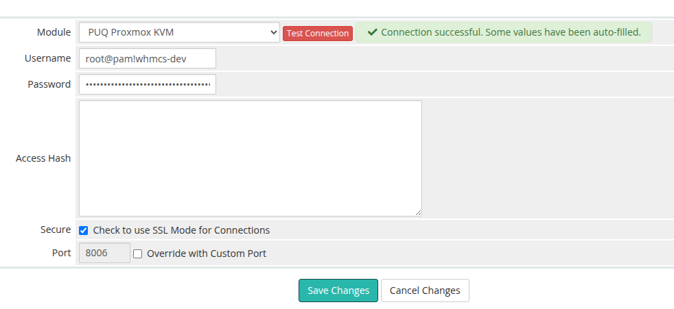
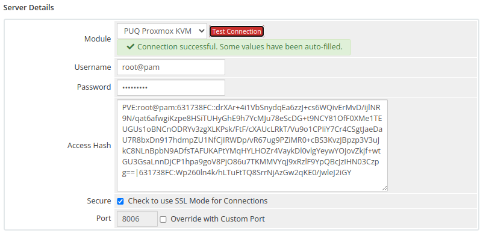
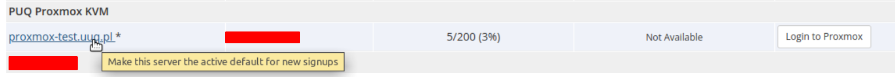

# Create new server for Proxmox in WHMCS

### Proxmox KVM module **[WHMCS](https://puqcloud.com/link.php?id=77)**
#####  [Order now](https://puqcloud.com/whmcs-module-proxmox-kvm.php) | [Download](https://download.puqcloud.com/WHMCS/servers/PUQ_WHMCS-Proxmox-KVM/) | [FAQ](https://faq.puqcloud.com/)

## Preface

For the module to work properly, you must configure the server settings in your main WHMCS panel. This is the place where you register a Proxmox server (or Proxmox cluster) which will then be used by the module to build KVM virtual machines. Here you define access credentials, IP ranges and additional settings.

> **Attention.** If you have only one server, or you do not use server groups, you need to make this server the **active default** for new signups by opening the server entry in WHMCS and ticking *"Make this server the active default for new signups"*.

## Server creation

Log in to your WHMCS panel and create a new Proxmox server:

**System Settings → Products/Services → Servers → Add New Server**



### Step 1: Name, Hostname and Assigned IP Addresses

- Enter the correct **Name** and **Hostname** of the Proxmox node.
- In the **Assigned IP Addresses** field enter the list of IP addresses that will be reserved for virtual machines built on this server.



> **Note.** Starting with module version **1.3**, the module supports IPv4/IPv6 pools managed in the addon. For new installations this is the recommended way to manage IP addresses — see the **IP Pools** chapter of this documentation. The "Assigned IP Addresses" field described below is the legacy format and is kept for backward compatibility.

#### Format to follow in the Assigned IP Addresses field

To define the available pool of IP addresses, enter one line per IP, with fields separated by the `|` character. Each line has the following structure:

```
<bridge>|<vlan_tag>|<IP_address>|<net_mask>|<Gateway>|<DNS1>,<DNS2>
```

| Field | Description |
|-------|-------------|
| `<bridge>` | The virtual bridge to which the VM network interface is connected (e.g. `vmbr0`). |
| `<vlan_tag>` | VLAN tag that will be set on the VM's network card. If VLANs are not used, enter `0`. |
| `<IP_address>` | IPv4 address that will be assigned to the VM. |
| `<net_mask>` | Network mask in CIDR form (e.g. `24`). |
| `<Gateway>` | Default gateway for the subnet. |
| `<DNS1>,<DNS2>` | Comma-separated list of DNS servers. |

##### Example

```
vmbr0|10|192.168.10.2|24|192.168.10.1|8.8.8.8,1.1.1.1
vmbr0|10|192.168.10.3|24|192.168.10.1|8.8.8.8,1.1.1.1
vmbr0|10|192.168.10.4|24|192.168.10.1|8.8.8.8,1.1.1.1
vmbr0|30|192.168.20.2|24|192.168.20.1|8.8.8.8,1.1.1.1
vmbr0|30|192.168.20.3|24|192.168.20.1|8.8.8.8,1.1.1.1
vmbr0|30|192.168.20.4|24|192.168.20.1|8.8.8.8,1.1.1.1
vmbr1|333|172.16.5.2|24|172.16.5.1|8.8.8.8,1.1.1.1
vmbr1|333|172.16.5.3|24|172.16.5.1|8.8.8.8,1.1.1.1
vmbr1|333|172.16.5.4|24|172.16.5.1|8.8.8.8,1.1.1.1
vmbr3|0|10.0.25.2|24|10.0.25.1|10.0.10.10,10.0.10.20
vmbr3|0|10.0.25.3|24|10.0.25.1|10.0.10.10,10.0.10.20
vmbr3|0|10.0.25.4|24|10.0.25.1|10.0.10.10,10.0.10.20
vmbr3|0|10.0.25.5|24|10.0.25.1|10.0.10.10,10.0.10.20
vmbr3|0|10.0.25.6|24|10.0.25.1|10.0.10.10,10.0.10.20
```

### Step 2: Server Details — module and credentials

In the **Server Details** section select the **PUQ Proxmox KVM** module and enter the correct credentials for the Proxmox API. Then click **Test connection** to verify.

> **Attention.** Starting from module version **2.3**, authentication has been changed to **token-based**.
> - **Username** — Proxmox token ID in the format `root@pam!whmcs-dev`
> - **Password** — the token secret value
>
> If you are using a version earlier than 2.3, enter the Proxmox username in the format `root@pam` in the **Username** field and the corresponding password in the **Password** field.
>
> During operation, the module will automatically fill in the **Access Hash** field. You do not need to fill it manually.

#### Version 2.3+ — Token authentication



#### Version 2.2 and earlier — Password authentication



##### Creating a Proxmox API Token

1. Log in to the Proxmox web UI.
2. Go to **Datacenter → Permissions → API Tokens**.
3. Click **Add**.
4. Select the **User** (e.g. `root@pam`).
5. Enter a **Token ID** (e.g. `whmcs`).
6. **Uncheck** *Privilege Separation* if the token should inherit the user's full permissions. If privilege separation is enabled, you must assign permissions to the token itself.
7. Click **Add**.
8. **Copy the generated token secret immediately** — it is displayed only once and cannot be retrieved later.

The resulting username for WHMCS will look like `root@pam!whmcs` and the password will be the token secret (a UUID-like string).

### Step 3: Make the server default (single-server installs)

If you have only one Proxmox server, or you do not use server groups, open the server entry and tick **"Make this server the active default for new signups"**. Otherwise newly ordered products will not be assigned to this server automatically.



## Test Connection

After saving the server configuration, always use the **Test Connection** button to verify:

- Network connectivity to the Proxmox host on port **8006**
- Authentication credentials are valid (token ID + secret, or username + password)
- The API user / token has sufficient permissions on the target nodes and storages

If the test fails, check:

- The WHMCS server can reach the Proxmox host on port `8006`
- The username and password/token are correct
- The Proxmox API service (`pveproxy`) is running
- No firewall is blocking the connection between WHMCS and Proxmox

## Server Groups

You can organize multiple Proxmox servers into **Server Groups** for automatic server selection during provisioning. This is useful when you have a Proxmox cluster with multiple nodes.

1. Go to **System Settings → Products/Services → Servers**
2. Click the **Server Groups** tab
3. Create a new group and assign your Proxmox servers to it
4. Set the **Fill Type**:
   - **Fill** — fills one server before moving to the next
   - **Round Robin** — distributes VMs evenly across servers
5. When configuring a product, select the server group instead of a specific server

> **Tip.** When using server groups with a Proxmox cluster, ensure the required storages exist on every node, or enable the VM migration step in the addon settings so the module moves freshly-cloned VMs to the correct target node automatically.
