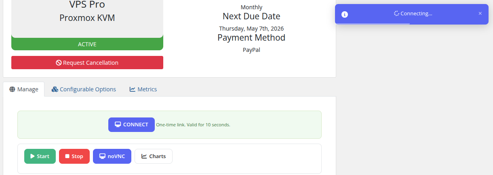

# Install VNCproxy and noVNC

### Proxmox KVM module **[WHMCS](https://puqcloud.com/link.php?id=77)**
#####  [Order now](https://puqcloud.com/whmcs-module-proxmox-kvm.php) | [Download](https://download.puqcloud.com/WHMCS/servers/PUQ_WHMCS-Proxmox-KVM/) | [FAQ](https://faq.puqcloud.com/)

## Preface

The module supports the ability to connect to and use a browser-based console to manage a specific KVM virtual machine. To connect to the VM console we use third-party software.

**noVNC** — the open-source VNC client. noVNC is both a VNC client JavaScript library and an application built on top of that library. It runs well in any modern browser, including mobile browsers (iOS and Android).

- Project site: [https://novnc.com](https://novnc.com)
- Project GitHub: [https://github.com/novnc/noVNC](https://github.com/novnc/noVNC)

> As we only use an external project, we do not take any responsibility for data leaks, hacks, etc.

The PUQ `vncwebproxy` binary itself is written in Go and uses the following libraries:

- [go-vncproxy](https://github.com/evangwt/go-vncproxy) (MIT License)
- [gin](https://github.com/gin-gonic/gin) (MIT License)
- [golang.org/x/net/websocket](https://pkg.go.dev/golang.org/x/net/websocket) (BSD License)

### How it works

The `vncwebproxy` sits between the client browser and your Proxmox server. It terminates the WebSocket from noVNC and forwards traffic to the Proxmox VNC port.

- The proxy must have stable network connectivity to the Proxmox server; TCP ports **5900–5999** to Proxmox are sufficient.
- If you use a **domain name** (not an IP) for the Proxmox server in the WHMCS server settings, that domain must resolve correctly **from the vncproxy host as well**.
- Each console session uses a one-time authentication ticket generated on demand and validated by the Proxmox API before the connection is established.
- All traffic between the client browser and the proxy is encrypted with SSL/TLS.

## Public PUQcloud proxy (default)

If you have any difficulties setting up your own proxy, you can use the public PUQcloud vncproxy server. **However, we strongly recommend setting up and using your own vncproxy server** — this way you retain full control over performance and security.

| Setting | Value |
|---------|-------|
| noVNC WEB proxy server | `vncproxy.puqcloud.com` |
| noVNC WEB proxy key | `puqcloud` |
| WEB ports | `80` / `443` |
| VNC ports | `5900–5999` |

These values go into the WHMCS product settings under **Module Settings → Integrations Configuration**:

| Setting | Description |
|---------|-------------|
| **noVNC Proxy Domain** | The URL of your noVNC proxy (e.g. `https://vncproxy.puqcloud.com`) |
| **noVNC Proxy Key** | Authentication key configured on the proxy (e.g. `puqcloud`) |

## Installation process — your own VNCproxy server

The sections below describe the full installation of a dedicated vncproxy server. The example uses **Debian 11** and the domain `vncproxy.puqcloud.com` — in your own deployment, substitute your domain everywhere.

### Step 1: Domain definition

First, choose a domain name for the vncproxy server (in our example: `vncproxy.puqcloud.com`). Create an `A`/`AAAA` record in your DNS pointing to the server's public IP address. Wait until the record propagates before requesting the SSL certificate.

### Step 2: Prepare the server

Provision a VM or dedicated host with your favorite Linux distribution — the example uses **Debian 11**. Make sure the server can reach your Proxmox nodes on TCP ports `5900–5999`, and that inbound ports `80/443` are open for clients.

Update the package database:

```bash
sudo apt update
```

Install the NGINX web server, Certbot and `zip`:

```bash
sudo apt install certbot nginx python3-certbot-nginx zip -y
```

### Step 3: Download the noVNC client

```bash
cd /root/
wget https://github.com/novnc/noVNC/archive/refs/tags/v1.3.0.zip
unzip v1.3.0.zip
cp -R noVNC-1.3.0/* /var/www/html/
rm v1.3.0.zip
rm -r noVNC-1.3.0/
```

After this step, opening `http://vncproxy.puqcloud.com/vnc.html` will load the noVNC client page.

### Step 4: Generate an SSL certificate with Certbot

```bash
certbot --nginx -d vncproxy.puqcloud.com
```

To renew the certificate automatically, add a cron job:

```bash
crontab -e
```

```
0 12 * * * /usr/bin/certbot renew --quiet
```

### Step 5: NGINX virtual host configuration

Edit the default site configuration:

```bash
nano /etc/nginx/sites-available/default
```

Use the following config — remember to replace `vncproxy.puqcloud.com` with your own domain:

```nginx
server {
    listen 80 default_server;
    listen [::]:80 default_server;

    root /var/www/html;

    index index.html index.htm index.nginx-debian.html;

    server_name _;

    location / {
        try_files $uri $uri/ =404;
    }
}

server {

    root /var/www/html;

    index index.html index.htm index.nginx-debian.html;
    server_name vncproxy.puqcloud.com; # managed by Certbot

    location / {
        try_files $uri $uri/ =404;
    }

    listen [::]:443 ssl ipv6only=on; # managed by Certbot
    listen 443 ssl; # managed by Certbot
    ssl_certificate /etc/letsencrypt/live/vncproxy.puqcloud.com/fullchain.pem; # managed by Certbot
    ssl_certificate_key /etc/letsencrypt/live/vncproxy.puqcloud.com/privkey.pem; # managed by Certbot
    include /etc/letsencrypt/options-ssl-nginx.conf; # managed by Certbot
    ssl_dhparam /etc/letsencrypt/ssl-dhparams.pem; # managed by Certbot

    location /vncproxy {
        proxy_pass http://127.0.0.1:8080/vncproxy;
        proxy_http_version 1.1;
        proxy_set_header Upgrade $http_upgrade;
        proxy_set_header Connection "Upgrade";
        proxy_set_header Host $host;
        proxy_set_header    X-Real-IP        $remote_addr;
        proxy_set_header    X-Forwarded-For  $proxy_add_x_forwarded_for;
    }
}

server {
    if ($host = vncproxy.puqcloud.com) {
        return 301 https://$host$request_uri;
    } # managed by Certbot

    listen 80 ;
    listen [::]:80 ;
    server_name vncproxy.puqcloud.com;
    return 404; # managed by Certbot
}
```

Reload NGINX:

```bash
service nginx restart
```

### Step 6: Install the `vncwebproxy` binary

Download the PUQ `vncwebproxy` binary from the official download server and make it executable:

```bash
apt-get install screen -y
cd /root/
wget https://download.puqcloud.com/WHMCS/servers/PUQ_WHMCS-Proxmox-KVM/vncproxy/vncwebproxy
chmod +x vncwebproxy
```

### Step 7: Run the proxy

Run the script inside a `screen` session so it keeps running in the background. The **first argument** is a unique key — this is exactly the value you will later put into the **noVNC Proxy Key** field in the WHMCS module.

```bash
screen
./vncwebproxy puqcloud
```

After a successful launch you can watch the request log directly in the console:

```
root@vncproxy:~# ./vncwebproxy puqcloud
[./vncwebproxy puqcloud]
proxmox-test.uuq.pl59002022/09/11 19:11:08 [vncproxy][debug] ServeWS
2022/09/11 19:11:08 [vncproxy][debug] request url: /vncproxy/proxmox-test.uuq.pl/5900/d91bac199c2ce79392d8e175076e3780
2022/09/11 19:11:13 [vncproxy][info] close peer
[GIN] 2022/09/11 - 19:11:13 | 200 |  4.740249024s |   79.184.10.217 | GET      "/vncproxy/proxmox-test.uuq.pl/5900/d91bac199c2ce79392d8e175076e3780"
```

Detach from `screen` with `Ctrl+A` then `D`. Reattach later with `screen -r`.

### Step 8: Configure WHMCS

In the WHMCS product settings, under **Module Settings → Integrations Configuration**, fill in:

- **noVNC Proxy Domain** → `https://vncproxy.your-domain.tld`
- **noVNC Proxy Key** → the key you passed to `./vncwebproxy` (in our example: `puqcloud`)

Save the product and try opening the console from the client area.

## Client Access

When noVNC is configured, clients see a **Console** button in their VM management area. Clicking it opens a new browser window with the noVNC console, providing full keyboard and mouse access to the virtual machine.



## Security

The security configuration of the vncproxy server should meet your own standards. A few mandatory points:

- Allow inbound TCP **80/443** from the internet (clients need HTTPS access to noVNC).
- Allow outbound TCP **5900–5999** from the vncproxy host to your Proxmox nodes.
- Keep the OS, NGINX and the `vncwebproxy` binary up to date.
- Each console session uses a **one-time ticket** — tickets are generated on demand, expire after a short period, and are validated against the Proxmox API before the connection is established.
- All traffic between the client browser and the proxy is encrypted via SSL/TLS (Let's Encrypt certificate).

Do not forget that for correct operation you must allow HTTPS to the proxy and outgoing connections from the proxy to the Proxmox server.
