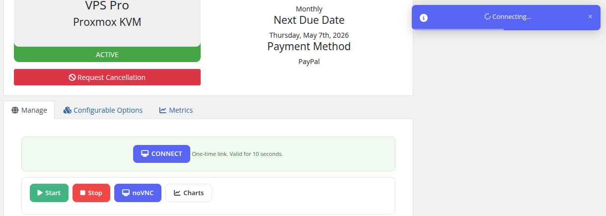

# Install VNCproxy and noVNC

### Proxmox KVM module **[WHMCS](https://puqcloud.com/link.php?id=77)**
##### [Order now](https://puqcloud.com/whmcs-module-proxmox-kvm.php) | [Download](https://download.puqcloud.com/WHMCS/servers/PUQ_WHMCS-Proxmox-KVM/) | [Community](https://community.puqcloud.com/)

## Preface

The module provides browser-based console access allowing clients to manage KVM virtual machines directly from the WHMCS client area without needing external VNC software. To establish console sessions, the module integrates with:

- **noVNC** — An open-source HTML5 VNC client JavaScript library and application that runs in any modern desktop or mobile browser (iOS, Android).
  - Project website: [https://novnc.com](https://novnc.com)
  - GitHub repository: [https://github.com/novnc/noVNC](https://github.com/novnc/noVNC)
- **vncwebproxy** — A lightweight Go daemon developed by PUQ that terminates the client's secure WebSocket connection and relays traffic to the Proxmox VNC port:
  - [go-vncproxy](https://github.com/evangwt/go-vncproxy) (MIT License)
  - [gin](https://github.com/gin-gonic/gin) (MIT License)
  - [golang.org/x/net/websocket](https://pkg.go.dev/golang.org/x/net/websocket) (BSD License)

### How It Works

The `vncwebproxy` sits between the client's web browser and your Proxmox VE cluster:

1. When a client clicks **Console** in WHMCS, the module requests a one-time VNC ticket and port from the Proxmox API.
2. WHMCS generates a signed, one-time console link incorporating the ticket and redirects the client's browser to the `vncwebproxy` domain.
3. The client browser loads noVNC via HTTPS and opens a secure WebSocket connection to `/vncproxy/...`.
4. `vncwebproxy` validates the authentication ticket and forwards the bidirectional VNC stream to the designated Proxmox node on TCP ports **5900–5999**.

```text
[ Client Browser (noVNC) ] 
       │  HTTPS / WSS (Ports 80 / 443)
       ▼
[ vncwebproxy ] 
       │  VNC TCP (Ports 5900–5999)
       ▼
[ Proxmox VE Node ]
```

---

## Public PUQcloud Proxy (Testing / Evaluation)

For rapid testing or evaluation, you can use the public PUQcloud demo proxy. **For production deployments, we strongly recommend hosting your own proxy** to ensure optimal performance, low latency, and full control over security.

| Setting | Value |
|---------|-------|
| noVNC WEB proxy server | `vncproxy.puqcloud.com` |
| noVNC WEB proxy key | `puqcloud` |
| Web ports | `80` / `443` (SSL/TLS) |
| Proxmox target ports | `5900–5999` |

These settings are entered in the WHMCS product settings under **Module Settings → Integrations Configuration**:

| Setting | Description | Example |
|---------|-------------|---------|
| **noVNC Proxy Domain** | The HTTPS URL of your proxy server | `https://vncproxy.yourdomain.com` |
| **noVNC Proxy Key** | The secret authentication key configured on the proxy | `your-secret-key` |

---

## Method 1: Docker Deployment (Recommended)

PUQ provides an official, all-in-one Docker image on Docker Hub:
**[puqcloud/vncwebproxy](https://hub.docker.com/r/puqcloud/vncwebproxy)**

This image bundles:
- The compiled `vncwebproxy` Go daemon
- **noVNC v1.7.0** served statically via an internal high-performance NGINX web server
- Built-in dual health checks (NGINX on port 80 and WebSocket listener on port 8080)
- Unified logging and minimal resource footprint

### Prerequisites
- Docker Engine 20.10+ and Docker Compose v2+ installed on your proxy server.
- The proxy server must have outbound network access to your Proxmox VE nodes on TCP ports **5900–5999**.
- A public domain name (e.g., `vncproxy.yourdomain.com`) with an `A`/`AAAA` DNS record pointing to your proxy server.

### Deploying with Docker Compose

Create a directory and a `docker-compose.yml` file:

```bash
mkdir -p /opt/vncwebproxy && cd /opt/vncwebproxy
nano docker-compose.yml
```

Add the following configuration:

```yaml
version: "3.8"

services:
  vncwebproxy:
    image: puqcloud/vncwebproxy:latest
    container_name: vncwebproxy
    restart: unless-stopped
    ports:
      - "8080:80"
    environment:
      - TZ=UTC
      # Set your unique Proxy Key (must match noVNC Proxy Key in WHMCS)
      - PROXY_KEY=my_secure_proxy_key_123
```

Start the container:

```bash
docker compose up -d
```

### Deploying with Docker CLI

Alternatively, run the container directly with `docker run`:

```bash
docker run -d \
  --name vncwebproxy \
  --restart unless-stopped \
  -p 8080:80 \
  -e PROXY_KEY=my_secure_proxy_key_123 \
  -e TZ=UTC \
  puqcloud/vncwebproxy:latest
```

### Environment Variables

| Variable | Description | Default |
|----------|-------------|---------|
| `PROXY_KEY` | The secret authentication key passed from WHMCS | `puqcloud` |
| `TZ` | Container timezone (e.g. `UTC`, `Europe/Warsaw`, `America/New_York`) | `UTC` |

### Reverse Proxy & SSL Configuration

Because modern browsers require HTTPS and WSS (secure WebSockets) for console access, place a reverse proxy with SSL termination in front of the container.

#### Example: NGINX Reverse Proxy

```nginx
server {
    listen 80;
    server_name vncproxy.yourdomain.com;
    return 301 https://$host$request_uri;
}

server {
    listen 443 ssl http2;
    server_name vncproxy.yourdomain.com;

    ssl_certificate /etc/letsencrypt/live/vncproxy.yourdomain.com/fullchain.pem;
    ssl_certificate_key /etc/letsencrypt/live/vncproxy.yourdomain.com/privkey.pem;

    location / {
        proxy_pass http://127.0.0.1:8080;
        proxy_http_version 1.1;
        proxy_set_header Upgrade $http_upgrade;
        proxy_set_header Connection "Upgrade";
        proxy_set_header Host $host;
        proxy_set_header X-Real-IP $remote_addr;
        proxy_set_header X-Forwarded-For $proxy_add_x_forwarded_for;
        proxy_set_header X-Forwarded-Proto $scheme;
    }
}
```

> **Using Nginx Proxy Manager?** In the NPM UI, create a Proxy Host pointing to `http://vncwebproxy:80` (or `http://127.0.0.1:8080`), enable **Websockets Support**, select **Request a new SSL Certificate**, and check **Force SSL**.

### Health Checks

The Docker image includes an automated dual health check:
1. Verifies that NGINX is actively serving the noVNC client interface on port 80.
2. Verifies that the internal Go proxy daemon is listening for WebSocket connections on port 8080.

Check container health:

```bash
docker inspect --format='{{.State.Health.Status}}' vncwebproxy
```

### Updating the Image

To update to the latest release:

```bash
docker compose pull
docker compose up -d
```

---

## Method 2: Manual Standalone Installation (Bare Metal)

If you prefer installing directly on the host without Docker:

### Step 1: Prepare Server & Packages (Debian / Ubuntu)

```bash
sudo apt update
sudo apt install certbot nginx python3-certbot-nginx zip -y
```

### Step 2: Download noVNC

```bash
cd /root/
wget https://github.com/novnc/noVNC/archive/refs/tags/v1.3.0.zip
unzip v1.3.0.zip
cp -R noVNC-1.3.0/* /var/www/html/
rm -rf v1.3.0.zip noVNC-1.3.0/
```

### Step 3: SSL Certificate via Certbot

```bash
certbot --nginx -d vncproxy.yourdomain.com
```

### Step 4: NGINX Virtual Host

Edit `/etc/nginx/sites-available/default`:

```nginx
server {
    root /var/www/html;
    index index.html index.htm;
    server_name vncproxy.yourdomain.com;

    listen 443 ssl http2;
    ssl_certificate /etc/letsencrypt/live/vncproxy.yourdomain.com/fullchain.pem;
    ssl_certificate_key /etc/letsencrypt/live/vncproxy.yourdomain.com/privkey.pem;

    location / {
        try_files $uri $uri/ =404;
    }

    location /vncproxy {
        proxy_pass http://127.0.0.1:8080/vncproxy;
        proxy_http_version 1.1;
        proxy_set_header Upgrade $http_upgrade;
        proxy_set_header Connection "Upgrade";
        proxy_set_header Host $host;
        proxy_set_header X-Real-IP $remote_addr;
        proxy_set_header X-Forwarded-For $proxy_add_x_forwarded_for;
    }
}
```

Reload NGINX:

```bash
systemctl restart nginx
```

### Step 5: Download & Run `vncwebproxy`

```bash
apt install screen -y
cd /opt
wget https://download.puqcloud.com/WHMCS/servers/PUQ_WHMCS-Proxmox-KVM/vncproxy/vncwebproxy
chmod +x vncwebproxy

screen -S vncproxy
./vncwebproxy my_secure_proxy_key_123
```

Detach from `screen` with `Ctrl+A` then `D`.

---

## Configuring WHMCS Product Settings

Once your proxy is running (via Docker or standalone), navigate to:
**WHMCS Admin Area → System Settings → Products/Services → Products/Services**

1. Select your Proxmox KVM product and open the **Module Settings** tab.
2. Scroll to the **Integrations Configuration** section.
3. Configure:
   - **noVNC Proxy Domain**: `https://vncproxy.yourdomain.com`
   - **noVNC Proxy Key**: `my_secure_proxy_key_123` (matching the `PROXY_KEY` environment variable or CLI argument)
4. Click **Save Changes**.

---

## Client Console Access

When configured, clients see the **Console** button in their VM management view. Clicking it opens a secure browser window with full keyboard, video, and mouse interaction.


*client-area-novnc-connecting.png*

---

## Security & Firewall Requirements

- **Inbound Ports to Proxy**: Allow TCP **80** and **443** from the public internet.
- **Outbound Ports from Proxy to Proxmox**: Allow TCP **5900–5999** from the proxy server to each Proxmox VE cluster node.
- **DNS Resolution**: If Proxmox hostnames are used instead of IP addresses in WHMCS, ensure the proxy server can resolve those hostnames.
- **One-Time Tickets**: Every session uses a short-lived one-time ticket generated by the Proxmox API, ensuring sessions cannot be hijacked or reused.
