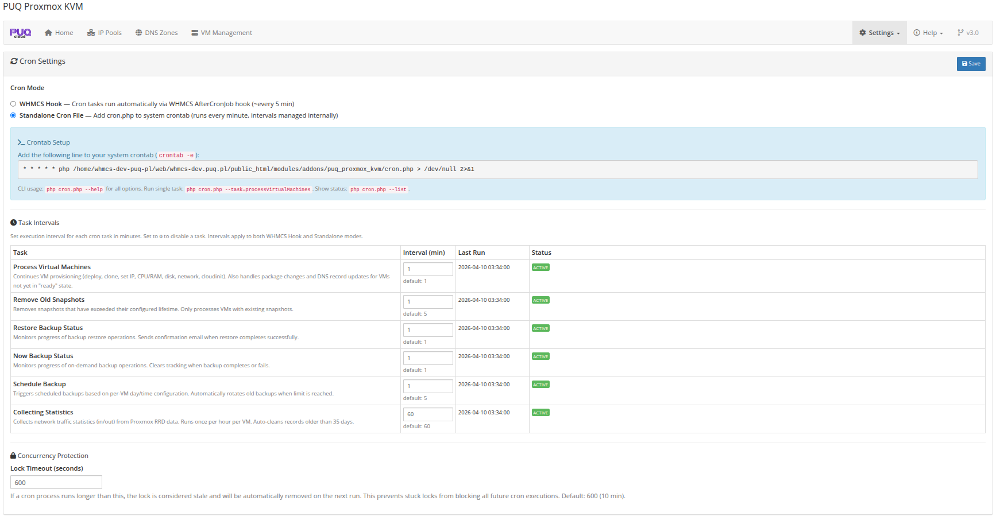
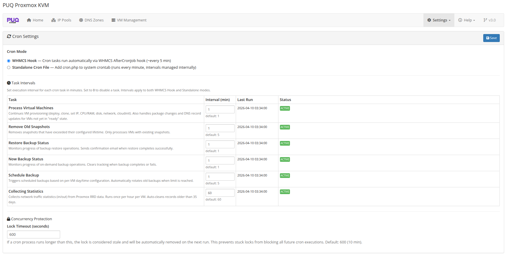

# Cron Configuration

### Proxmox KVM module **[WHMCS](https://puqcloud.com/link.php?id=77)**
#####  [Order now](https://puqcloud.com/whmcs-module-proxmox-kvm.php) | [Download](https://download.puqcloud.com/WHMCS/servers/PUQ_WHMCS-Proxmox-KVM/) | [FAQ](https://faq.puqcloud.com/)

## Overview

The module requires a cron system to process VM deployments, package changes, backups, and other automated tasks. Two cron modes are available, and you can choose the one that best fits your environment.

## Cron Modes

### Mode 1: WHMCS Hook (Default)

In this mode, the module hooks into the standard WHMCS cron and executes its tasks automatically each time the WHMCS cron runs.

**Advantages:**
- No additional configuration required
- Works out of the box after module activation
- Uses the existing WHMCS cron schedule

**When to use:** This is the recommended mode for most installations. If your WHMCS cron runs every 5 minutes (the standard recommendation), this provides timely task execution.

No additional crontab entries are needed. Just ensure the standard WHMCS cron is running:

```bash
*/5 * * * * php -q /path/to/whmcs/cron/cron.php
```

### Mode 2: Standalone

In this mode, the module's cron runs independently from the WHMCS cron via a separate crontab entry. This gives you independent control over the module's cron frequency.

**Advantages:**
- Independent schedule from WHMCS cron
- Can run more frequently for faster VM provisioning
- Useful if your WHMCS cron runs less frequently

**When to use:** Use standalone mode if you need the module to process tasks more frequently than your WHMCS cron runs, or if you want to separate the module's workload from the main WHMCS cron.

To set up standalone cron, add the following to your server's crontab:

```bash
*/5 * * * * php -q /path/to/whmcs/modules/addons/puq_proxmox_kvm/cron.php
```



## Configuring Cron Mode

The cron mode is configured in the addon settings:

1. Navigate to **Addons > PUQ Proxmox KVM**
2. Go to the **Settings** page
3. Select the **Cron** tab
4. Choose your preferred cron mode: **WHMCS Hook** or **Standalone**
5. Save settings



## Task Intervals

Each cron task has a configurable interval that controls how often it runs. These intervals can be adjusted in the Cron settings page. For details on individual tasks and their intervals, see the [Cron and Automation](../07-cron-and-automation/_chapter.md) section.

## Verifying Cron Operation

To confirm the cron is running correctly:

1. Navigate to the addon **Settings > Cron** page
2. Check the **Last Run** timestamp for each task
3. Verify there are no stale lock files

If tasks are not executing, check:

- The WHMCS cron is running (for Hook mode)
- The standalone crontab entry is correct (for Standalone mode)
- PHP CLI is available at the path specified in the crontab
- File permissions allow the cron script to execute
