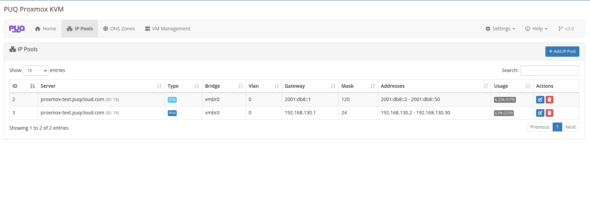
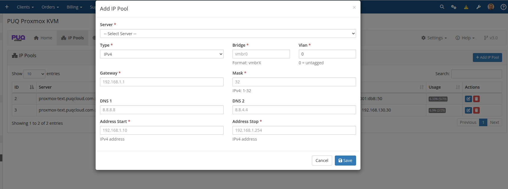

# IP Pools

### Proxmox KVM module **[WHMCS](https://puqcloud.com/link.php?id=77)**
#####  [Order now](https://puqcloud.com/whmcs-module-proxmox-kvm.php) | [Download](https://download.puqcloud.com/WHMCS/servers/PUQ_WHMCS-Proxmox-KVM/) | [FAQ](https://faq.puqcloud.com/)

IP Pools allow you to manage blocks of IPv4 and IPv6 addresses that are automatically assigned to virtual machines during provisioning.

> **Changed in v3.0.** IP Pools are now a first-class feature of the dedicated `puq_proxmox_kvm` addon. In v1.3–v2.x the same pool management lived in the separate **PUQ Customization** addon, which is no longer required — on first activation the new addon **automatically imports** all pools from the legacy `puq_customization_ip_pools` tables, including their allocations and per-server assignments. If you are migrating from an older version you do not need to recreate the pools by hand.

> **Legacy alternative (still supported).** If you prefer not to use pools at all, you can still define the IP addresses directly on the WHMCS server entry using the pipe-delimited **Assigned IP Addresses** format — see [Create new server for Proxmox in WHMCS](../03-installation-and-configuration/04-create-new-server-for-proxmox-in-whmcs.md). The server module will pick an IP from whichever source has free entries (pools first, then the legacy list).

## IP Pools List

Navigate to **Addons > PUQ Proxmox KVM > IP Pools** to view all configured pools.

The table displays:

| Column | Description |
|--------|-------------|
| **ID** | Pool identifier |
| **Server** | Associated Proxmox server |
| **Type** | IPv4 or IPv6 |
| **Bridge** | Network bridge (e.g., `vmbr0`) |
| **Vlan** | VLAN tag (0 = no VLAN) |
| **Gateway** | Default gateway address |
| **Mask** | Subnet mask |
| **Addresses** | Total IPs in pool |
| **Usage** | Visual bar showing allocated vs available |
| **Actions** | Edit / Delete buttons |

## Adding an IP Pool

Click **+ Add IP Pool** to open the creation dialog.

Fill in the following fields:

| Field | Description | Example |
|-------|-------------|---------|
| **Server** | Select the Proxmox server | `pve-waw1` |
| **Type** | IPv4 or IPv6 | `IPv4` |
| **Bridge** | Network bridge name | `vmbr0` |
| **Vlan** | VLAN tag (0 for untagged) | `0` |
| **Gateway** | Default gateway address | `192.168.130.1` |
| **Mask** | Subnet mask (1-32 for IPv4, 1-128 for IPv6) | `24` |
| **DNS 1** | Primary DNS server | `8.8.8.8` |
| **DNS 2** | Secondary DNS server | `1.1.1.1` |
| **Address Start** | First IP in the range | `192.168.130.2` |
| **Address Stop** | Last IP in the range | `192.168.130.254` |

## Editing an IP Pool

Click the **Edit** button next to any pool to modify its settings.

> **Note:** Modifying a pool does not affect already-assigned IP addresses. Changes only apply to new allocations.

## IP Allocation Process

IPs are automatically allocated from pools during VM provisioning when:

1. The server has no assigned IPs configured in WHMCS server settings
2. The addon module is installed and activated
3. The product's network configuration has **Auto bridge/VLAN** enabled

The system selects IPs from pools matching the server associated with the product. IPv4 and IPv6 addresses are allocated from separate pools.

## Validation Rules

- Bridge must be a valid Proxmox bridge name
- Gateway must match the pool type (IPv4 for IPv4 pools, IPv6 for IPv6 pools)
- Server must be a valid Proxmox server configured in WHMCS
- Address range must be valid for the given type
