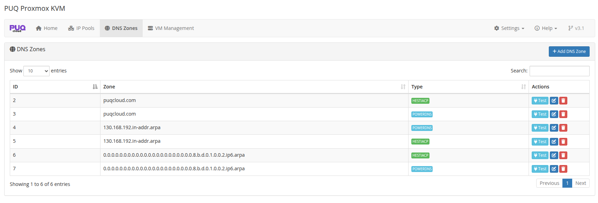
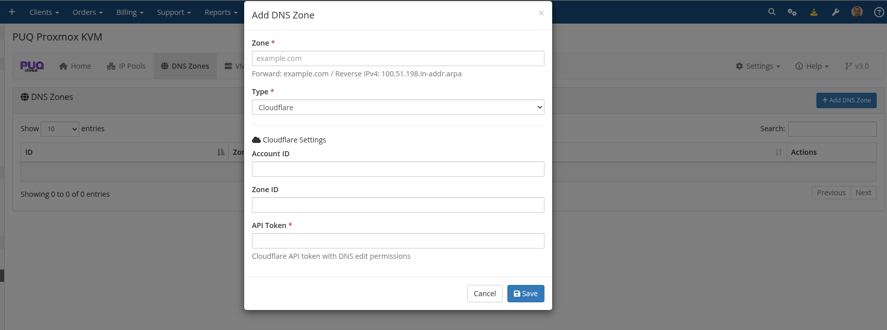
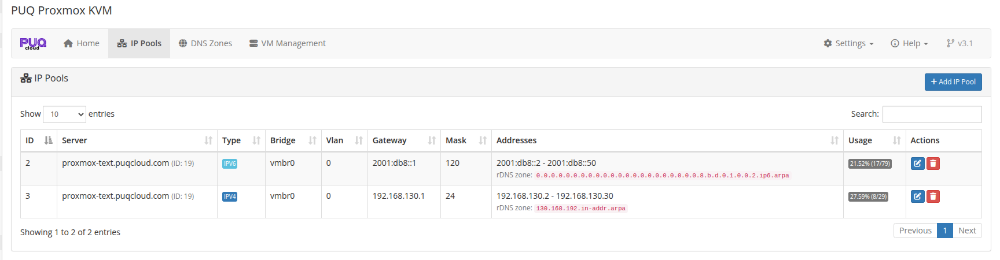

# DNS Zones

### Proxmox KVM module **[WHMCS](https://puqcloud.com/link.php?id=77)**
#####  [Order now](https://puqcloud.com/whmcs-module-proxmox-kvm.php) | [Download](https://download.puqcloud.com/WHMCS/servers/PUQ_WHMCS-Proxmox-KVM/) | [FAQ](https://faq.puqcloud.com/)

DNS Zones enable automatic management of forward (A/AAAA) and reverse (PTR) DNS records for every virtual machine the module provisions. Configure your zones once and the module takes care of creation on deploy, refresh on package change, and cleanup on termination — across all three supported providers.

> **Changed in v3.2.** Added native PowerDNS support, asynchronous DNS record creation, live cron output, and automatic reverse-zone hints on the IP Pools page. DNS errors are fully non-blocking — a misconfigured or unreachable provider never stops deployment, package change, or termination. Credentials are no longer echoed back to the browser.

## DNS Zones list

Navigate to **Addons → PUQ Proxmox KVM → DNS Zones**.



Each zone line shows: internal ID, the zone name, the provider type badge, and per-row actions (**Test** connection, **Edit**, **Delete**).

You can add any number of zones. When a VM is deployed, the module matches the VM's FQDN and every assigned IP against all configured zones and writes to **every** matching zone.

## Supported providers

The module supports three DNS providers. You can mix them freely — forward zones on Cloudflare, reverse zones on PowerDNS, legacy zones on HestiaCP, all at the same time.

| Provider | Forward (A/AAAA) | Reverse (PTR) | API style |
|---|---|---|---|
| **Cloudflare** | yes | yes | REST v4, bearer token |
| **HestiaCP** | yes | yes | custom CLI-over-HTTP, admin user + password |
| **PowerDNS** | yes | yes | Authoritative Server REST API, `X-API-Key` |

## Adding a DNS zone

Click **+ Add DNS Zone**. Choose the provider in the Type dropdown; the form fields change to match the provider.



### Cloudflare

| Field | Description |
|-------|-------------|
| **Zone** | The zone name as it appears in Cloudflare (e.g., `example.com` for forward, `130.168.192.in-addr.arpa` for reverse). |
| **Type** | `Cloudflare` |
| **Account ID** | Cloudflare Account ID from the Cloudflare dashboard. |
| **Zone ID** | Cloudflare Zone ID from the zone's Overview page. |
| **API Token** | Cloudflare API token scoped to DNS edit on this zone. |

### HestiaCP

| Field | Description |
|-------|-------------|
| **Zone** | Domain name as configured on the HestiaCP server. |
| **Type** | `HestiaCP` |
| **Server URL** | HestiaCP URL, e.g., `https://hestia.example.com:8083/`. The trailing slash is added automatically if omitted. |
| **Admin User** | HestiaCP admin username. |
| **Admin Password** | HestiaCP admin password. |
| **User** | HestiaCP user that owns the DNS zone. |

### PowerDNS

| Field | Description |
|-------|-------------|
| **Zone** | Zone name as configured in PowerDNS (`example.com.` for forward, `8.b.d.0.1.0.0.2.ip6.arpa.` for IPv6 reverse). Trailing dots are normalized automatically. |
| **Type** | `PowerDNS` |
| **Server URL** | PowerDNS REST API base URL, e.g., `https://pdns.example.com:8081`. |
| **API Key** | Value of the `X-API-Key` header configured in `pdns.conf`. |

Make sure the PowerDNS API is enabled in your `pdns.conf`:

```
api=yes
api-key=<your-key-here>
webserver=yes
webserver-address=0.0.0.0
webserver-port=8081
webserver-allow-from=127.0.0.1,<whmcs-ip>
```

PowerDNS uses RRset-based updates: records are added or replaced atomically per name+type. PTR/CNAME/NS content is automatically wrapped with a trailing dot to satisfy PowerDNS strict validation.

## Forward vs reverse zones

The module does not distinguish between "forward" and "reverse" zones in the UI — there is just one **Zone** field. What makes a zone forward or reverse is simply its **name**:

- **Forward zone**: a regular domain name. Example: `puqcloud.com`.
  - Stores A records (IPv4 → hostname) and AAAA records (IPv6 → hostname).
  - Needed for clients to reach their VM by DNS name.
- **Reverse IPv4 zone**: ends in `.in-addr.arpa`. Example: `130.168.192.in-addr.arpa` (covers the `192.168.130.0/24` network).
  - Stores PTR records (IP → hostname).
  - Needed for outbound mail, rDNS verification, PTR lookups.
- **Reverse IPv6 zone**: ends in `.ip6.arpa`. Example: `0.0.0.0.0.0.0.0.0.0.0.0.0.0.0.0.0.0.0.0.0.0.8.b.d.0.1.0.0.2.ip6.arpa` (covers `2001:db8::/120`).
  - Stores PTR records for IPv6.

You can add **multiple zones of different providers with the same name**. For example, if you run a primary PowerDNS and a secondary HestiaCP, add two zones: `puqcloud.com / PowerDNS` and `puqcloud.com / HestiaCP`. The module will push every forward record to both on deploy and remove from both on termination.

## Finding the reverse-zone name for a pool

You don't have to compute the reverse zone name for an IP pool by hand. The addon does it for you on the IP Pools page: the required **rDNS zone** for each pool is shown on the second line in the Addresses column, and live in the add/edit modal as you type the prefix:



Example from the screenshot:

- Pool `192.168.130.2 - 192.168.130.30` (gateway `192.168.130.1`, mask `/24`) → **rDNS zone `130.168.192.in-addr.arpa`**
- Pool `2001:db8::2 - 2001:db8::50` (gateway `2001:db8::1`, mask `/120`) → **rDNS zone `0.0.0.0.0.0.0.0.0.0.0.0.0.0.0.0.0.0.0.0.0.0.8.b.d.0.1.0.0.2.ip6.arpa`**

Copy that value straight into the **Zone** field when adding a DNS zone for reverse records. The pool itself doesn't need any DNS configuration — the module only uses this name to know where PTR records should go, and only if such a zone actually exists in DNS Zones.

### Prefix alignment

- **IPv4** reverse zones work naturally for `/8`, `/16`, `/24` prefixes. Non-octet-aligned prefixes (e.g., `/22`, `/28`) require "classless delegation" — a more advanced DNS setup described in RFC 2317 — which is beyond the module's scope. Pools with such prefixes show `classless delegation required` instead of a ready-made zone name.
- **IPv6** reverse zones work for any nibble-aligned prefix (multiple of 4): `/4`, `/8`, `/12`, `/16`, … `/124`, `/128`. The module supports the full range.

## How DNS automation works

When a VM transitions through state changes, the following DNS operations run automatically:

| Event | Forward records | Reverse records |
|---|---|---|
| **Deploy** (state `clone → set_dns`) | Create A and/or AAAA for `<vmname>.<domain>` | Create PTR for every assigned IP |
| **Change package** (state `change_package → cp_update_ip`) | Delete all, then recreate — reflects any IP changes | Delete all, then recreate |
| **Terminate** | Delete forward records for the VM's FQDN | Delete PTR records for every assigned IP |
| **Set DNS records admin button** | Delete + recreate — forces a full resync | Delete + recreate |

The main domain used for forward records comes from product configuration: **Admin → Products → [your product] → Module Settings → Integrations → Main domain**. For example if the main domain is `puqcloud.com` and the VM's internal name is `5551-1776530141`, the FQDN registered in DNS is `5551-1776530141.puqcloud.com`.

### Zone matching

For a given DNS operation the module walks every configured zone and checks whether the record name would fit that zone:

- A forward `vm-123.puqcloud.com` matches any zone whose name is a suffix: `puqcloud.com`, for example. It does not match `puq.com` or `example.com`.
- A reverse PTR `10.1.168.192.in-addr.arpa` matches `1.168.192.in-addr.arpa`, `168.192.in-addr.arpa`, or `192.in-addr.arpa` — any level of reverse delegation.
- An IPv6 PTR matches any `*.ip6.arpa` zone that is a proper suffix of the full 32-nibble reverse name.

Zones that don't match a given VM's records are simply skipped — there's no error.

### Non-blocking errors

Every per-zone and per-record operation is wrapped in its own try/catch. If a zone's provider is down, credentials are wrong, or a specific record creation fails:

- The error is logged to **Utilities → Logs → Module Log** with full context.
- A live cron output shows `fwd ERR` / `rev ERR` for that specific operation.
- **Deploy / change package / terminate continues** — the next zone, the next record, and the next pipeline step all run.
- When errors occur, a summary entry is written to the WHMCS module log so admins can audit failures after the fact.

This is by design: a DNS outage must not block a client from getting their VM. You can always run **Set DNS records** later from the admin service page once the DNS provider is back online (see below).

## Set DNS records admin button

On a service's admin page in WHMCS, the module exposes a **Set DNS records** button under Module Commands. It performs a full DNS resync for that specific VM: delete every existing forward and reverse record, then recreate them from the VM's current IPs and domain.

Starting with v3.2 this runs **asynchronously**. Clicking the button queues the job (sets `vm_status = 'set_dns_records'`) and returns immediately. The next cron tick picks up the VM and runs the full delete + create cycle with live output — useful for services with dozens of reverse records where the synchronous version used to time out.

The progress shows up in VM Management → Log modal and in the cron stdout just like during deploy.

## Credentials never leave the server

In v3.2 the DNS Zones list API masks all secret fields (API token, admin password, API key) with a `__KEEP__` sentinel before sending data to the browser. The edit form shows `(unchanged — enter new to replace)` placeholders:

- If you **don't type anything** in a secret field on save, the stored value is kept.
- If you **type a new value**, it overwrites the stored value.

This means tokens cannot be stolen by inspecting the edit form's HTML or by a compromised admin browser. The only way to read a stored credential is direct database access.

## Testing a zone

The **Test** button per row runs a live connectivity and authorization check against the provider. For Cloudflare and PowerDNS it fetches the zone metadata; for HestiaCP it issues a zone listing call.

A green toast means the provider is reachable with valid credentials and the zone name matches what's configured on the server. A red toast shows the exact error returned by the provider.

---

## Legacy DNS endpoint (`dns.php`)

> **Still supported.** The legacy read-only JSON endpoint introduced in v1.4 is kept for backwards compatibility with external DNS automations. It does not write to any DNS server — it just returns the current forward/reverse mapping so you can feed it into your own DNS-sync script.

Send a `GET` request to:

```
https://<WHMCS-SERVER>/modules/servers/puqProxmoxKVM/lib/dns/dns.php
```

Example response:

```json
[
   {
      "forward": "vlan-1-4779.vps.uuq.pl",
      "ip": "192.168.0.2",
      "reverse": "mail.uuq.pl"
   },
   {
      "forward": "vps-1-4780.vps.uuq.pl",
      "ip": "192.168.0.3",
      "reverse": "test.vps.uuq.pl"
   }
]
```

### Access control

Restrict access with `.htaccess` next to the file:

```
order deny,allow
deny from all
allow from <allowed_IP_address>
```

> For new integrations, use the native DNS providers (Cloudflare / HestiaCP / PowerDNS) instead of scraping this endpoint. The native integration handles forward + reverse, deletion on terminate, retry on transient errors, credential masking, and produces a live audit trail in the cron log and module log.

## Related reading

- [IP Pools](02-ip-pools.md) — where the rDNS zone name is computed for you.
- [Deploy Process](../07-cron-and-automation/01-deploy-process.md) — when forward and reverse records are created.
- [Change Package](../07-cron-and-automation/02-change-package.md) — DNS refresh on package changes.
- [Terminate Process](../07-cron-and-automation/03-terminate-process.md) — DNS cleanup on service termination.
