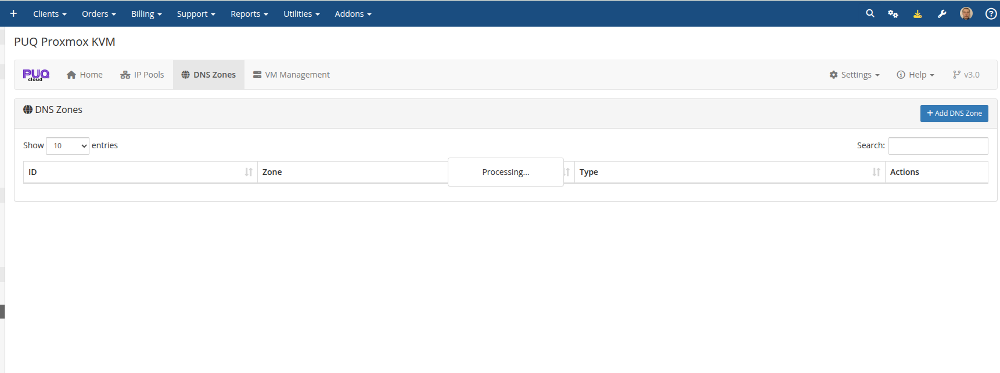

# DNS Zones

### Proxmox KVM module **[WHMCS](https://puqcloud.com/link.php?id=77)**
#####  [Order now](https://puqcloud.com/whmcs-module-proxmox-kvm.php) | [Download](https://download.puqcloud.com/WHMCS/servers/PUQ_WHMCS-Proxmox-KVM/) | [FAQ](https://faq.puqcloud.com/)

DNS Zones enable automatic management of forward (A/AAAA) and reverse (PTR) DNS records for virtual machines.

> **Changed in v3.0.** DNS synchronization is now built directly into the dedicated addon module with three supported providers — **Cloudflare**, **HestiaCP** and **PowerDNS**. In v1.4–v2.x the DNS sync required the separate **PUQ Customization** addon and only supported Cloudflare and HestiaCP. The legacy read-only `dns.php` endpoint (described at the bottom of this page) is still shipped for external automations that integrated against it.

## DNS Zones List

Navigate to **Addons > PUQ Proxmox KVM > DNS Zones** to view configured zones.



## Adding a DNS Zone

Click **+ Add DNS Zone** to configure a new zone.


### Cloudflare Configuration

| Field | Description |
|-------|-------------|
| **Zone** | Domain name (e.g., `example.com`) |
| **Type** | `Cloudflare` |
| **Account ID** | Cloudflare Account ID |
| **Zone ID** | Cloudflare Zone ID |
| **API Token** | Cloudflare API token with DNS edit permissions |

### HestiaCP Configuration

| Field | Description |
|-------|-------------|
| **Zone** | Domain name (e.g., `example.com`) |
| **Type** | `HestiaCP` |
| **Server** | HestiaCP server URL (e.g., `https://hestia.example.com:8083/`) |
| **Admin User** | HestiaCP admin username |
| **Admin Password** | HestiaCP admin password |
| **User** | DNS zone owner user in HestiaCP |

### PowerDNS Configuration *(new in v3.0)*

| Field | Description |
|-------|-------------|
| **Zone** | Domain name (e.g., `example.com`) |
| **Type** | `PowerDNS` |
| **Server URL** | PowerDNS API base URL (e.g., `https://pdns.example.com:8081`) |
| **API Key** | Value of the `X-API-Key` header configured in `pdns.conf` |
| **Server ID** | PowerDNS server identifier, usually `localhost` |

The PowerDNS provider uses the native RRset-based REST API to create, update and delete records. Make sure the API is enabled in your `pdns.conf` (`api=yes`, `api-key=...`, `webserver=yes`).

## How DNS Automation Works

When a VM is deployed or its package is changed:

1. **Forward DNS** — A record (IPv4) and AAAA record (IPv6) are created pointing to the VM's main domain
2. **Reverse DNS** — PTR records are created for all assigned IP addresses
3. **On termination** — all DNS records associated with the VM are automatically deleted

The main domain is configured in the product settings under **Integrations > Main domain**. For example, if the main domain is `.puqcloud.com` and the VM name is `5546-1775780928`, the FQDN will be `5546-1775780928.puqcloud.com`.

> **Non-blocking errors (new in v3.0).** Every DNS provider call is wrapped in its own `try/catch`. If a provider is unreachable, returns an error, or a specific zone is misconfigured, deployment **does not stall** — the error is logged to the module log and deployment continues. In v2.x a failed DNS call could leave the VM stuck in the DNS step until the next cron tick.

---

## Legacy DNS endpoint (`dns.php`)

> **Still supported.** The legacy read-only JSON endpoint introduced in v1.4 is kept in v3.0 for backwards compatibility with external DNS automations that were built against it. It does not write to any DNS server — it just returns the current forward/reverse mapping so that you can feed it into your own DNS-sync script or cron.

To obtain all IP addresses and DNS records currently assigned to services, send a `GET` request:

```
https://<WHMCS-SERVER>/modules/servers/puqProxmoxKVM/lib/dns/dns.php
```

Example response:

```json
[
   {
      "forward" : "vlan-1-4779.vps.uuq.pl",
      "ip" : "192.168.0.2",
      "reverse" : "mail.uuq.pl"
   },
   {
      "forward" : "vps-1-4780.vps.uuq.pl",
      "ip" : "192.168.0.3",
      "reverse" : "test.vps.uuq.pl"
   },
   {
      "forward" : "vlan-1-4781.vps.uuq.pl",
      "ip" : "192.168.0.4",
      "reverse" : "blabla.vps.uuq.pl"
   }
]
```

The script does not return entries that contain errors or are empty.

### Access control

Restrict access to `dns.php` with an `.htaccess` file next to it so that only your DNS automation can query it. Example:

```
order deny,allow
deny from all
allow from <allowed_IP_address>
```

> For new integrations we **strongly recommend** configuring the native DNS providers (Cloudflare / HestiaCP / PowerDNS) in the addon instead of scraping the legacy endpoint — the addon already handles both forward and reverse records, retry and error logging for you.
