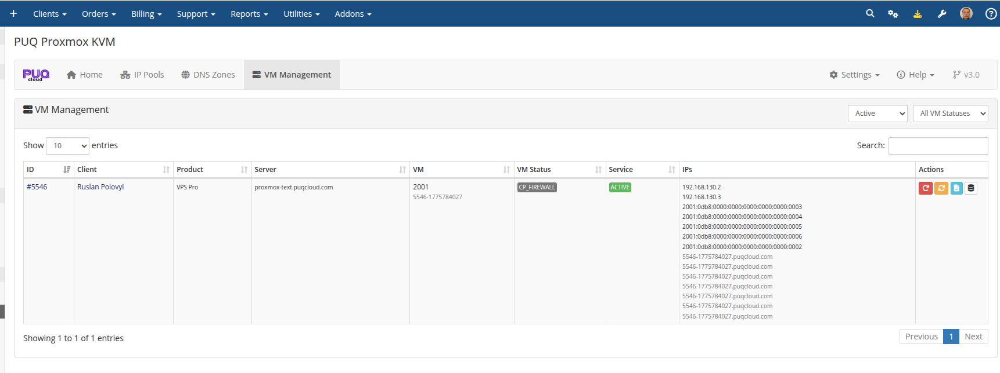
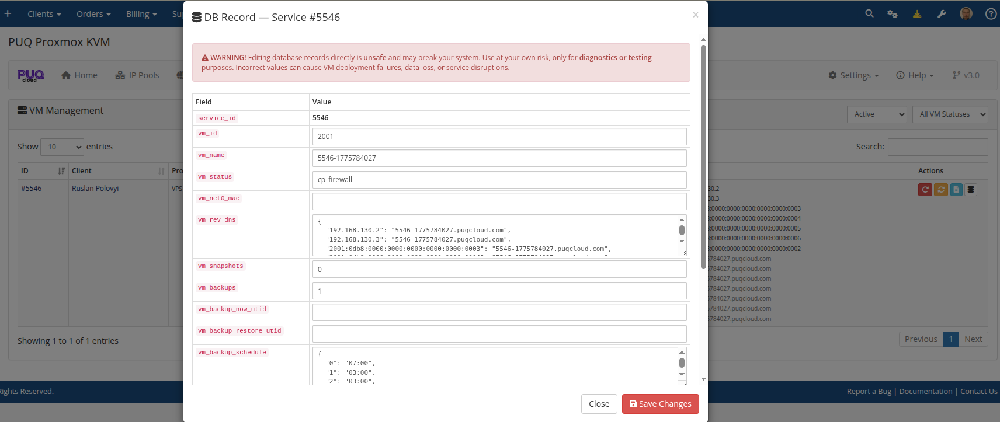

# VM Management

### Proxmox KVM module **[WHMCS](https://puqcloud.com/link.php?id=77)**
#####  [Order now](https://puqcloud.com/whmcs-module-proxmox-kvm.php) | [Download](https://download.puqcloud.com/WHMCS/servers/PUQ_WHMCS-Proxmox-KVM/) | [FAQ](https://faq.puqcloud.com/)

The VM Management page provides a centralized view of all KVM virtual machines across all servers with their current status, assigned IPs, and administrative actions.

## VM List

Navigate to **Addons > PUQ Proxmox KVM > VM Management**.

The table shows:

| Column | Description |
|--------|-------------|
| **ID** | WHMCS service ID |
| **Client** | Client name (link to client profile) |
| **Product** | Product/service name |
| **Server** | Proxmox server name |
| **VM** | VM ID and hostname |
| **VM Status** | Current deployment status (ready, deploying, change_package, etc.) |
| **Service Status** | WHMCS service status (Active, Suspended, etc.) |
| **IPs** | All assigned IPv4/IPv6 addresses with reverse DNS |
| **Actions** | Retry Deploy, Reset Status, View Log |

## Deploy Log

Click **View Log** on any VM to see the detailed deployment and action history.

The log modal shows:

- **Current Status** — current VM status
- **Last Action** — most recent operation (deploy, change_package, etc.) with step-by-step breakdown
- **Deploy History** — chronological list of all deployment runs with timestamps, step counts, and results

Each step shows:
- Step name and human-readable label
- Status before and after the step
- Result (success or error message)
- Duration in seconds
- Timestamp

## DB Record Editor

For advanced troubleshooting, click **DB Record** to view and edit the raw database record.

> **Warning:** Direct database editing should only be used for troubleshooting. Incorrect values may cause deployment failures or data loss.

## Administrative Actions

| Action | Description |
|--------|-------------|
| **Retry Deploy** | Restart the deployment process from the current step |
| **Reset Status** | Reset VM status to `ready` (use when stuck in an intermediate state) |
| **View Log** | Open the deployment and action log modal |
