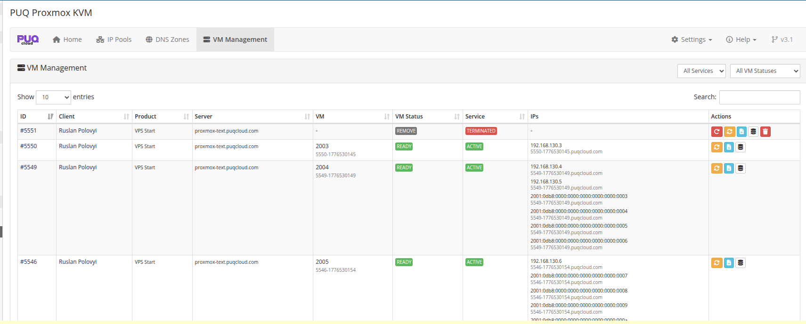

# VM Management

### Proxmox KVM module **[WHMCS](https://puqcloud.com/link.php?id=77)**
#####  [Order now](https://puqcloud.com/whmcs-module-proxmox-kvm.php) | [Download](https://download.puqcloud.com/WHMCS/servers/PUQ_WHMCS-Proxmox-KVM/) | [FAQ](https://faq.puqcloud.com/)

The VM Management page provides a centralized view of every KVM virtual machine across every Proxmox server — their current status, assigned IPs with reverse DNS, deployment history, and per-VM admin actions.

## VM list

Navigate to **Addons → PUQ Proxmox KVM → VM Management**.



The list is server-side-paginated with search and sorting. Two dropdown filters above the table narrow the view by WHMCS service status and by VM state; both remember your last choice in the browser, so the list opens the way you left it next time.

### Columns

| Column | Description |
|---|---|
| **ID** | WHMCS service ID (click for client services page). |
| **Client** | Client name with a link to the client profile. |
| **Product** | Product / plan name. |
| **Server** | Proxmox server name. |
| **VM** | Proxmox VM ID and internal VM name. |
| **VM Status** | Module lifecycle status — see [status reference](#vm-status-reference) below. |
| **Service** | WHMCS service status: Active, Suspended, Terminated, Cancelled, Pending. |
| **IPs** | Every assigned IPv4 / IPv6 address paired with its current reverse DNS name on the line below. |
| **Actions** | Per-VM admin buttons: Redeploy, Reset, Log, DB Record, (Delete Record when applicable). |

### IPs column — IPs with rDNS

Starting with v3.2, each IP is shown together with its rDNS on a second, smaller line:

```
192.168.130.2
  5546-1776530141.puqcloud.com

2001:0db8:0000:0000:0000:0000:0000:0007
  5546-1776530141.puqcloud.com
```

Visual grouping makes it easy to scan. IPs without a rDNS entry simply don't have the second line.

## Administrative actions

| Button | Visible when | What it does |
|---|---|---|
| **Redeploy** (red, circular-arrow) | `vm_status != ready` | Destroys the VM on Proxmox, clears IPs, resets logs, sets state back to `creation` — the full deploy pipeline runs from scratch on the next cron tick. **Destructive.** |
| **Reset** (yellow, sync) | always | Opens the Reset VM Status modal — switch the VM to any of the re-runnable states. See below. |
| **Log** (blue, file) | always | Opens the VM Log modal with per-run and per-step history. |
| **DB Record** (grey, database) | always | Opens the raw `puqProxmoxKVM_vm_info` row for inspection and manual editing. Last-resort troubleshooting tool. |
| **Delete Record** (red, trash) | `vm_status in (error_terminate, remove)` | Removes the row from `puqProxmoxKVM_vm_info`. Does **not** touch Proxmox or `tblhosting`. Confirmation dialog warns explicitly. |

## Reset VM Status

The Reset modal lets you switch a VM to any of the re-runnable states. An embedded reference table explains when each one is appropriate:

| Status | Use case |
|---|---|
| `ready` | Return the VM to the normal "everything is fine" state. Use after you've finished a manual fix and want cron to stop touching it. |
| `creation` | Retry deploy from the beginning — typically after fixing the underlying reason an earlier deploy failed. |
| `set_ip` | Retry only the IP allocation step. |
| `change_package` | Rerun the full package-change flow. |
| `set_dns_records` | Queue a full DNS resync (delete + recreate all records). Fast and safe. |
| `terminate` | Retry termination after an `error_terminate`. |
| `remove` | Force-mark the VM as removed (no Proxmox contact). Use only when the VM is already gone from Proxmox and you just need WHMCS to stop showing it as active. |

## VM Log modal

The Log modal shows every pipeline run — deploy, change package, set DNS records, terminate — with per-step duration, result, and any errors. The most recent 50 runs are kept.


When the last run failed, a red banner at the top shows the failing action and error message. Each step row shows:

- Step label (human-readable).
- State transition (e.g., `set_ip → clone`).
- Result: `success` / `waiting` / `error: …`.
- Duration in seconds.
- Timestamp.

Skipped steps in change package (see [Change Package](../07-cron-and-automation/02-change-package.md)) show `skip (no change)` and contribute zero duration.

## VM status reference

| Status | Meaning | Cron behavior |
|---|---|---|
| `creation`, `set_ip`, `clone`, `set_dns`, `migrated`, `set_cpu_ram`, `set_system_disk_size`, `set_system_disk_bandwidth`, `set_created_additional_disk`, `set_additional_disk_size`, `set_additional_disk_bandwidth`, `set_network`, `set_firewall`, `set_cloudinit`, `starting` | Deploy pipeline in progress at the named step. | Cron executes the next step each tick. |
| `ready` | VM is live and the client has access. | Cron ignores. |
| `change_package`, `cp_update_ip`, `cp_stop`, `cp_cpu_ram`, `cp_system_disk_size`, `cp_system_disk_bandwidth`, `cp_additional_disk`, `cp_additional_disk_size`, `cp_additional_disk_bandwidth`, `cp_network`, `cp_firewall`, `cp_start` | Change-package pipeline in progress. | Cron executes the next step each tick. |
| `reinstall` | Reinstall requested; needs the existing VM removed before reverting to `set_ip`. | Cron converts to `set_ip` after removing the old VM. |
| `set_dns_records` | Queued DNS resync. | Cron does a full delete+create cycle then returns to `ready`. |
| `terminate` | Termination queued. | Cron performs stop → backups → DNS → DELETE → cleanup. |
| `error_terminate` | Terminate failed. **Admin action required.** | Cron skips. Fix the cause and reset to `terminate` or `remove`. |
| `remove` | VM has been cleaned up. | Cron skips. Optionally use **Delete Record** to remove the row. |

## Watching an async action in VM Management

After clicking a long-running action (Terminate, Set DNS records), the VM row reflects the current state badge in real time. You can watch status changes by refreshing the page or by tracking the cron standalone output:


Once the cron finishes, the row appears with the final state — `remove` on success, `error_terminate` on failure:


## DB Record editor

For advanced troubleshooting, click **DB Record** to view and edit the raw `puqProxmoxKVM_vm_info` row:


> **Warning:** Direct database editing bypasses every safeguard in the state machine. Incorrect values cause deployment failures, incorrect IP accounting, or data loss. Use only when you know exactly what you're doing and the usual Reset / Redeploy actions cannot help.

## Related reading

- [Deploy Process](../07-cron-and-automation/01-deploy-process.md) — deploy state machine driving `creation → … → ready`.
- [Change Package](../07-cron-and-automation/02-change-package.md) — the `change_package → … → ready` flow.
- [Terminate Process](../07-cron-and-automation/03-terminate-process.md) — async terminate, `error_terminate` path and recovery.
- [DNS Zones & Integration](03-dns-zones.md) — what runs when you click Set DNS records or when `set_dns_records` is queued.
