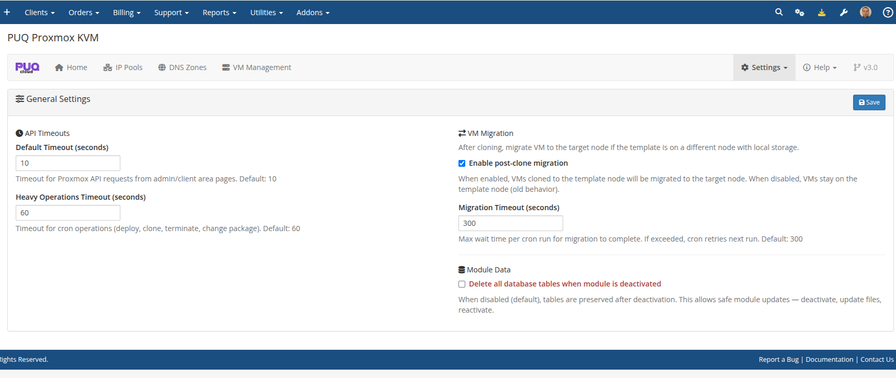

# Settings

### Proxmox KVM module **[WHMCS](https://puqcloud.com/link.php?id=77)**
#####  [Order now](https://puqcloud.com/whmcs-module-proxmox-kvm.php) | [Download](https://download.puqcloud.com/WHMCS/servers/PUQ_WHMCS-Proxmox-KVM/) | [FAQ](https://faq.puqcloud.com/)

The Settings section is divided into two pages: **General** and **Cron**.

---

## General Settings

Navigate to **Addons > PUQ Proxmox KVM > Settings > General**.



### API Timeouts

| Setting | Default | Range | Description |
|---------|---------|-------|-------------|
| **Default Timeout** | 10s | 1–300 | Timeout for Proxmox API requests from admin/client area pages |
| **Heavy Operations Timeout** | 60s | 1–600 | Timeout for cron operations (deploy, clone, terminate, change package) |

### VM Migration

| Setting | Default | Description |
|---------|---------|-------------|
| **Enable post-clone migration** | Yes | When enabled, VMs cloned to the template node will be automatically migrated to the target node with the correct storage |
| **Migration Timeout** | 300s | Maximum wait time per cron run for migration to complete. If exceeded, cron retries on next run |

### Module Data

| Setting | Default | Description |
|---------|---------|-------------|
| **Delete all database tables** | No | When enabled, all module database tables are dropped on addon deactivation. When disabled (default), tables are preserved for safe updates |

---

## Cron Settings

Navigate to **Addons > PUQ Proxmox KVM > Settings > Cron**.

### WHMCS Hook Mode


In this mode, cron tasks run automatically as part of the WHMCS system cron. No additional configuration is needed.

### Standalone Mode


In standalone mode, you run the cron file directly via system crontab:

```bash
* * * * * php /path/to/whmcs/modules/addons/puq_proxmox_kvm/cron.php
```

### Cron Tasks

| Task | Default Interval | Description |
|------|-----------------|-------------|
| **Process Virtual Machines** | 1 min | Deploys new VMs, processes change_package, refreshes DNS |
| **Remove Old Snapshots** | 5 min | Deletes snapshots past their configured lifetime |
| **Restore Backup Status** | 1 min | Checks completion of backup restore operations |
| **Now Backup Status** | 1 min | Checks completion of manual backup operations |
| **Schedule Backup** | 5 min | Runs scheduled automatic backups |
| **Collecting Statistics** | 60 min | Collects network usage metrics for billing |

- Set interval to **0** to disable a task
- **Lock Timeout** — maximum time a cron lock is held before considered stale (default: 600s)

### CLI Tools


The standalone cron file supports command-line arguments:

```bash
# Run all tasks
php cron.php

# Run specific task
php cron.php --task=processVirtualMachines

# Force run (ignore intervals)
php cron.php --force

# List tasks and their status
php cron.php --list

# Show help
php cron.php --help
```
