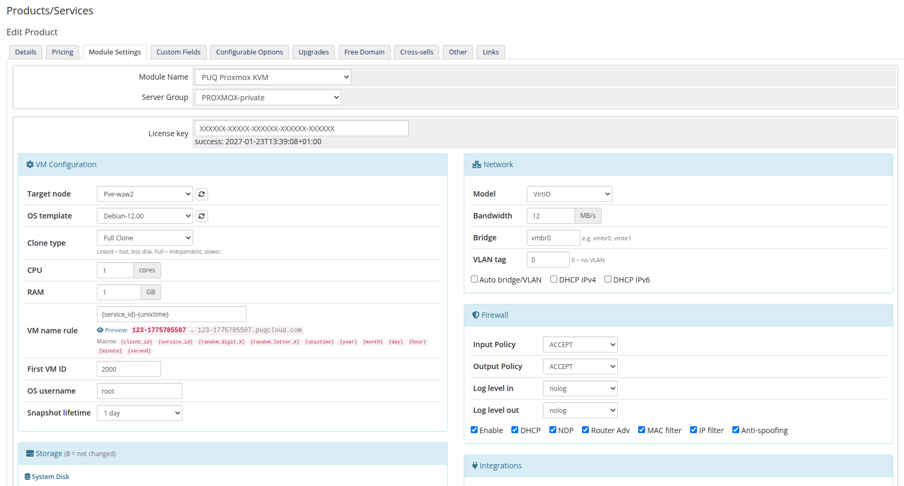
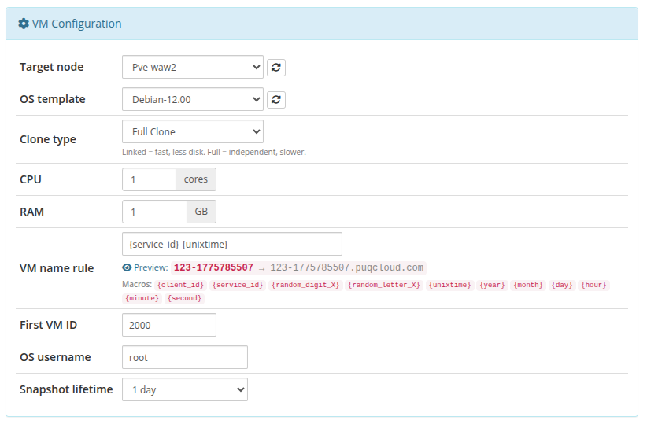
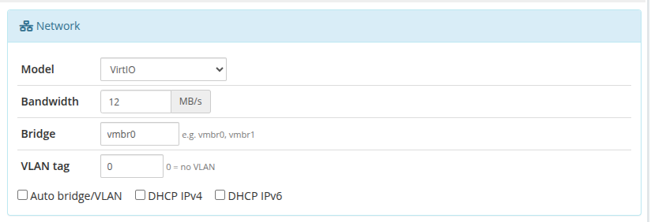
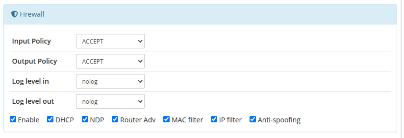
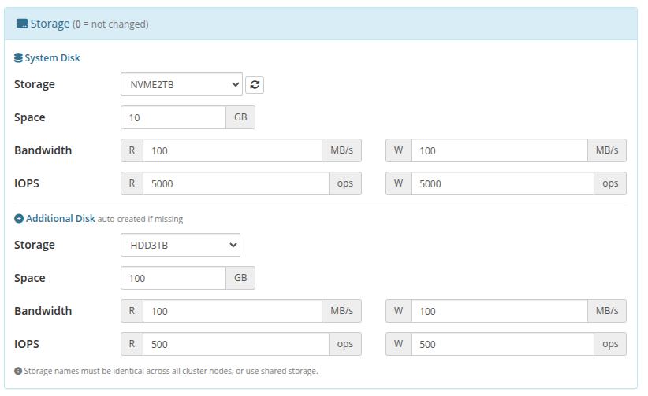
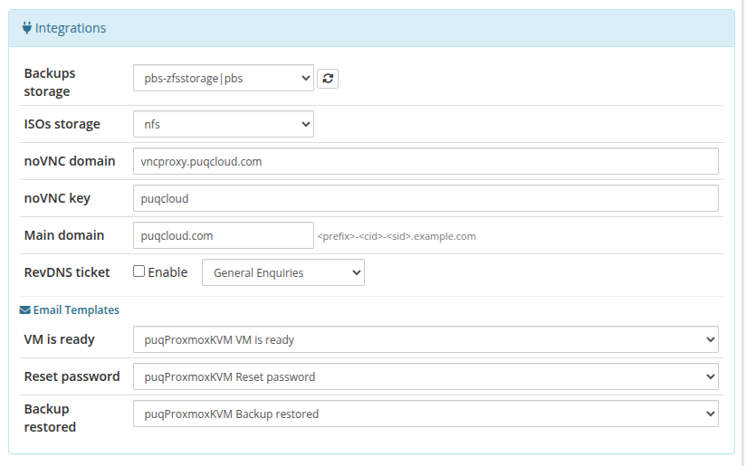
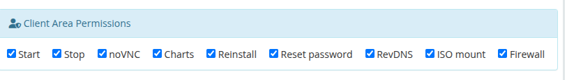
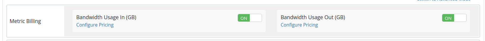

# Product Configuration

### Proxmox KVM module **[WHMCS](https://puqcloud.com/link.php?id=77)**
#####  [Order now](https://puqcloud.com/whmcs-module-proxmox-kvm.php) | [Download](https://download.puqcloud.com/WHMCS/servers/PUQ_WHMCS-Proxmox-KVM/) | [FAQ](https://faq.puqcloud.com/)

The product configuration page defines all default settings for virtual machines provisioned under a given WHMCS product. These settings are accessible by navigating to **Setup > Products/Services > Products/Services**, selecting a product, and opening the **Module Settings** tab with **PUQ ProxmoxKVM** selected as the module.

The module injects a custom settings panel directly below the standard WHMCS module options. All settings are organized into collapsible sections arranged in a two-column layout.

> **Changed in v3.0.** The product configuration page has been fully rewritten as a custom Bootstrap panel injected into the Module Settings tab. In v1.x–v2.x the same options were stored in the stock WHMCS `configoption1..N` fields and displayed as plain textareas — all existing values are preserved during upgrade and migrated to the new panel automatically. The **Firewall** section and the **Anti-spoofing** checkbox, which previously lived inside the Network block, are now a dedicated collapsible section of their own.

---

## License Key

The first field in the standard WHMCS module settings area is the **License key**. Enter your PUQ ProxmoxKVM license key here. The module validates the license on each page load and displays a verification badge next to the field.

---

## VM Configuration

This section controls the core virtual machine parameters applied during provisioning.

| Setting | Description | Default |
|---------|-------------|---------|
| **Target node** | Proxmox node where VMs will be created. Select a specific node from the dropdown or leave as **automatically** to let the module choose the node with the most available resources. The dropdown is populated via AJAX from the connected Proxmox server; click the refresh button to reload the list. | `automatically` |
| **OS template** | The default operating system template used for cloning new VMs. Templates are loaded from Proxmox via AJAX. Click the refresh button to reload available templates. | (none) |
| **Clone type** | Determines how the VM is cloned from the template. **Linked Clone** is faster and uses less disk space by sharing the base disk with the template. **Full Clone** creates a completely independent copy but is slower and uses more storage. | `Linked Clone` |
| **CPU** | Number of virtual CPU cores assigned to the VM. | `1` |
| **RAM** | Amount of memory in gigabytes assigned to the VM. | `1` |
| **VM name rule** | A naming pattern for the VM hostname. Supports macros that are expanded at provisioning time. Leave empty to use the default pattern. A live preview is shown below the field. | `{client_id}-{service_id}` |
| **First VM ID** | The starting VM ID number. The module assigns VM IDs sequentially from this value, skipping any IDs already in use on the Proxmox cluster. | `100` |
| **OS username** | The default operating system username set via cloud-init. Leave empty to generate a random username. | (empty = random) |
| **Snapshot lifetime** | Automatic cleanup period for client-created snapshots. The cron job removes snapshots older than the selected duration. Set to **Don't remove** to keep snapshots indefinitely. | `Don't remove` |

### VM Name Rule Macros

The following macros can be used in the **VM name rule** field:

| Macro | Description | Example |
|-------|-------------|---------|
| `{client_id}` | WHMCS client ID | `142` |
| `{service_id}` | WHMCS service/hosting ID | `387` |
| `{random_digit_X}` | Random digits (X = count) | `{random_digit_4}` = `7291` |
| `{random_letter_X}` | Random lowercase letters (X = count) | `{random_letter_3}` = `kqz` |
| `{unixtime}` | Current Unix timestamp | `1712678400` |
| `{year}` | Current 4-digit year | `2026` |
| `{month}` | Current 2-digit month | `04` |
| `{day}` | Current 2-digit day | `09` |
| `{hour}` | Current 2-digit hour | `14` |
| `{minute}` | Current 2-digit minute | `35` |
| `{second}` | Current 2-digit second | `07` |

### Snapshot Lifetime Options

| Value | Duration |
|-------|----------|
| Don't remove | Snapshots kept indefinitely |
| 1 day | 86,400 seconds |
| 2 days | 172,800 seconds |
| 3 days | 259,200 seconds |
| 4 days | 345,600 seconds |
| 5 days | 432,000 seconds |
| 6 days | 518,400 seconds |
| 7 days | 604,800 seconds |
| 8 days | 691,200 seconds |
| 9 days | 777,600 seconds |
| 10 days | 864,000 seconds |

---

## Network

This section configures the virtual network adapter and IP addressing behavior for provisioned VMs.

| Setting | Description | Default |
|---------|-------------|---------|
| **Model** | The virtual network adapter model. **As in template** preserves the model defined in the Proxmox template. Other options: **VirtIO** (recommended for Linux), **Intel E1000**, **Realtek RTL8139**, **VMware vmxnet3**. | `As in template` |
| **Bandwidth** | Maximum network bandwidth limit in MB/s. Set to **0** for unlimited bandwidth. | `0` (unlimited) |
| **Bridge** | The Proxmox network bridge to attach the VM's network adapter to (e.g., `vmbr0`, `vmbr1`). | `vmbr0` |
| **VLAN tag** | VLAN tag for the network adapter. Set to **0** for no VLAN tagging. Valid range: 0-4096. | `0` |
| **Auto bridge/VLAN** | When enabled, the bridge and VLAN are automatically determined from the IP Pool configuration in the addon module, overriding the manual Bridge and VLAN settings above. | `on` |
| **DHCP IPv4** | Enable DHCP for IPv4 addressing in cloud-init configuration. | `on` |
| **DHCP IPv6** | Enable DHCP for IPv6 addressing in cloud-init configuration. | `on` |

> **Note:** When **Auto bridge/VLAN** is enabled and the addon module's IP Pools are configured, the pool's bridge and VLAN values take precedence over the manually entered Bridge and VLAN fields.

> **DHCP caveat.** When either DHCP IPv4 or DHCP IPv6 is enabled, the module does **not** know the VM's final IP address at provisioning time. In that case no firewall rules and no anti-spoofing IPSet are applied to the VM's interface (they would be meaningless without a known IP). If you want the firewall feature, either use static IPs with the IP pool, or configure the rules manually after the DHCP lease has been issued.

---

## Firewall

This section defines the default Proxmox firewall configuration applied to each provisioned VM's network interface.

### Policy and Logging

| Setting | Description | Default |
|---------|-------------|---------|
| **Input Policy** | Default policy for incoming traffic. Options: **ACCEPT**, **DROP**, **REJECT**. | `ACCEPT` |
| **Output Policy** | Default policy for outgoing traffic. Options: **ACCEPT**, **DROP**, **REJECT**. | `ACCEPT` |
| **Log level in** | Logging level for incoming traffic. Options: **nolog**, **info**, **notice**, **warning**. | `nolog` |
| **Log level out** | Logging level for outgoing traffic. Options: **nolog**, **info**, **notice**, **warning**. | `nolog` |

### Firewall Toggles

| Setting | Description | Default |
|---------|-------------|---------|
| **Enable** | Enable the Proxmox firewall on the VM's network interface. | `on` |
| **DHCP** | Allow DHCP traffic through the firewall. | `on` |
| **NDP** | Allow Neighbor Discovery Protocol (IPv6) traffic. | `on` |
| **Router Adv** | Allow Router Advertisement packets. Typically disabled for client VMs. | `off` |
| **MAC filter** | Enable MAC address filtering on the network interface. | `on` |
| **IP filter** | Enable IP address filtering, restricting traffic to assigned IPs only. | `off` |
| **Anti-spoofing** | Enable anti-spoofing rules to prevent the VM from sending traffic with forged source addresses. | `on` |

> **Anti-spoofing requires a deny-by-default policy on the cluster.** For the anti-spoofing IPSet (`ipfilter-net0`) to actually protect against spoofed traffic, the **cluster / node firewall policy must be DENY/DENY** — the module then only adds permissive rules matching the VM's own IP addresses. Without a DENY baseline, the permissive rules change nothing and the feature has no effect. The filter was renamed from the legacy `wm-VMID` to `ipfilter-net0` in v2.3; v3.0 uses the same naming.

---

## Storage

This section configures the system (boot) disk and optional additional (secondary) disk for provisioned VMs. A value of **0** means "not changed" — the template's default is preserved.

### System Disk

| Setting | Description | Default |
|---------|-------------|---------|
| **Storage** | Proxmox storage pool for the system disk. Select a specific storage or leave as **auto (from template)** to use the same storage as the template. The dropdown is populated via AJAX from the connected Proxmox server. | `auto (from template)` |
| **Space** | System disk size in GB. Set to **0** to keep the template's disk size. | `0` |
| **Bandwidth Read** | Maximum read throughput in MB/s. Set to **0** for unlimited. | `0` |
| **Bandwidth Write** | Maximum write throughput in MB/s. Set to **0** for unlimited. | `0` |
| **IOPS Read** | Maximum read I/O operations per second. Set to **0** for unlimited. | `0` |
| **IOPS Write** | Maximum write I/O operations per second. Set to **0** for unlimited. | `0` |

### Additional Disk

The additional disk is automatically created during provisioning if the space is set to a value greater than 0.

| Setting | Description | Default |
|---------|-------------|---------|
| **Storage** | Proxmox storage pool for the additional disk. Leave as **same as system disk** to use the system disk's storage. | `same as system disk` |
| **Space** | Additional disk size in GB. Set to **0** to skip additional disk creation. | `0` |
| **Bandwidth Read** | Maximum read throughput in MB/s. Set to **0** for unlimited. | `0` |
| **Bandwidth Write** | Maximum write throughput in MB/s. Set to **0** for unlimited. | `0` |
| **IOPS Read** | Maximum read I/O operations per second. Set to **0** for unlimited. | `0` |
| **IOPS Write** | Maximum write I/O operations per second. Set to **0** for unlimited. | `0` |

> **Important:** Storage names must be identical across all cluster nodes, or use shared storage. If the VM may be migrated between nodes, ensure the target storage exists on all nodes.

---

## Integrations

This section configures external integrations: backup/ISO storage locations, noVNC console proxy, domain naming, reverse DNS ticket creation, and email notification templates.

### Storage and Console

| Setting | Description | Default |
|---------|-------------|---------|
| **Backups storage** | Proxmox storage pool for VM backups. The dropdown lists all storages with backup content type. The value includes the storage name and plugin type (e.g., `local\|dir`). | (none) |
| **ISOs storage** | Proxmox storage pool where ISO images are stored for client ISO mount functionality. | (none) |
| **noVNC domain** | Domain name of the noVNC proxy server used for browser-based console access. | `vncproxy.puqcloud.com` |
| **noVNC key** | Authentication key for the noVNC proxy server. | `puqcloud` |

### Domain and DNS

| Setting | Description | Default |
|---------|-------------|---------|
| **Main domain** | The base domain suffix used for VM hostname generation. The full hostname is constructed as `<prefix>-<client_id>-<service_id><main_domain>`. | `.example.com` |
| **RevDNS ticket** | When enabled, a support ticket is automatically created when a client requests a reverse DNS change (if no DNS zone automation is configured). Select the support department for these tickets from the dropdown. | `on` |

### Email Templates

These dropdowns list all WHMCS product-type email templates. Select the template to be sent for each event, or choose **None** to disable the notification.

| Setting | Description | Default Template |
|---------|-------------|-----------------|
| **VM is ready** | Sent when VM provisioning completes successfully. Contains VM credentials and connection details. | `puqProxmoxKVM VM is ready` |
| **Reset password** | Sent when a client resets the VM's OS password. Contains the new credentials. | `puqProxmoxKVM Reset password` |
| **Backup restored** | Sent when a backup restore operation completes. | `puqProxmoxKVM Backup restored` |

---

## Client Area Permissions

This section controls which features are visible and accessible to clients in their service management area. Each toggle enables or disables a specific client area function.

| Permission | Description | Default |
|------------|-------------|---------|
| **Start** | Allow clients to power on their VM. | `on` |
| **Stop** | Allow clients to power off their VM. | `on` |
| **noVNC** | Allow clients to open a browser-based console session. | `on` |
| **Charts** | Allow clients to view CPU, RAM, disk, and network performance charts. | `on` |
| **Reinstall** | Allow clients to reinstall the VM's operating system (destructive). | `on` |
| **Reset password** | Allow clients to reset the VM's OS password via cloud-init. | `on` |
| **RevDNS** | Allow clients to configure reverse DNS records for their IP addresses. | `on` |
| **ISO mount** | Allow clients to mount and unmount ISO images on their VM. | `on` |
| **Firewall** | Allow clients to manage their VM's Proxmox firewall rules. | `on` |

---

## Metric Billing

The module includes a built-in WHMCS Usage Billing (Metric) Provider that reports monthly bandwidth consumption per service. This integrates with WHMCS's standard metric billing system.

### Available Metrics

| Metric | Description | Unit | Period |
|--------|-------------|------|--------|
| **Bandwidth Usage In** | Total inbound network traffic | GB | Monthly |
| **Bandwidth Usage Out** | Total outbound network traffic | GB | Monthly |

To enable metric billing:

1. Navigate to **Setup > Products/Services > Products/Services** and edit the product
2. Open the **Metrics** tab
3. Enable the desired metrics and configure pricing

The module's cron job collects bandwidth statistics from Proxmox and stores them in the `puqProxmoxKVM_statistics` table. The metric provider aggregates this data for WHMCS's billing calculations.
