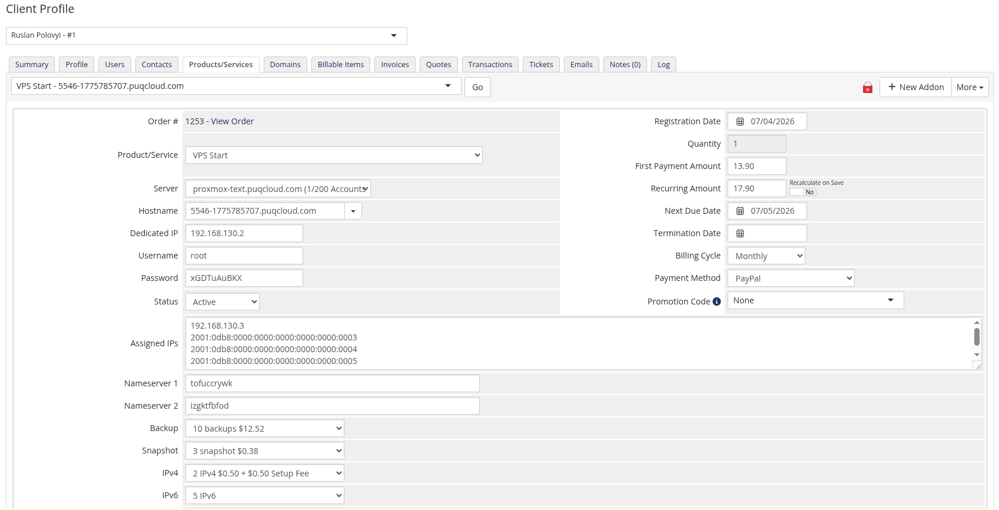
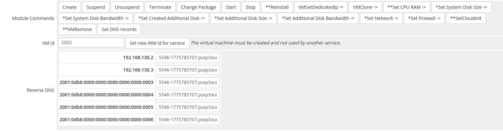
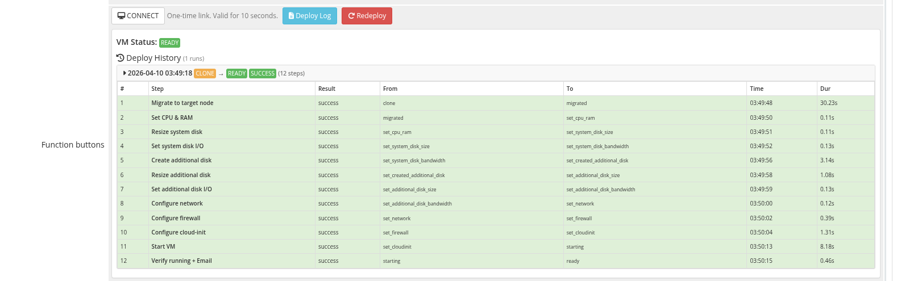
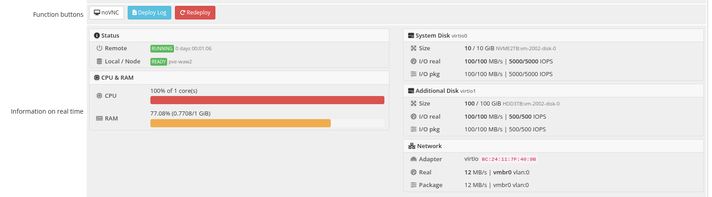
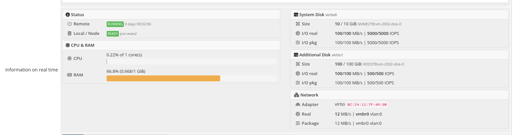
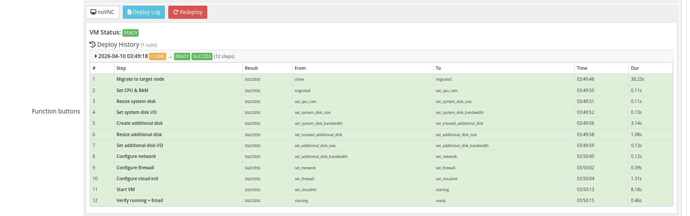
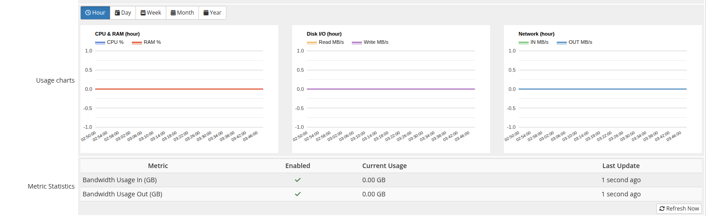
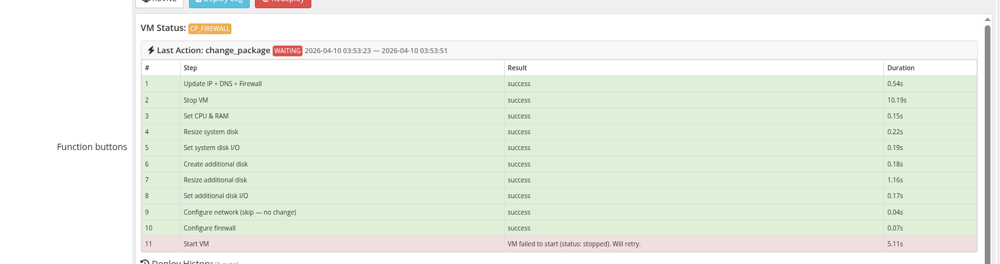
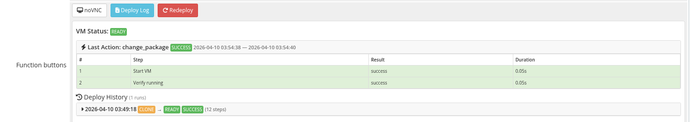

# Service Management

### Proxmox KVM module **[WHMCS](https://puqcloud.com/link.php?id=77)**
#####  [Order now](https://puqcloud.com/whmcs-module-proxmox-kvm.php) | [Download](https://download.puqcloud.com/WHMCS/servers/PUQ_WHMCS-Proxmox-KVM/) | [FAQ](https://faq.puqcloud.com/)

The service management page is the primary admin interface for an individual client's KVM service. It is accessed by navigating to **Clients > [Client Name] > Products/Services > [Service]** and viewing the module's custom tab fields.

The page provides real-time VM status monitoring, resource usage visualization, deploy logging, console access, performance charts, and direct module command execution.

---

## VM ID and Reverse DNS

At the top of the service tab, the module displays:

- **VM ID** — the Proxmox VM identifier, with a verification status indicator confirming whether the VM exists on the cluster
- **Reverse DNS** — a table listing all assigned IP addresses with editable reverse DNS fields; changes are saved when the admin clicks the WHMCS **Save Changes** button

## API Connection Status

The module checks connectivity to the Proxmox API on each page load. A green **API answer OK** box confirms successful communication. If the connection fails, a red error box is shown with the error details, and real-time features are disabled.

---

## Function Buttons

Below the connection status, a toolbar provides quick-action buttons:

| Button | Description |
|--------|-------------|
| **noVNC** | Generates a one-time noVNC console URL. The link is valid for 10 seconds. After expiration, click again to generate a new link. |
| **Deploy Log** | Toggles the deploy log panel (see below). |
| **Redeploy** | Deletes the existing VM on Proxmox, clears IP assignments, and starts a fresh provisioning cycle. Requires confirmation. |

### noVNC Console

Clicking **noVNC** sends an AJAX request to the module, which obtains a VNC ticket from Proxmox and constructs a proxy URL. The link opens in a new 800x600 browser window. The URL is single-use and expires after 10 seconds for security.

---

## Module Commands

The module registers a set of administrative command buttons in the WHMCS **Module Commands** section of the service page.

| Command | Description | Notes |
|---------|-------------|-------|
| **Start** | Power on the VM | — |
| **Stop** | Power off the VM | — |
| **Reinstall** | Wipe the VM and reinstall the OS from the template | Destructive; requires confirmation |
| **VMSetDedicatedIp** | Assign or reassign dedicated IP addresses from the pool | — |
| **VMClone** | Clone the VM to a new VM ID | — |
| **Set CPU RAM** | Update CPU core count and RAM size | Requires VM stop for certain changes |
| **Set System Disk Size** | Resize the boot disk | One-way: can only increase |
| **Set System Disk Bandwidth** | Update read/write throughput and IOPS limits on the system disk | — |
| **Set Created Additional Disk** | Create a secondary disk if one does not exist | — |
| **Set Additional Disk Size** | Resize the secondary disk | One-way: can only increase |
| **Set Additional Disk Bandwidth** | Update read/write throughput and IOPS limits on the additional disk | — |
| **Set Network** | Update network bridge, VLAN, bandwidth, and adapter model | — |
| **Set Firewall** | Apply firewall configuration from product settings to the VM | — |
| **SetCloudinit** | Reapply cloud-init configuration (hostname, user, SSH keys, network) | Destructive; overwrites current cloud-init |
| **VMRemove** | Delete the VM from Proxmox | Destructive; requires confirmation |
| **Set DNS records** | Synchronize forward and reverse DNS records based on current IP assignments | — |

> **Legend of the button prefixes:**
>
> - `*` — the function can run while the VM is **running**
> - `**` — the function can only run when the VM is **stopped**
> - `->` — the function participates in the automatic creation/reinstall pipeline and points to the next step in the state machine
>
> These markers match the ones PUQcloud has used since v1.0 — they are shown inline next to each command button in WHMCS.

### Local status values

The module tracks each VM with an internal **local status** that controls which automation actions may run on the next cron tick. Knowing the status helps diagnose stuck deploys.

| Status | Meaning |
|--------|---------|
| `creation` | First status issued at the time of service creation. Indicates that the VM creation process should start on the next cron run. |
| `reinstall` | The VM is in the reinstall queue and will be redeployed from the selected template. |
| `clone` | The clone operation is in progress (or just finished) — the state machine is about to start post-clone configuration. |
| `migrated` | *(new in v3.0)* The VM has been successfully migrated to the target node after cloning. |
| `set_cpu_ram` | CPU cores and RAM have been configured successfully. |
| `set_system_disk_size` | System disk has been resized successfully. |
| `set_system_disk_bandwidth` | System disk I/O bandwidth limits have been applied. |
| `set_created_additional_disk` | Additional disk step finished (whether a disk was created or not — the step is skipped if the package has no additional disk). |
| `set_additional_disk_size` | Additional disk has been resized (or skipped). |
| `set_additional_disk_bandwidth` | Additional disk bandwidth limits have been applied (or skipped). |
| `set_network` | Network card configuration (bridge, VLAN, bandwidth, MAC) is complete. |
| `set_firewall` | Firewall options, policies and anti-spoofing IPSet have been configured. |
| `set_cloudinit` | Cloud-init has been rewritten with the target user/password/network. |
| `ready` | Terminal success state — the VM was created correctly and is ready to work. |
| `set_dns_records` | On the next cron tick, DNS records will be synchronized. |
| `change_package` | On the next cron tick, the module will start the `change_package` state machine to apply new package parameters. |
| `cp_*` | *(new in v3.0)* Intermediate states of the change-package state machine (`cp_update_ip`, `cp_stop`, `cp_cpu_ram`, `cp_system_disk_size`, `cp_system_disk_bandwidth`, `cp_additional_disk`, `cp_additional_disk_size`, `cp_additional_disk_bandwidth`, `cp_network`, `cp_firewall`, `cp_start`). Each state represents a single completed change-package step. On failure the state machine resumes from the last successful state. |

Alongside the local status the module tracks:

- **Remote status** — the status returned by the Proxmox API itself: `running` or `stopped`.
- **VM remote lock** — set by Proxmox while a long operation (like `clone` or `backup`) is in progress. While a lock is present the module pauses all other actions against that VM.

---

## Real-Time VM Information

The real-time information panel refreshes automatically every 5 seconds (with a 10-second initial load). It displays comprehensive VM status and resource usage in a two-column layout.

### Left Column: Status and Compute

**Status Section:**

| Field | Description |
|-------|-------------|
| **Remote** | Current VM power state on Proxmox (running/stopped), uptime, and lock status if any operation is in progress |
| **Local / Node** | The module's internal status tracking and the Proxmox node hosting the VM |

**CPU & RAM Section:**

| Field | Description |
|-------|-------------|
| **CPU** | Current CPU usage as a percentage of allocated cores, with a color-coded progress bar (green < 50%, yellow 50-80%, red > 80%) |
| **RAM** | Current memory usage in GiB and percentage, with a color-coded progress bar |

### Right Column: Storage and Network

**System Disk Section:**

| Field | Description |
|-------|-------------|
| **Size** | Current disk size vs. package-configured size, with the underlying file path |
| **I/O real** | Actual read/write throughput in MB/s and IOPS as currently measured |
| **I/O pkg** | Package-configured throughput and IOPS limits |

**Additional Disk Section** (shown only if an additional disk exists):

Same fields as the system disk section, displayed for the secondary disk.

**Network Section:**

| Field | Description |
|-------|-------------|
| **Adapter** | Network model and MAC address |
| **Real** | Actual bandwidth rate, bridge, and VLAN as configured on Proxmox |
| **Package** | Package-configured bandwidth limit, bridge, and VLAN |
| **ISO** | Currently mounted ISO image, if any |

---

## Deploy Log

The deploy log panel is toggled by clicking the **Deploy Log** button. It provides a complete history of all provisioning and administrative operations performed on the VM.

### Last Action

The top section shows the most recent operation:

| Field | Description |
|-------|-------------|
| **Action** | The operation name (e.g., `deploy`, `reinstall`, `change_package`) |
| **Result** | Success or failure badge |
| **Time range** | Start and finish timestamps |
| **Steps table** | Numbered list of individual steps with result status and duration in seconds |

### Deploy History

Below the last action, a chronological list of all deploy runs is displayed. Each entry shows:

- Start timestamp
- Status transition (before → after)
- Result badge (success/waiting/error)
- Error message, if applicable
- Expandable step detail table (click the header to toggle)

Each step in the detail table includes:

| Column | Description |
|--------|-------------|
| **#** | Step sequence number |
| **Step** | Operation name (e.g., `clone`, `set_ip`, `set_cpu_ram`, `set_firewall`) |
| **Result** | Success or failure |
| **From** | VM status before this step |
| **To** | VM status after this step |
| **Time** | Timestamp when the step executed |
| **Dur** | Duration in seconds |

---

## Usage Charts

The charts section displays CPU, memory, disk I/O, and network throughput graphs rendered using Google Charts. The data is fetched via AJAX from Proxmox's RRD statistics.

### Time Frame Selection

A button group allows selecting the chart time range:

| Button | Period |
|--------|--------|
| **Hour** | Last 60 minutes (default on page load) |
| **Day** | Last 24 hours |
| **Week** | Last 7 days |
| **Month** | Last 30 days |
| **Year** | Last 365 days |

### Chart Types

Three area charts are displayed side by side:

| Chart | Series | Description |
|-------|--------|-------------|
| **CPU & RAM** | CPU %, RAM % | Processor and memory utilization over time |
| **Disk I/O** | Read MB/s, Write MB/s | Storage throughput |
| **Network** | IN MB/s, OUT MB/s | Network interface throughput |

---

## Change Package

When a service's product/package is changed (upgrade or downgrade), the module executes a multi-step reconfiguration process. The admin can monitor progress through the deploy log.

The change package operation follows this sequence:

1. Update IP addresses (if pool/network changed)
2. Stop the VM
3. Set CPU and RAM to new values
4. Resize system disk
5. Update system disk bandwidth limits
6. Create or resize additional disk
7. Update additional disk bandwidth limits
8. Reconfigure network adapter
9. Reapply firewall rules
10. Start the VM

Each step is logged individually in the deploy log. If any step fails, the process halts and the error is recorded. The admin can review the failure in the deploy log and either fix the issue manually or use the **Redeploy** button to start fresh.
