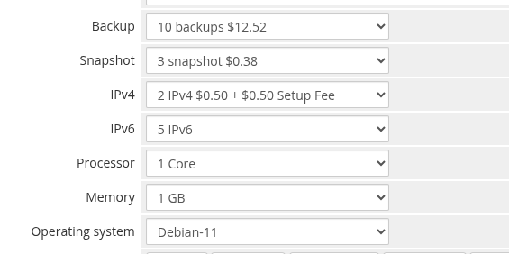

# Configurable Options

### Proxmox KVM module **[WHMCS](https://puqcloud.com/link.php?id=77)**
#####  [Order now](https://puqcloud.com/whmcs-module-proxmox-kvm.php) | [Download](https://download.puqcloud.com/WHMCS/servers/PUQ_WHMCS-Proxmox-KVM/) | [FAQ](https://faq.puqcloud.com/)

WHMCS Configurable Options allow clients to customize their virtual machine resources at order time and during upgrades. The PUQ Proxmox KVM module reads configurable option values and uses them to override the product's default settings during provisioning and change package operations.



---

## Overview

Configurable Options provide a way to offer multiple resource tiers within a single product. For example, you can create one "KVM VPS" product with configurable options for CPU, RAM, and disk, letting clients pick their desired configuration and pricing tier at checkout.

When a configurable option is set on an order, its value takes precedence over the corresponding product-level default configured in the Module Settings.

---

## Setup

1. Navigate to **Setup > Products/Services > Configurable Options**
2. Click **Create a New Group**
3. Name the group (e.g., "KVM VPS Options")
4. Add individual options as described below
5. Assign the group to your PUQ ProxmoxKVM product(s) using the **Assigned Products** tab

---

## Supported Configurable Options

The module recognizes the following configurable option names. The **Option Name** must match exactly (case-sensitive) for the module to detect and apply the value.

### Compute Resources

| Option Name | Type | Description | Example Values |
|-------------|------|-------------|----------------|
| **CPU Cores** | Dropdown | Number of virtual CPU cores | `1`, `2`, `4`, `8`, `16` |
| **RAM** | Dropdown | Memory size in GB | `1`, `2`, `4`, `8`, `16`, `32` |

### Storage

| Option Name | Type | Description | Example Values |
|-------------|------|-------------|----------------|
| **System Disk** | Dropdown | Boot disk size in GB | `10`, `20`, `40`, `80`, `160` |
| **Additional Disk** | Dropdown | Secondary disk size in GB (0 = no additional disk) | `0`, `10`, `20`, `50`, `100` |
| **System Disk Read Bandwidth** | Dropdown | System disk read throughput limit in MB/s | `0`, `50`, `100`, `200` |
| **System Disk Write Bandwidth** | Dropdown | System disk write throughput limit in MB/s | `0`, `50`, `100`, `200` |
| **System Disk Read IOPS** | Dropdown | System disk read IOPS limit | `0`, `500`, `1000`, `5000` |
| **System Disk Write IOPS** | Dropdown | System disk write IOPS limit | `0`, `500`, `1000`, `5000` |
| **Additional Disk Read Bandwidth** | Dropdown | Additional disk read throughput limit in MB/s | `0`, `50`, `100` |
| **Additional Disk Write Bandwidth** | Dropdown | Additional disk write throughput limit in MB/s | `0`, `50`, `100` |
| **Additional Disk Read IOPS** | Dropdown | Additional disk read IOPS limit | `0`, `500`, `1000` |
| **Additional Disk Write IOPS** | Dropdown | Additional disk write IOPS limit | `0`, `500`, `1000` |

### Network

| Option Name | Type | Description | Example Values |
|-------------|------|-------------|----------------|
| **Network Bandwidth** | Dropdown | Network bandwidth limit in MB/s (0 = unlimited) | `0`, `10`, `50`, `100`, `1000` |
| **IPv4 Addresses** | Dropdown | Number of IPv4 addresses to allocate from the pool | `1`, `2`, `4`, `8` |
| **IPv6 Addresses** | Dropdown | Number of IPv6 addresses to allocate from the pool | `0`, `1`, `4`, `16` |

### Operating System

| Option Name | Type | Description | Example Values |
|-------------|------|-------------|----------------|
| **Operating System** | Dropdown | OS template selection (Proxmox template VM ID) | Template IDs from Proxmox |

---

## Creating a Configurable Option

For each option:

1. Click **Add New Configurable Option** in your group
2. Set the **Option Name** to match one of the supported names above
3. Set the **Option Type** to **Dropdown**
4. Add sub-options with the format: `value|Display Name`

### Example: CPU Cores

```
Option Name: CPU Cores
Option Type: Dropdown

Sub-options:
1|1 Core
2|2 Cores
4|4 Cores
8|8 Cores
```

### Example: RAM

```
Option Name: RAM
Option Type: Dropdown

Sub-options:
1|1 GB
2|2 GB
4|4 GB
8|8 GB
16|16 GB
32|32 GB
```

### Example: System Disk

```
Option Name: System Disk
Option Type: Dropdown

Sub-options:
10|10 GB
20|20 GB
40|40 GB
80|80 GB
160|160 GB
```

### Example: Operating System

```
Option Name: Operating System
Option Type: Dropdown

Sub-options:
9001|Ubuntu 22.04 LTS
9002|Debian 12
9003|AlmaLinux 9
9004|Windows Server 2022
```

> **Note:** The sub-option values for **Operating System** must be the Proxmox template VM IDs. The display names can be human-readable OS names.

---

## Pricing

Each sub-option can have its own pricing configured per billing cycle. Navigate to the sub-option's pricing section to set monthly, quarterly, semi-annual, and annual prices.

For options where `0` means "not configured" or "unlimited" (such as Additional Disk = 0, Network Bandwidth = 0), you would typically set the price for the `0` sub-option to $0.00.

---

## Upgrade/Downgrade

When a client upgrades or downgrades their service through the WHMCS client area, the module automatically detects the changed configurable option values and triggers a **change package** operation. This operation updates the VM's resources on Proxmox to match the new configuration.

The change package process is logged step-by-step in the [Deploy Log](02-service-management.md#deploy-log) and can be monitored from the admin service management page.

---

## Priority Order

When determining the final value for a VM resource, the module follows this priority:

1. **Configurable Option value** (highest priority, if set and non-zero)
2. **Product Module Settings default** (used when no configurable option overrides it)

This means you can set conservative defaults in the product configuration and allow clients to customize resources upward through configurable options.

---

## Legacy prefix-based option names (v1.x–v2.x)

> **Still supported in v3.0.** In v1.x–v2.x, PUQ Proxmox KVM used a **prefix-based convention** for configurable option names where the prefix identified the option type and the display name was free text. If you upgraded from an older version, your existing configurable options continue to work without any changes — the module recognizes both the legacy prefix-based names and the v3.0 plain names.

The legacy convention uses an Option Name of the form `PREFIX|Display Name` (the text on the right of the `|` can be whatever you want — "My Backup Offer", "Sicherung", etc.) and sub-options of the form `value|Display Name`.

| Legacy Option Name | Sub-option format | Meaning |
|--------------------|-------------------|---------|
| `B\|Backup` | `<count>\|Name` | Number of allowed backups (0 disables backups for the service) |
| `S\|Snapshot` | `<count>\|Name` | Number of allowed snapshots (0 disables snapshots for the service) |
| `CPU\|Processor` | `<count>\|Name` | Number of CPU cores |
| `RAM\|Memory` | `<count>\|Name` | RAM in GB |
| `ipv4\|IPv4` | `<count>\|Name` | Number of IPv4 addresses to allocate |
| `ipv6\|IPv6` | `<count>\|Name` | Number of IPv6 addresses to allocate |
| `OS\|Operating system` | `<template_id>\|Name` | Proxmox template VM ID to clone from |

### Legacy example: Operating System

```
Option Name: OS|Operating system
Option Type: Dropdown

Sub-options:
1010|Debian-10.12
1011|Debian-11
1012|Debian-12
1021|Ubuntu-20.04
1022|Ubuntu-22.04
```

The sub-option values are the Proxmox template VMIDs (e.g. `1010` = a template VM in Proxmox with ID 1010 based on Debian 10). The module uses the number on the left of the `|` to call `qm clone`; the text on the right is shown to the admin/client in the order form.

### Legacy example: Backup

```
Option Name: B|Backup
Option Type: Dropdown

Sub-options:
0|No backups
3|3 backups
7|7 backups
14|14 backups
```

### Which format should I use?

- **New installations** — use the plain v3.0 names shown higher on this page (`CPU Cores`, `RAM`, `System Disk`, etc.).
- **Upgrades from v1.x/v2.x** — keep using your existing prefix-based names. They are still recognized and require no changes. Migrating them to the new names is optional and purely cosmetic.
- **Mixing both** — not recommended, but technically allowed. If both a legacy `CPU|Processor` and a new `CPU Cores` option are assigned to the same product, the plain v3.0 name wins.
