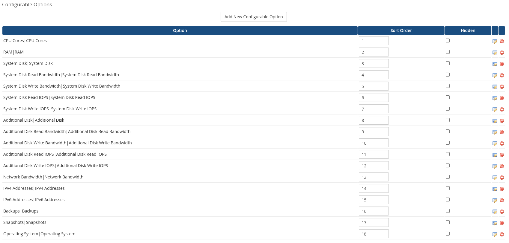
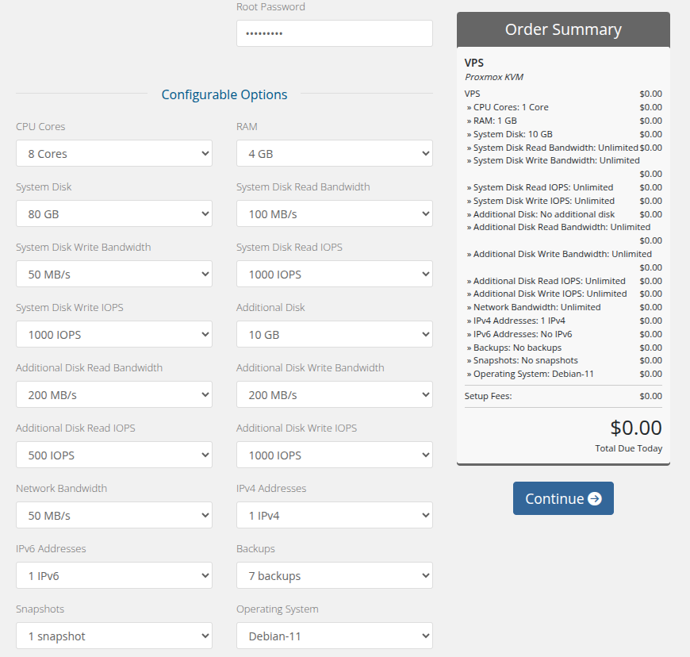
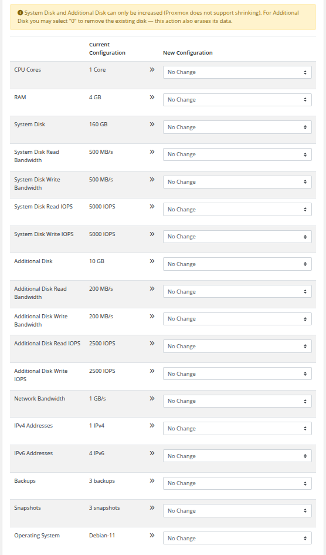

# Configurable Options

### Proxmox KVM module **[WHMCS](https://puqcloud.com/link.php?id=77)**
#####  [Order now](https://puqcloud.com/whmcs-module-proxmox-kvm.php) | [Download](https://download.puqcloud.com/WHMCS/servers/PUQ_WHMCS-Proxmox-KVM/) | [Community](https://community.puqcloud.com/)

WHMCS Configurable Options allow clients to customize their virtual machine resources at order time and during upgrades. The PUQ Proxmox KVM module reads configurable option values and uses them to override the product's default settings during provisioning and change package operations.

> **New in v3.3.** Eleven new options (every disk size / bandwidth / IOPS parameter plus Network Bandwidth) and clean plain-English names for the four previously prefix-only ones (`Backups`, `Snapshots`, `IPv4 Addresses`, `IPv6 Addresses`). Every overridable resource also has a default in Module Settings, so a product works without any Configurable Options at all.


*admin-configurable-options-list-v3.3.png*

The screenshot above shows all 18 supported options assigned to a single product. The next screenshot shows how a client sees them on the order form:


*client-order-configurable-options.png*

---

## Overview

Configurable Options provide a way to offer multiple resource tiers within a single product. For example, you can create one "KVM VPS" product with configurable options for CPU, RAM, and disk, letting clients pick their desired configuration and pricing tier at checkout.

When a configurable option is set on an order, its value takes precedence over the corresponding product-level default configured in the Module Settings.

---

## Setup

1. Navigate to **Setup > Products/Services > Configurable Options**
2. Click **Create a New Group**
3. Name the group (e.g., "KVM VPS Options")
4. Add individual options as described below
5. Assign the group to your PUQ ProxmoxKVM product(s) using the **Assigned Products** tab

---

## Supported Configurable Options

The module recognizes the following configurable option names. The **Option Name** must match exactly (case-sensitive) for the module to detect and apply the value.

### Compute Resources

| Option Name | Type | Description | Example Values |
|-------------|------|-------------|----------------|
| **CPU Cores** | Dropdown | Number of virtual CPU cores | `1`, `2`, `4`, `8`, `16` |
| **RAM** | Dropdown | Memory size in GB | `1`, `2`, `4`, `8`, `16`, `32` |

### Backups & Snapshots

| Option Name | Type | Description | Example Values |
|-------------|------|-------------|----------------|
| **Backups** | Dropdown | Maximum number of backups for the service (0 = backups disabled) | `0`, `3`, `7`, `14`, `30` |
| **Snapshots** | Dropdown | Maximum number of snapshots for the service (0 = snapshots disabled) | `0`, `1`, `3`, `5`, `10` |

### Storage

| Option Name | Type | Description | Example Values |
|-------------|------|-------------|----------------|
| **System Disk** | Dropdown | Boot disk size in GB | `10`, `20`, `40`, `80`, `160` |
| **Additional Disk** | Dropdown | Secondary disk size in GB (0 = no additional disk) | `0`, `10`, `20`, `50`, `100` |
| **System Disk Read Bandwidth** | Dropdown | System disk read throughput limit in MB/s | `0`, `50`, `100`, `200` |
| **System Disk Write Bandwidth** | Dropdown | System disk write throughput limit in MB/s | `0`, `50`, `100`, `200` |
| **System Disk Read IOPS** | Dropdown | System disk read IOPS limit | `0`, `500`, `1000`, `5000` |
| **System Disk Write IOPS** | Dropdown | System disk write IOPS limit | `0`, `500`, `1000`, `5000` |
| **Additional Disk Read Bandwidth** | Dropdown | Additional disk read throughput limit in MB/s | `0`, `50`, `100` |
| **Additional Disk Write Bandwidth** | Dropdown | Additional disk write throughput limit in MB/s | `0`, `50`, `100` |
| **Additional Disk Read IOPS** | Dropdown | Additional disk read IOPS limit | `0`, `500`, `1000` |
| **Additional Disk Write IOPS** | Dropdown | Additional disk write IOPS limit | `0`, `500`, `1000` |

### Network

| Option Name | Type | Description | Example Values |
|-------------|------|-------------|----------------|
| **Network Bandwidth** | Dropdown | Network bandwidth limit in MB/s (0 = unlimited) | `0`, `10`, `50`, `100`, `1000` |
| **IPv4 Addresses** | Dropdown | Number of IPv4 addresses to allocate from the pool | `1`, `2`, `4`, `8` |
| **IPv6 Addresses** | Dropdown | Number of IPv6 addresses to allocate from the pool | `0`, `1`, `4`, `16` |

### Operating System

| Option Name | Type | Description | Example Values |
|-------------|------|-------------|----------------|
| **Operating System** | Dropdown | OS template selection (Proxmox template VM ID) | Template IDs from Proxmox |

---

## Creating a Configurable Option

For each option:

1. Click **Add New Configurable Option** in your group
2. Set the **Option Name** to match one of the supported names above
3. Set the **Option Type** to **Dropdown**
4. Add sub-options with the format: `value|Display Name`

### Compute resources

#### Example: CPU Cores

```
Option Name: CPU Cores
Option Type: Dropdown

Sub-options:
1|1 Core
2|2 Cores
4|4 Cores
8|8 Cores
16|16 Cores
```

#### Example: RAM

```
Option Name: RAM
Option Type: Dropdown

Sub-options:
1|1 GB
2|2 GB
4|4 GB
8|8 GB
16|16 GB
32|32 GB
```

### Backups & Snapshots

#### Example: Backups

```
Option Name: Backups
Option Type: Dropdown

Sub-options:
0|No backups
3|3 backups
7|7 backups
14|14 backups
30|30 backups
```

#### Example: Snapshots

```
Option Name: Snapshots
Option Type: Dropdown

Sub-options:
0|No snapshots
1|1 snapshot
3|3 snapshots
5|5 snapshots
10|10 snapshots
```

### Storage — size

#### Example: System Disk

```
Option Name: System Disk
Option Type: Dropdown

Sub-options:
10|10 GB
20|20 GB
40|40 GB
80|80 GB
160|160 GB
```

#### Example: Additional Disk

```
Option Name: Additional Disk
Option Type: Dropdown

Sub-options:
0|No additional disk
10|10 GB
20|20 GB
50|50 GB
100|100 GB
500|500 GB
```

> **Note:** `0` means no additional disk required by the package. If a disk already exists on the VM, the module does not delete it — the existing disk is preserved.

### Storage — I/O limits

#### Example: System Disk Read Bandwidth

```
Option Name: System Disk Read Bandwidth
Option Type: Dropdown

Sub-options:
0|Unlimited
50|50 MB/s
100|100 MB/s
200|200 MB/s
500|500 MB/s
```

#### Example: System Disk Write Bandwidth

```
Option Name: System Disk Write Bandwidth
Option Type: Dropdown

Sub-options:
0|Unlimited
50|50 MB/s
100|100 MB/s
200|200 MB/s
500|500 MB/s
```

#### Example: System Disk Read IOPS

```
Option Name: System Disk Read IOPS
Option Type: Dropdown

Sub-options:
0|Unlimited
500|500 IOPS
1000|1000 IOPS
2500|2500 IOPS
5000|5000 IOPS
```

#### Example: System Disk Write IOPS

```
Option Name: System Disk Write IOPS
Option Type: Dropdown

Sub-options:
0|Unlimited
500|500 IOPS
1000|1000 IOPS
2500|2500 IOPS
5000|5000 IOPS
```

#### Example: Additional Disk Read Bandwidth

```
Option Name: Additional Disk Read Bandwidth
Option Type: Dropdown

Sub-options:
0|Unlimited
50|50 MB/s
100|100 MB/s
200|200 MB/s
```

#### Example: Additional Disk Write Bandwidth

```
Option Name: Additional Disk Write Bandwidth
Option Type: Dropdown

Sub-options:
0|Unlimited
50|50 MB/s
100|100 MB/s
200|200 MB/s
```

#### Example: Additional Disk Read IOPS

```
Option Name: Additional Disk Read IOPS
Option Type: Dropdown

Sub-options:
0|Unlimited
500|500 IOPS
1000|1000 IOPS
2500|2500 IOPS
```

#### Example: Additional Disk Write IOPS

```
Option Name: Additional Disk Write IOPS
Option Type: Dropdown

Sub-options:
0|Unlimited
500|500 IOPS
1000|1000 IOPS
2500|2500 IOPS
```

> **Note:** For bandwidth / IOPS options, `0` means **unlimited** — the value is omitted from the disk config string sent to Proxmox.

### Network

#### Example: Network Bandwidth

```
Option Name: Network Bandwidth
Option Type: Dropdown

Sub-options:
0|Unlimited
10|10 MB/s
50|50 MB/s
100|100 MB/s
500|500 MB/s
1000|1 GB/s
```

#### Example: IPv4 Addresses

```
Option Name: IPv4 Addresses
Option Type: Dropdown

Sub-options:
1|1 IPv4
2|2 IPv4
4|4 IPv4
8|8 IPv4
16|16 IPv4
```

#### Example: IPv6 Addresses

```
Option Name: IPv6 Addresses
Option Type: Dropdown

Sub-options:
0|No IPv6
1|1 IPv6
4|4 IPv6
16|16 IPv6
```

> **Note:** Setting either count to `0` means «no addresses of that family will be allocated from the IP pool for this service». Upgrades that lower the count automatically release the excess addresses back to the pool.

### Operating System

#### Example: Operating System

```
Option Name: Operating System
Option Type: Dropdown

Sub-options:
9001|Ubuntu 22.04 LTS
9002|Debian 12
9003|AlmaLinux 9
9004|Windows Server 2022
```

> **Note:** The sub-option values for **Operating System** must be the Proxmox template VM IDs. The display names can be human-readable OS names.

---

## Pricing

Each sub-option can have its own pricing configured per billing cycle. Navigate to the sub-option's pricing section to set monthly, quarterly, semi-annual, and annual prices.

For options where `0` means "not configured" or "unlimited" (such as Additional Disk = 0, Network Bandwidth = 0), you would typically set the price for the `0` sub-option to $0.00.

---

## Upgrade/Downgrade

When a client upgrades or downgrades their service through the WHMCS client area, the module automatically detects the changed configurable option values and triggers a **change package** operation. This operation updates the VM's resources on Proxmox to match the new configuration.

The change package process is logged step-by-step in the [Deploy Log](02-service-management.md#deploy-log) and can be monitored from the admin service management page.

---

## Disk size constraints

**System Disk and Additional Disk size can only be increased.** Proxmox does not support shrinking VM disks (it would risk corrupting/losing data), so any configurable option that would result in a smaller disk than the current size is rejected by the module.


*client-upgrade-configurable-options.png*

### How it is enforced

The module applies the constraint at three layers:

1. **Client-area upgrade page** — on `/clientarea.php?action=upgrade&type=configoptions`, sub-options whose value is smaller than the currently selected one are visually disabled in the System Disk / Additional Disk dropdowns and marked `(downgrade not allowed)`. A warning banner is shown above the form.
2. **Change-package state machine** — if a smaller value still reaches the backend (e.g. via direct admin edit), the `Resize system disk` / `Resize additional disk` step is skipped with status `skip — shrink not allowed by Proxmox`. The VM is **not** stopped, snapshots are **not** removed, and the step is logged via `logModuleCall` under the action name `system_disk_shrink_rejected` / `additional_disk_shrink_rejected`.
3. **Post-backup-restore re-apply** — when the module re-applies package configuration after a backup restore, a smaller package disk size is treated the same way: the resize is silently skipped, the existing larger disk is kept, and the rejection is logged.

### Resulting behaviour for clients

- A client picking a smaller System Disk / Additional Disk in an upgrade order cannot submit it — the option is disabled in the UI.
- If by some path a smaller value reaches the change-package operation, the **disk size stays unchanged**. All other configurable options in the same change-package operation (CPU, RAM, bandwidth, IOPS, IPv4/IPv6 count, etc.) are still applied normally.

### Additional Disk special cases

- `Additional Disk = 0` with no existing disk → no action.
- `Additional Disk = 0` with **existing disk** → the existing disk is **detached and deleted**. VM is stopped first, all snapshots are removed (Proxmox requires this for detach), the disk interface is removed from the VM config, and the disk file is purged from storage. **All data on the additional disk is lost.** Logged via `logModuleCall` under `additional_disk_deleted`.
- `Additional Disk` increased from `0` to `N` → new disk is created with size `N` GB.
- `Additional Disk` increased from `N` to `M > N` → disk is resized in place (no data loss).
- `Additional Disk` decreased while > 0 (e.g. from `50` to `20`) → treated as shrink, rejected, current size kept.

> **Note for clients:** The upgrade form shows a confirmation dialog before submitting an Additional Disk = `0` change. The sub-option is also labeled `(removes the existing disk — data will be lost)` in the dropdown to make the destructive effect visible.

> **Note for admins:** If you do not want clients to be able to delete the additional disk via the configurable option, omit the `0|...` sub-option from the Additional Disk dropdown — make the lowest entry the minimum disk size you offer (e.g. `10|10 GB`).

---

## Priority Order

When determining the final value for a VM resource, the module follows this priority:

1. **Configurable Option value** (highest priority — applied whenever the option is assigned to the service, including a value of `0`)
2. **Product Module Settings default** (used only when no configurable option for that resource is assigned to the service)

Every overridable resource has a default in **Module Settings** for the product. If you do not create a Configurable Option for a resource, that default is used for every service of the product. The defaults live in:

| Resource | Module Settings location | Default value (if you don't set it) |
|---|---|---|
| CPU Cores | VM Configuration → CPU | `1` |
| RAM | VM Configuration → RAM | `1` GB |
| Backups | VM Configuration → Backups | `0` (disabled) |
| Snapshots | VM Configuration → Snapshots | `0` (disabled) |
| System Disk size + bandwidth + IOPS | Storage → System Disk | `0` (no change) |
| Additional Disk size + bandwidth + IOPS | Storage → Additional Disk | `0` (no additional disk) |
| Network Bandwidth | Network → Bandwidth | `0` (unlimited) |
| IPv4 count | Network → IPv4 count | `1` |
| IPv6 count | Network → IPv6 count | `0` |
| Operating System | VM Configuration → OS template | `configoption4` (default OS template) |

`0` is a meaningful value for many options and is **always** applied when a client selects it through a Configurable Option:
- `Additional Disk` = `0` → existing disk is **detached and deleted** (data lost)
- `Network Bandwidth` = `0` → unlimited
- `*Bandwidth` / `*IOPS` = `0` → unlimited
- `IPv4 Addresses` / `IPv6 Addresses` = `0` → no address of that family (existing addresses are released back to the pool)
- `Backups` / legacy `B|Backup` = `0` → backups disabled for the service
- `Snapshots` / legacy `S|Snapshot` = `0` → snapshots disabled for the service

This means you can set conservative defaults in the product configuration and allow clients to customize resources both upward (more CPU/RAM/disk) and downward (disable additional disk, set unlimited bandwidth) through configurable options.

---

## Legacy prefix-based option names (v1.x–v2.x)

> **Still supported in v3.0.** In v1.x–v2.x, PUQ Proxmox KVM used a **prefix-based convention** for configurable option names where the prefix identified the option type and the display name was free text. If you upgraded from an older version, your existing configurable options continue to work without any changes — the module recognizes both the legacy prefix-based names and the v3.0 plain names.

The legacy convention uses an Option Name of the form `PREFIX|Display Name` (the text on the right of the `|` can be whatever you want — "My Backup Offer", "Sicherung", etc.) and sub-options of the form `value|Display Name`.

| Legacy Option Name | Sub-option format | Meaning |
|--------------------|-------------------|---------|
| `B\|Backup` | `<count>\|Name` | Number of allowed backups (0 disables backups for the service) |
| `S\|Snapshot` | `<count>\|Name` | Number of allowed snapshots (0 disables snapshots for the service) |
| `CPU\|Processor` | `<count>\|Name` | Number of CPU cores |
| `RAM\|Memory` | `<count>\|Name` | RAM in GB |
| `ipv4\|IPv4` | `<count>\|Name` | Number of IPv4 addresses to allocate |
| `ipv6\|IPv6` | `<count>\|Name` | Number of IPv6 addresses to allocate |
| `OS\|Operating system` | `<template_id>\|Name` | Proxmox template VM ID to clone from |

### Legacy example: Operating System

```
Option Name: OS|Operating system
Option Type: Dropdown

Sub-options:
1010|Debian-10.12
1011|Debian-11
1012|Debian-12
1021|Ubuntu-20.04
1022|Ubuntu-22.04
```

The sub-option values are the Proxmox template VMIDs (e.g. `1010` = a template VM in Proxmox with ID 1010 based on Debian 10). The module uses the number on the left of the `|` to call `qm clone`; the text on the right is shown to the admin/client in the order form.

### Legacy example: Backup

```
Option Name: B|Backup
Option Type: Dropdown

Sub-options:
0|No backups
3|3 backups
7|7 backups
14|14 backups
```

### Legacy example: Snapshot

```
Option Name: S|Snapshot
Option Type: Dropdown

Sub-options:
0|No snapshots
1|1 snapshot
3|3 snapshots
5|5 snapshots
10|10 snapshots
```

### Legacy example: CPU

```
Option Name: CPU|Processor
Option Type: Dropdown

Sub-options:
1|1 Core
2|2 Cores
4|4 Cores
8|8 Cores
16|16 Cores
```

### Legacy example: RAM

```
Option Name: RAM|Memory
Option Type: Dropdown

Sub-options:
1|1 GB
2|2 GB
4|4 GB
8|8 GB
16|16 GB
```

### Legacy example: IPv4

```
Option Name: ipv4|IPv4
Option Type: Dropdown

Sub-options:
1|1 IPv4
2|2 IPv4
4|4 IPv4
8|8 IPv4
```

### Legacy example: IPv6

```
Option Name: ipv6|IPv6
Option Type: Dropdown

Sub-options:
0|No IPv6
1|1 IPv6
4|4 IPv6
16|16 IPv6
```

### Which format should I use?

- **New installations** — use the plain v3.0 names shown higher on this page (`CPU Cores`, `RAM`, `System Disk`, etc.).
- **Upgrades from v1.x/v2.x** — keep using your existing prefix-based names. They are still recognized and require no changes. Migrating them to the new names is optional and purely cosmetic.
- **Mixing both** — not recommended, but technically allowed. If both a legacy `CPU|Processor` and a new `CPU Cores` option are assigned to the same product, the plain v3.0 name wins.
