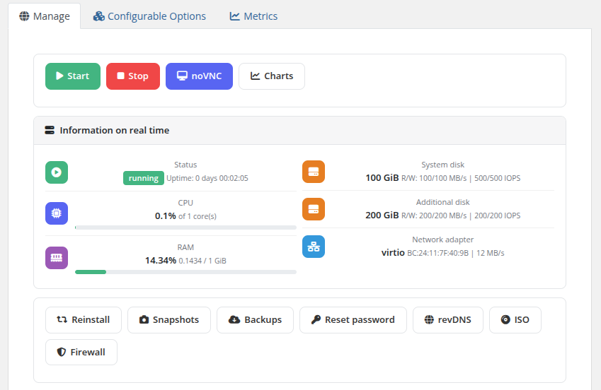
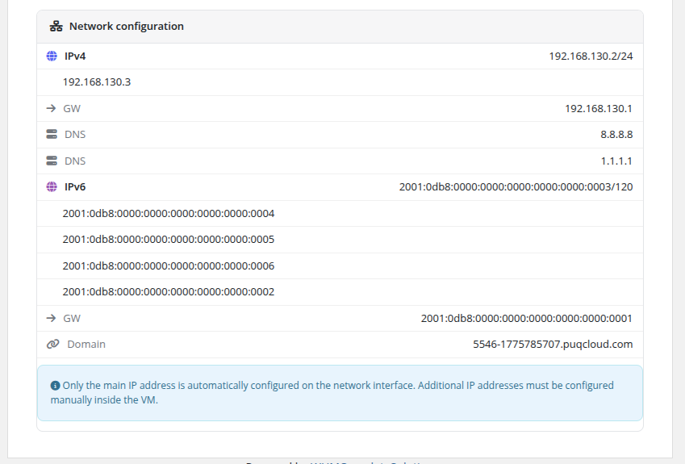
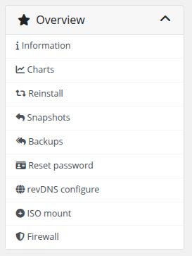

# Overview

### Proxmox KVM module **[WHMCS](https://puqcloud.com/link.php?id=77)**
#####  [Order now](https://puqcloud.com/whmcs-module-proxmox-kvm.php) | [Download](https://download.puqcloud.com/WHMCS/servers/PUQ_WHMCS-Proxmox-KVM/) | [FAQ](https://faq.puqcloud.com/)

The Overview page is the main management screen displayed when a client opens their Proxmox KVM service. It provides real-time VM status information, quick action buttons, and a complete network configuration summary.

## Action Buttons

At the top of the page, action buttons allow the client to perform common operations:

- **Start** — Power on the virtual machine
- **Stop** — Gracefully shut down the virtual machine
- **noVNC** — Open a browser-based VNC console session (see [noVNC](02-novnc.md))
- **Charts** — View performance usage graphs (see [Charts](03-charts.md))

Below the real-time information panel, additional management buttons provide access to:

- **Reinstall** — Reinstall the operating system
- **Snapshots** — Manage VM snapshots
- **Backups** — Manage backups and schedules
- **Reset password** — Reset the root/admin password
- **revDNS** — Configure reverse DNS records
- **ISO** — Mount or unmount ISO images
- **Firewall** — Manage firewall policies and rules

The visibility of each button depends on the Client Area Permissions configured by the administrator for the product.

## Information on Real Time

The overview displays live VM metrics that auto-refresh every 7 seconds:

| Field | Description |
|-------|-------------|
| **Status** | Current VM state (running / stopped) with uptime counter |
| **CPU** | Current CPU utilization percentage and number of allocated cores |
| **RAM** | Current memory usage with used/total values and a progress bar |
| **System disk** | System disk size with R/W throughput (MB/s) and IOPS limits |
| **Additional disk** | Additional disk size with R/W throughput (MB/s) and IOPS limits (if configured) |
| **Network adapter** | Network adapter model, MAC address, and link speed |

## Network Configuration

Below the real-time information panel, the network configuration section displays the complete networking setup for the VM:

- **IPv4** — Primary IPv4 address with subnet mask, plus any additional IPv4 addresses
- **GW** — IPv4 gateway address
- **DNS** — Configured DNS servers (primary and secondary)
- **IPv6** — Primary IPv6 address with prefix length, plus any additional IPv6 addresses
- **GW** — IPv6 gateway address
- **Domain** — The assigned domain name for the VM

An informational note reminds the client that only the main IP address is automatically configured on the network interface. Additional IP addresses must be configured manually inside the VM.

## Disabled actions

When a feature is not permitted by the product's client-area permissions (or is temporarily unavailable — for example, during a backup or snapshot operation), the corresponding button stays **visible but dimmed** and is not clickable. This is intentional: the client can see the full list of features the product offers, even if specific ones are not allowed in their plan, and clearly understands the state of their VM while operations are in progress.

> **Changed in v3.0.** Feature permissions have moved from the legacy `configoption12` checkboxes to the new Bootstrap-based **Client permissions** panel in the product settings. All permission flags are preserved during upgrade, so the end-user behavior is identical to v2.x.

## Navigation menu

Every sub-page in the client service area (Snapshots, Backups, Firewall, Reset password, revDNS, ISO, Charts, Reinstall) has a sidebar **navigation menu** that allows the client to jump between settings without going back to the overview each time.

If the client navigates directly to a page for a feature that the product does not allow, they see an **Access Denied** error message instead of the feature's UI. The `Overview` and `noVNC` buttons cannot be hidden — they are always available.

## Error messages

The client area displays two common error messages:

- **Something went wrong** — returned when WHMCS cannot reach the Proxmox server (network issue, credentials invalid, API service down) or when the VM is no longer present on Proxmox. Check the [Log Collection](../08-troubleshooting/01-log-collection.md) chapter for diagnostics.
- **Access Denied** — returned when the client tries to open a page (via a direct URL or a bookmarked link) for a feature that is not enabled for their product.
