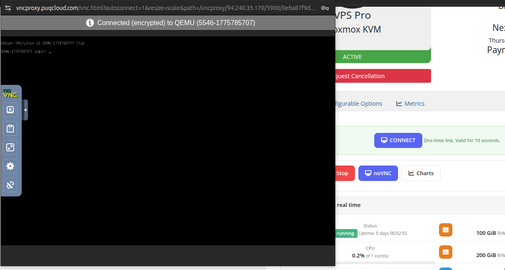
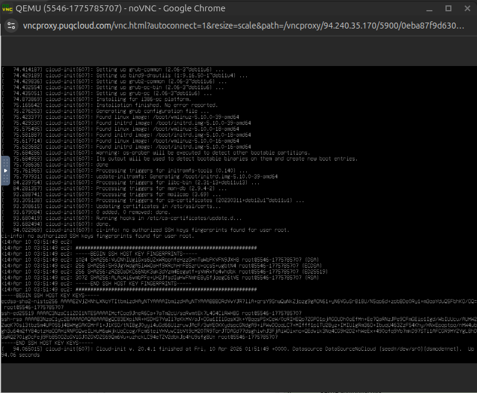

# noVNC Console

### Proxmox KVM module **[WHMCS](https://puqcloud.com/link.php?id=77)**
#####  [Order now](https://puqcloud.com/whmcs-module-proxmox-kvm.php) | [Download](https://download.puqcloud.com/WHMCS/servers/PUQ_WHMCS-Proxmox-KVM/) | [FAQ](https://faq.puqcloud.com/)

The noVNC console provides browser-based remote access to the virtual machine's display, allowing clients to interact with their VM directly without requiring a separate VNC client application.

## Accessing the Console

1. Navigate to the service detail page and click the **noVNC** button in the action bar.
2. A **CONNECT** button will appear along with a note indicating that the link is a one-time connection valid for 10 seconds.
3. Click **CONNECT** to open the noVNC console in a new browser tab.

## Connecting

After clicking the CONNECT button, a new browser tab opens and establishes a secure, encrypted WebSocket connection to the Proxmox VNC proxy. A status indicator in the console confirms the connection, showing the target QEMU VM identifier.

## Console View

Once connected, the full noVNC console is displayed, providing direct keyboard and mouse interaction with the VM. The console toolbar on the left side provides additional controls for clipboard, screen scaling, and connection settings.

## Important Notes

- The console connection link is **one-time use** and expires after **10 seconds**. If the link expires, click the noVNC button again to generate a new one.
- The VM must be in a **running** state to open a console session.
- The noVNC feature must be enabled in the product's Client Area Permissions by the administrator.
- The connection is encrypted (TLS) between the browser and the VNC proxy server.
- Full keyboard input is supported, including special key combinations (Ctrl+Alt+Del, etc.) via the console toolbar.
