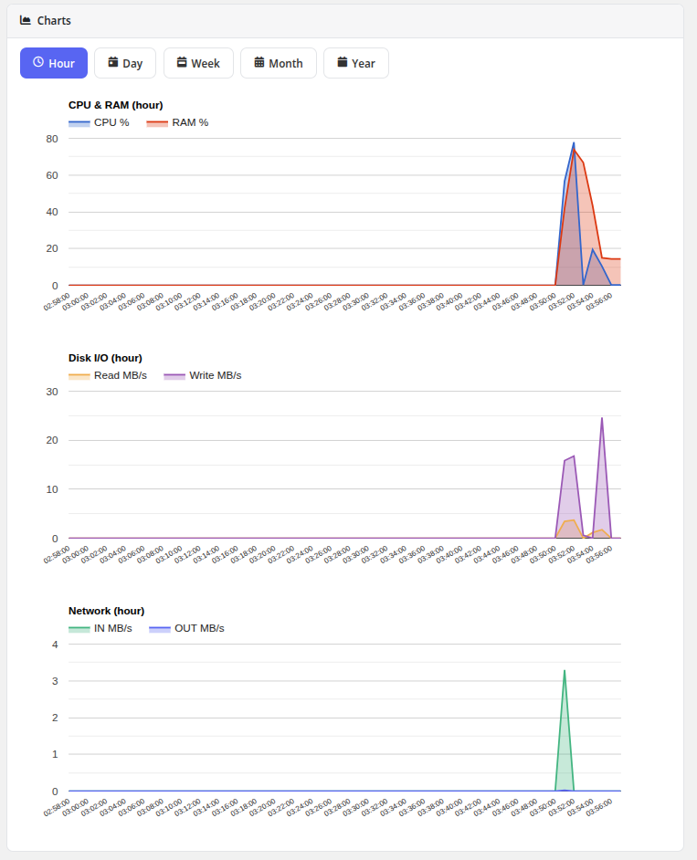

# Charts

### Proxmox KVM module **[WHMCS](https://puqcloud.com/link.php?id=77)**
#####  [Order now](https://puqcloud.com/whmcs-module-proxmox-kvm.php) | [Download](https://download.puqcloud.com/WHMCS/servers/PUQ_WHMCS-Proxmox-KVM/) | [FAQ](https://faq.puqcloud.com/)

The Charts page provides visual performance graphs showing resource utilization of the virtual machine over time. Data is sourced from Proxmox VE RRD (Round Robin Database) statistics and rendered using the Google Charts library.

## Available Charts

The page displays four resource usage graphs:

| Chart | Description |
|-------|-------------|
| **CPU Usage** | Processor utilization as a percentage of allocated cores over time |
| **RAM Usage** | Memory consumption showing used vs. available RAM |
| **Disk I/O Usage** | Disk read and write throughput, displayed as separate Read MB/s and Write MB/s lines |
| **Network Usage** | Network traffic volume with separate lines for inbound (In MB/s) and outbound (Out MB/s) traffic |

## Time Period Tabs

Charts can be viewed across different time ranges using the tab buttons at the top of the page:

- **Hour** — Last 60 minutes of data
- **Day** — Last 24 hours of data
- **Week** — Last 7 days of data
- **Month** — Last 30 days of data
- **Year** — Last 12 months of data

Clicking a tab reloads all four charts with data for the selected time period.

## Notes

- The Charts feature must be enabled in the product's Client Area Permissions by the administrator.
- The VM must be running to generate new data points. Historical data is available even when the VM is stopped.
- Data granularity varies by time period: shorter periods show more detailed data points, while longer periods are averaged.
