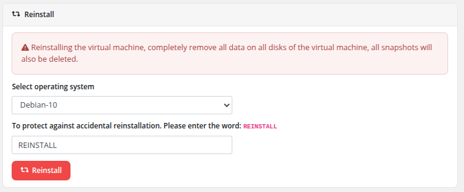

# Reinstall

### Proxmox KVM module **[WHMCS](https://puqcloud.com/link.php?id=77)**
#####  [Order now](https://puqcloud.com/whmcs-module-proxmox-kvm.php) | [Download](https://download.puqcloud.com/WHMCS/servers/PUQ_WHMCS-Proxmox-KVM/) | [FAQ](https://faq.puqcloud.com/)

The Reinstall page allows clients to reinstall the operating system on their virtual machine. This is a destructive operation that replaces the current OS with a fresh installation from the selected template.

## Process

1. Navigate to the service and click **Reinstall** in the sidebar or from the action buttons on the overview page.
2. A warning is displayed: reinstalling will **completely remove all data on all disks** of the virtual machine, and **all snapshots will also be deleted**.
3. Select the desired operating system from the **Select operating system** dropdown. The available options are configured by the administrator in the product settings.
4. To protect against accidental reinstallation, type the word **REINSTALL** in the confirmation field.
5. Click the **Reinstall** button to begin the process.

## What Happens During Reinstall

- The VM is stopped if currently running.
- All data on all disks is destroyed.
- All existing snapshots are deleted.
- The VM is redeployed from the selected OS template using the module's deploy pipeline.
- Cloud-init configuration is reapplied (hostname, IP addresses, DNS, user credentials).
- **Network identity is preserved** — the original IPv4/IPv6 addresses, the **same network card MAC address**, the VLAN tag and the VMID are kept so that inventory systems, firewalls and DNS records continue to work without changes.
- A new root password is generated and sent to the client via email.

> **Backups survive a reinstall.** The reinstall procedure explicitly deletes only the VM's disks and snapshots — any existing **backup archives are kept intact**. This gives you a safety net: even after reinstalling a brand-new OS, you can still restore a previous backup to return to the pre-reinstall state. Use this carefully.

## Important Notes

- This operation is **irreversible** for the data on the VM disks. All data will be permanently lost.
- The Reinstall feature must be enabled in the product's Client Area Permissions by the administrator.
- Only OS templates approved by the administrator appear in the dropdown list.
- The VM must not be locked by another operation (backup, snapshot, migration) when initiating a reinstall.
- The `REINSTALL` confirmation word must be typed **in capital letters** exactly — it's an intentional speed-bump to prevent accidental reinstalls.
