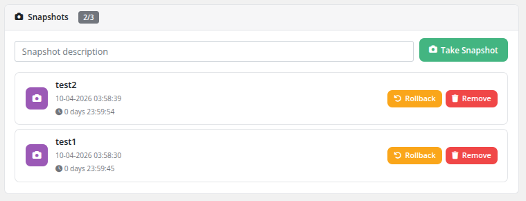

# Snapshots

### Proxmox KVM module **[WHMCS](https://puqcloud.com/link.php?id=77)**
#####  [Order now](https://puqcloud.com/whmcs-module-proxmox-kvm.php) | [Download](https://download.puqcloud.com/WHMCS/servers/PUQ_WHMCS-Proxmox-KVM/) | [FAQ](https://faq.puqcloud.com/)

The Snapshots page allows clients to create, rollback, and remove point-in-time snapshots of their virtual machine. Snapshots capture the complete state of the VM, including disk contents and memory (if running), enabling quick recovery to a known good state.

> **Snapshots are not backups.** They are intended as a quick safety net during system administration work (package updates, config changes, etc.) — that's why their lifetime is enforced and limited (1–10 days). For long-term data protection use the [Backups](06-backups.md) feature instead.

## Snapshot Quota

The snapshot quota is displayed at the top of the page as a counter (e.g., **2/3**), showing the number of existing snapshots out of the maximum allowed. The quota limit is configured by the administrator in the product settings.

## Creating a Snapshot

1. Navigate to the service and click **Snapshots** in the sidebar.
2. Optionally enter a description in the **Snapshot description** text field.
3. Click the **Take Snapshot** button.
4. The snapshot is created in the background. Once complete, it appears in the list below.

## Managing Snapshots

Each snapshot in the list displays:

- **Name** — The snapshot identifier
- **Date and time** — When the snapshot was created
- **Remaining lifetime** — A countdown showing how long until the snapshot is automatically deleted (e.g., "0 days 23:59:54")

For each snapshot, two actions are available:

- **Rollback** — Restore the VM to the exact state captured by this snapshot. The VM will be stopped during the rollback process.
- **Remove** — Permanently delete this snapshot to free up storage space and quota.

## Snapshot Lifetime

Snapshots have a configurable lifetime set by the administrator in the product settings. When the lifetime expires, the snapshot is automatically removed by the cron system. The remaining lifetime for each snapshot is displayed in the snapshot list.

## Important Notes

- Snapshots consume additional storage space on the Proxmox node. The more changes are made after a snapshot, the larger the snapshot data grows.
- The VM must not be locked by another operation (backup, migration, etc.) when creating or managing snapshots.
- Rolling back to a snapshot will discard all changes made after the snapshot was taken.
- The maximum number of snapshots is determined by the product configuration.
