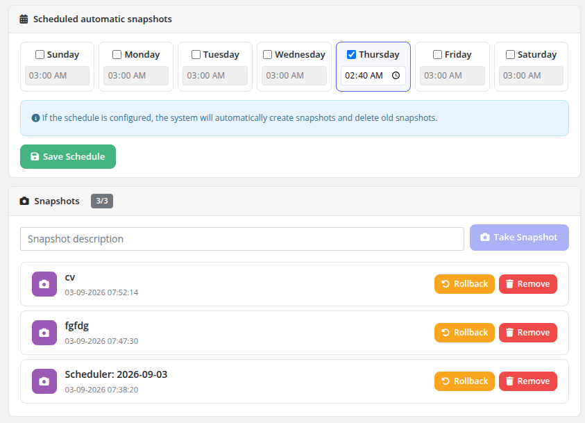

# Snapshots

### Proxmox KVM module **[WHMCS](https://puqcloud.com/link.php?id=77)**
##### [Order now](https://puqcloud.com/whmcs-module-proxmox-kvm.php) | [Download](https://download.puqcloud.com/WHMCS/servers/PUQ_WHMCS-Proxmox-KVM/) | [Community](https://community.puqcloud.com/)

The **Snapshots** page allows clients to create, schedule, rollback, and remove point-in-time snapshots of their virtual machine directly from the WHMCS client area. Snapshots capture the complete state of the VM (including disk contents and RAM state if running), enabling quick recovery to a known good state.

> **Snapshots are not backups.** Snapshots depend on the VM's underlying disk storage and are intended as short-term recovery checkpoints (for example, prior to applying OS updates or software changes). For durable, long-term disaster recovery, use the [Backups](06-backups.md) feature.

---

## Operating Modes

The module supports two operational modes for snapshots, configured by the administrator in the product's **Module Settings → VM Configuration**:

### 1. Scheduled Automatic Snapshots Mode (Recommended)

When **Snapshot schedule mode** is enabled on the product, snapshots operate on an automated weekly schedule with automatic FIFO rotation:

- **Weekly Schedule Card**: The client selects which days of the week (Sunday through Saturday) and at what time of day snapshots should be taken.
- **Automated Execution**: The background cron task (`scheduleSnapshot`) runs every 5 minutes, checks the VM's configured schedule, and automatically takes a snapshot named `Scheduler: YYYY-MM-DD`.
- **Automatic FIFO Rotation**: When the service snapshot quota is reached (e.g., **3/3**), the system automatically deletes the oldest snapshot before creating the new scheduled snapshot. The client always maintains the most recent checkpoints without manual intervention.
- **Manual Snapshots**: The client can also manually create snapshots at any time, subject to the service quota limit.

### 2. Lifetime Expiration Mode

When **Snapshot schedule mode** is disabled on the product:

- Snapshots are created manually by the client.
- Each snapshot has a maximum retention lifetime (1–10 days or indefinite) configured in the product settings.
- A countdown timer (e.g., `0 days 23:59:54`) is displayed next to each snapshot indicating when it will expire.
- When the lifetime expires, the background cleanup cron automatically removes the snapshot.

---

## Configuring Snapshot Schedule

If scheduled snapshot mode is enabled for your service:

1. In the **Scheduled automatic snapshots** card at the top of the page, check the days of the week on which you want snapshots taken.
2. For each selected day, configure the desired execution time.
3. Click the **Save Schedule** button.

The system will automatically create snapshots at the configured times and rotate older ones once the quota is reached.

---

## Snapshot Quota

The snapshot quota is displayed in the card header as a counter badge (e.g., **3/3**), showing the number of active snapshots out of the maximum allowed. The quota limit is determined by the product configuration or the `Snapshots` Configurable Option assigned to the service.

When the quota limit is reached, the **Take Snapshot** button is disabled until an existing snapshot is removed or rotated.

---

## Taking a Manual Snapshot

1. Navigate to your service and click **Snapshots** in the sidebar.
2. Enter a description in the **Snapshot description** field (e.g., `Before kernel update`).
3. Click the **Take Snapshot** button and confirm the action in the prompt modal.
4. The snapshot process runs in the background. Once complete, the new snapshot appears in the list.

---

## Managing Snapshots

Each snapshot in the list displays:

- **Description / Label** — The description provided during creation, or `Scheduler: YYYY-MM-DD` for automated snapshots.
- **Timestamp** — The exact date and time the snapshot was taken.
- **Remaining Lifetime** — (Lifetime mode only) A countdown indicator showing time remaining until automatic deletion.

Two primary actions are available for each snapshot:

- **Rollback** (<i class="fas fa-undo"></i>): Restores the virtual machine to the exact state captured at the time of the snapshot. During rollback, the VM is temporarily stopped, reverted to the snapshot point, and restarted.
- **Remove** (<i class="fas fa-trash"></i>): Permanently deletes the snapshot from Proxmox storage, freeing up quota and disk space.

*client-area-snapshots.png*

---

## Important Notes

- **Storage Impact**: Snapshots use copy-on-write delta storage on the Proxmox node. As the VM continues to run and write data, snapshot delta files grow over time.
- **Operation Locks**: The VM must not be locked by another pending task (backup, reinstall, migration) when creating or rolling back a snapshot.
- **Rollback Impact**: Rolling back to a previous snapshot discards all disk changes made after that snapshot was captured.
- **Backup Restore**: When restoring a full backup, all existing snapshots on the VM are permanently removed as part of the storage re-initialization.
