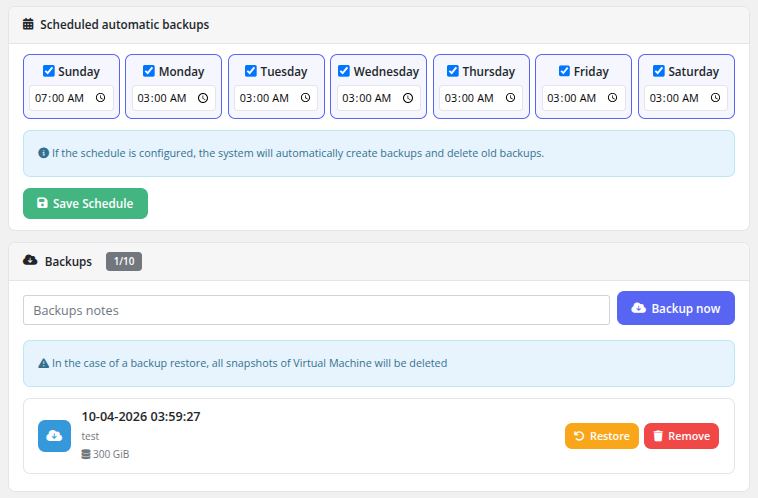

# Backups

### Proxmox KVM module **[WHMCS](https://puqcloud.com/link.php?id=77)**
#####  [Order now](https://puqcloud.com/whmcs-module-proxmox-kvm.php) | [Download](https://download.puqcloud.com/WHMCS/servers/PUQ_WHMCS-Proxmox-KVM/) | [FAQ](https://faq.puqcloud.com/)

The Backups page provides full VM backup management, including scheduled automatic backups, manual on-demand backups, restore from backup, and backup removal.

## Scheduled Automatic Backups

The top section of the page displays the backup schedule configuration with a day-of-week grid. For each day of the week (Sunday through Saturday), the client can:

- **Enable or disable** the day using the checkbox.
- **Set the time** for the backup to run on that day.

After configuring the schedule, click **Save Schedule** to apply the changes. When a schedule is configured, the system will automatically create backups at the specified times and delete old backups that exceed the retention quota.

An informational note confirms: "If the schedule is configured, the system will automatically create backups and delete old backups."

## Backup Quota

The backup quota is displayed as a counter next to the **Backups** heading (e.g., **1/10**), showing the number of existing backups out of the maximum allowed. The quota limit is configured by the administrator in the product settings.

## Creating a Manual Backup

1. Optionally enter a note in the **Backups notes** text field to identify the backup.
2. Click the **Backup now** button.
3. The backup task is submitted to Proxmox and runs in the background. Progress is monitored by the WHMCS cron system.

## Backup List

Each backup in the list displays:

- **Date and time** — When the backup was created
- **Description** — The note entered when creating the backup
- **Size** — The storage size of the backup (e.g., 300 GiB)

For each backup, two actions are available:

- **Restore** — Restore the VM from this backup. The VM will be stopped during the restore process.
- **Remove** — Permanently delete this backup to free up storage space and quota.

A warning note reminds the client: "In the case of a backup restore, all snapshots of Virtual Machine will be deleted."

## How scheduled backups run

On each cron tick the backup task:

1. Checks which VMs have the current weekday enabled in their schedule.
2. Checks whether the configured time-of-day for today is already in the past (so that the job runs once per day, not repeatedly).
3. Checks whether today's backup already exists — if yes, skips.
4. Checks whether there is a free backup slot. If the quota is full, the **oldest** backup is deleted first to make room.
5. Creates the new backup and monitors the Proxmox task until completion.

## Backup restoration

Before a backup is restored, the VM must be in a **powered off** state. After a successful restore the module automatically re-applies the current package parameters to the restored VM:

1. Set CPU & RAM if different from the restored values
2. Resize system disk if different
3. Re-apply system disk bandwidth limits
4. Create additional disk if needed
5. Resize additional disk if needed
6. Re-apply additional disk bandwidth limits
7. Re-apply network configuration (bridge, VLAN, bandwidth, MAC)
8. Start the VM
9. Send the **Backup restored** email to the client

If the restore fails for any reason, the client is given the option to retry the restore or to reinstall the virtual machine from scratch.

## Important Notes

- Backups are stored on the backup storage configured in Proxmox by the administrator.
- Restoring a backup will stop the VM and delete all existing snapshots.
- Backup creation runs as a background task; large VMs may take considerable time to back up.
- Scheduled backups are executed by the WHMCS cron system. Ensure that the cron is running properly for scheduled backups to function.
- **While a backup is being created or restored, all other VM management operations are suspended** — Start/Stop, Reinstall, Reset password, Snapshots and package changes are locked until Proxmox releases the backup lock.
- The datastore used for backups must either not rotate backup copies, or rotate them in a way that does not interfere with the number of spare copies purchased by the client.
