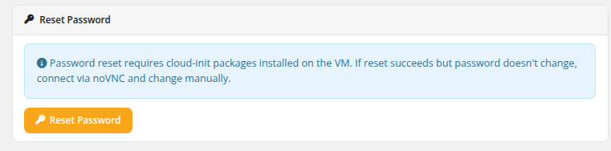

# Reset Password

### Proxmox KVM module **[WHMCS](https://puqcloud.com/link.php?id=77)**
#####  [Order now](https://puqcloud.com/whmcs-module-proxmox-kvm.php) | [Download](https://download.puqcloud.com/WHMCS/servers/PUQ_WHMCS-Proxmox-KVM/) | [FAQ](https://faq.puqcloud.com/)

The Reset Password page allows clients to generate a new root/admin password for their virtual machine. The new password is applied via cloud-init and sent to the client by email.

## Process

1. Navigate to the service and click **Reset password** in the sidebar.
2. Review the informational note about cloud-init requirements.
3. Click the **Reset Password** button.
4. A new password is automatically generated by the system.
5. Cloud-init applies the new password to the VM.
6. The new password is sent to the client via the configured email template.

## Cloud-Init Requirement

An informational note on the page states: "Password reset requires cloud-init packages installed on the VM. If reset succeeds but password doesn't change, connect via noVNC and change manually."

This means:

- The **cloud-init** package must be installed and properly configured inside the VM's operating system.
- The **QEMU guest agent** is recommended for the password change to take effect immediately.
- If cloud-init is not installed or not functioning, the password reset command will succeed on the API level but the actual password inside the VM will not change. In this case, the client should use the noVNC console to log in and change the password manually.

## Important Notes

- The Reset Password feature must be enabled in the product's Client Area Permissions by the administrator.
- The VM should be in a **running** state for the password change to be applied by cloud-init.
- The generated password is random and secure. The client receives it only via the configured email template.
- If the VM was deployed from a template that does not include cloud-init, this feature will not work as expected.

> **Changed in v3.0.** The password reset flow now works on a **running** VM via cloud-init (and the QEMU guest agent if installed) — the client does not need to stop the VM first. In **v2.x and earlier**, the client had to manually power off the VM before resetting the password; the module then generated the new password, rewrote cloud-init and started the VM back up. If you are documenting behaviour for clients running an older version, keep that difference in mind.
