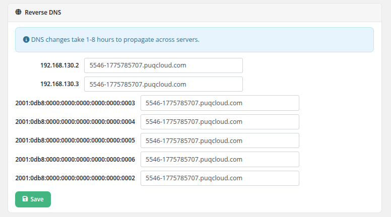

# Reverse DNS

### Proxmox KVM module **[WHMCS](https://puqcloud.com/link.php?id=77)**
#####  [Order now](https://puqcloud.com/whmcs-module-proxmox-kvm.php) | [Download](https://download.puqcloud.com/WHMCS/servers/PUQ_WHMCS-Proxmox-KVM/) | [FAQ](https://faq.puqcloud.com/)

The Reverse DNS page allows clients to configure PTR (pointer) records for all IP addresses assigned to their virtual machine. Reverse DNS records map IP addresses back to hostnames and are commonly required for mail servers and other services that perform reverse lookups.

## Configuration

1. Navigate to the service and click **revDNS configure** in the sidebar.
2. Each IP address assigned to the VM (both IPv4 and IPv6) is listed with an editable hostname field.
3. Enter the desired hostname for each IP address.
4. Click the **Save** button to apply the changes.

The page lists all assigned addresses, including:

- All IPv4 addresses (primary and additional)
- All IPv6 addresses (primary and additional)

Each address has its own hostname input field, allowing independent reverse DNS configuration per IP.

## DNS Propagation

An informational note at the top of the page states: "DNS changes take 1-8 hours to propagate across servers."

After saving, the reverse DNS records are automatically synchronized with the configured DNS provider (Cloudflare or HestiaCP, as configured in the addon module). However, due to DNS caching and propagation across the internet, the changes may not be visible to all resolvers immediately.

## Important Notes

- The RevDNS feature must be enabled in the product's Client Area Permissions by the administrator.
- The DNS addon module must be configured with the appropriate reverse DNS zones for the IP ranges used by the VM.
- Hostnames must be in a valid DNS format (e.g., `mail.example.com`).
- Reverse DNS is particularly important for email delivery. Many mail servers reject messages from IP addresses without proper PTR records.

## Ticket-based fallback

> **Still supported for operators without a DNS API.** If your reverse-DNS infrastructure does not expose an API (neither Cloudflare, HestiaCP nor PowerDNS), the module can fall back to **opening a WHMCS ticket** when the client requests a revDNS change — you then apply the change by hand on your DNS server.
>
> This is configured in the product settings under **Integrations → Revdns ticket / RevDNS ticket department**. When a ticket department is selected, saving the reverse-DNS form creates a new WHMCS ticket in that department with the requested IP→hostname mapping instead of calling the DNS provider.

> **Changed in v3.0.** With the PowerDNS provider added alongside Cloudflare and HestiaCP, most deployments can now use the automatic path and do not need the ticket fallback any more. The ticket mode is still available for mixed setups or for operators who deliberately want manual approval of every PTR change.
