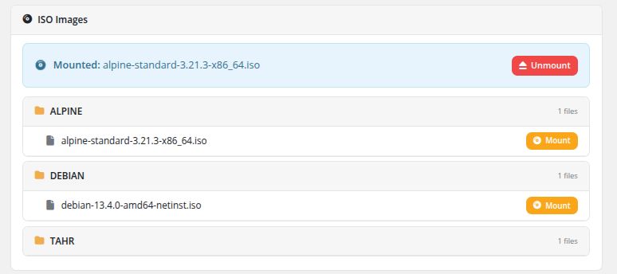

# ISO Mount

### Proxmox KVM module **[WHMCS](https://puqcloud.com/link.php?id=77)**
#####  [Order now](https://puqcloud.com/whmcs-module-proxmox-kvm.php) | [Download](https://download.puqcloud.com/WHMCS/servers/PUQ_WHMCS-Proxmox-KVM/) | [FAQ](https://faq.puqcloud.com/)

The ISO Mount page allows clients to mount and unmount ISO images on their virtual machine's virtual CD/DVD drive. ISO images are organized into categorized folders for easy browsing.

## Currently Mounted ISO

If an ISO image is currently mounted, it is displayed at the top of the page with a highlighted status bar showing the filename (e.g., "Mounted: alpine-standard-3.21.3-x86_64.iso") and an **Unmount** button to eject it.

## Browsing Available ISOs

ISO images are organized into folders by category. Each folder displays:

- **Folder name** — The category name (e.g., ALPINE, DEBIAN, TAHR), shown with a folder icon
- **File count** — The number of ISO files in that folder

Inside each folder, individual ISO files are listed with their full filename and a **Mount** button.

### How the categorization works

To keep the ISO list readable the module derives the folder name from the **part of the filename before the first `-` character**:

- `Debian-12.5.0-amd64-netinst.iso` → folder **Debian**
- `alpine-standard-3.21.3-x86_64.iso` → folder **alpine**
- `myimage.iso` (no dash at all) → folder **OTHER**

Follow this convention when uploading ISOs to your Proxmox ISO storage. PUQcloud publishes a set of pre-built ISO images that are named in this convention and ready to use — see the ISO storage on [files.puqcloud.com](https://files.puqcloud.com/).

## Mounting an ISO

1. Navigate to the service and click **ISO mount** in the sidebar.
2. Browse the available ISO folders to find the desired image.
3. Click the **Mount** button next to the ISO file.
4. The ISO is attached to the VM's virtual CD/DVD drive and becomes available for booting or installation.

## Unmounting an ISO

1. Locate the currently mounted ISO at the top of the page.
2. Click the **Unmount** button.
3. The ISO is ejected from the virtual CD/DVD drive.

## Use Cases

- **Recovery operations** — Boot from a rescue ISO to repair a broken system
- **Manual OS installation** — Install an operating system from an ISO image
- **Additional software** — Mount driver or utility ISOs for installation
- **Diagnostics** — Boot diagnostic tools (e.g., memtest, disk utilities)

## Important Notes

- The ISO mount feature must be enabled in the product's Client Area Permissions by the administrator.
- Available ISO images are sourced from the ISO storage configured in the Proxmox product settings. Only ISOs uploaded by the administrator to that storage will appear.
- To boot from a mounted ISO, the VM's boot order may need to be configured to include the CD/DVD drive.
- Only one ISO can be mounted at a time. Mounting a new ISO will replace the currently mounted one.
