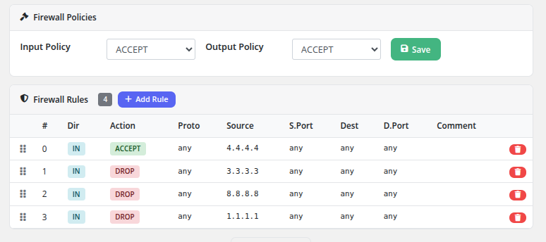

# Firewall

### Proxmox KVM module **[WHMCS](https://puqcloud.com/link.php?id=77)**
#####  [Order now](https://puqcloud.com/whmcs-module-proxmox-kvm.php) | [Download](https://download.puqcloud.com/WHMCS/servers/PUQ_WHMCS-Proxmox-KVM/) | [FAQ](https://faq.puqcloud.com/)

The Firewall page provides clients with full control over their virtual machine's Proxmox firewall, including default policies and individual traffic rules.

## Firewall Policies

At the top of the page, two default policies can be configured:

- **Input Policy** — The default action for incoming traffic (ACCEPT or DROP)
- **Output Policy** — The default action for outgoing traffic (ACCEPT or DROP)

After selecting the desired policy values from the dropdown menus, click the **Save** button to apply them. These policies determine what happens to traffic that does not match any specific rule.

## Firewall Rules

Below the policies section, the rules table displays all configured firewall rules. The rule count is shown as a badge next to the heading (e.g., **4**).

### Rules Table Columns

| Column | Description |
|--------|-------------|
| **#** | Rule position number (determines evaluation order) |
| **Dir** | Traffic direction: **IN** (inbound) or **OUT** (outbound) |
| **Action** | What to do with matching traffic: **ACCEPT** (allow, shown in green) or **DROP** (block, shown in red) |
| **Proto** | Protocol filter (e.g., tcp, udp, any) |
| **Source** | Source IP address or network (or "any" for all sources) |
| **S.Port** | Source port or port range (or "any" for all ports) |
| **Dest** | Destination IP address or network (or "any" for all destinations) |
| **D.Port** | Destination port or port range (or "any" for all ports) |
| **Comment** | Optional description of the rule's purpose |

### Adding a Rule

Click the **+ Add Rule** button to open the rule creation modal. Fill in the rule parameters (direction, action, protocol, source, destination, ports, and comment) and save.

### Reordering Rules

Rules are evaluated in order from top to bottom. The drag handle (grid icon) on the left side of each rule row allows drag-and-drop reordering. Drag a rule up or down to change its evaluation priority. The first matching rule determines the action taken on the traffic.

### Deleting a Rule

Click the red delete button on the right side of a rule row to remove it. The rule is deleted immediately.

## How Rules Are Evaluated

1. Incoming or outgoing traffic is checked against the rules in order, starting from rule #0.
2. The first rule that matches the traffic's direction, protocol, source, destination, and ports determines the action (ACCEPT or DROP).
3. If no rule matches, the default policy (Input Policy or Output Policy) is applied.

## Important Notes

- The Firewall feature must be enabled in the product's Client Area Permissions by the administrator.
- Anti-spoofing IPSet rules are automatically managed by the module to prevent IP address spoofing from the VM.
- Rule changes take effect immediately on the Proxmox firewall.
- Be cautious when changing the default Input Policy to DROP, as this will block all incoming traffic that is not explicitly allowed by a rule. Ensure you have an ACCEPT rule for your management access (e.g., SSH on port 22) before changing the policy.
