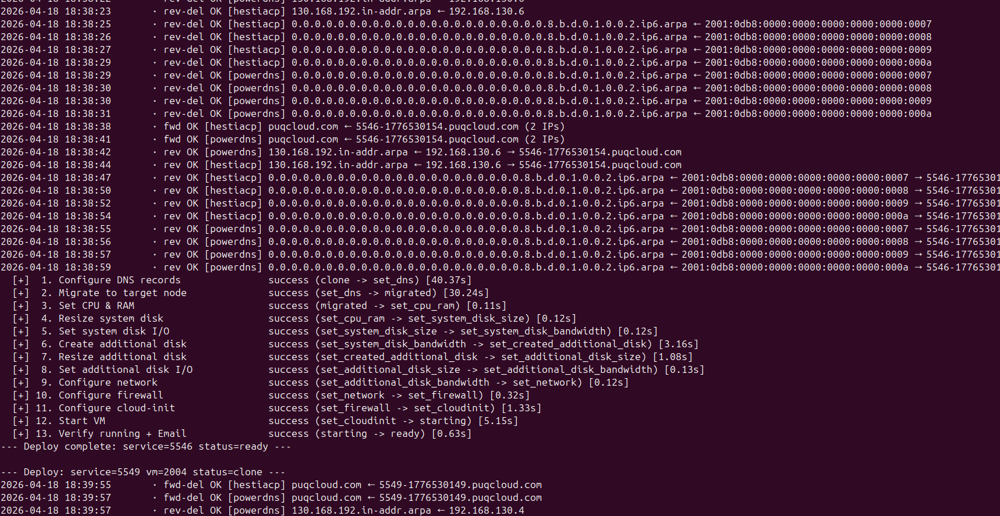
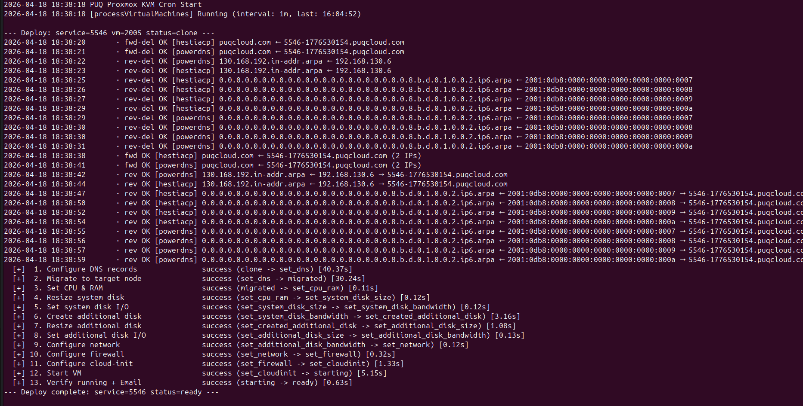
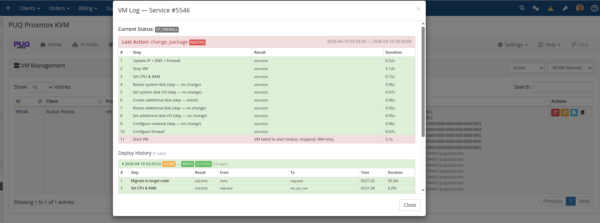

# Deploy Process

### Proxmox KVM module **[WHMCS](https://puqcloud.com/link.php?id=77)**
#####  [Order now](https://puqcloud.com/whmcs-module-proxmox-kvm.php) | [Download](https://download.puqcloud.com/WHMCS/servers/PUQ_WHMCS-Proxmox-KVM/) | [FAQ](https://faq.puqcloud.com/)

## Overview

When a new virtual machine is provisioned (from a WHMCS order, an admin **Create** action, or the WHMCS API), the module does **not** try to do everything inside the HTTP request. Instead it just writes the VM record with status `creation` and returns immediately — WHMCS sees the order as "accepted" within milliseconds. The actual work is done by the cron task **Process VMs** as a 15-step state machine. Each step is idempotent and resumable: if anything fails, the VM stays at its current step and the next cron tick retries it.

This design makes the module resilient to:

- Proxmox API timeouts and slow storage operations
- Cluster-wide task queue back-pressure
- Transient network failures between the WHMCS host and Proxmox
- Long-running operations (disk resize, full clones, cross-node migration)

## Deploy Pipeline

The pipeline progresses through the following states:

```
creation → set_ip → clone → set_dns → migrated →
set_cpu_ram → set_system_disk_size → set_system_disk_bandwidth →
set_created_additional_disk → set_additional_disk_size → set_additional_disk_bandwidth →
set_network → set_firewall → set_cloudinit → starting → ready
```

A state name represents the **last completed step** — not the current action. When a VM is in state `set_ip`, the IP has been allocated and the next action to run is "Clone VM".

### Step descriptions

| State (done) | Next action | What happens |
|---|---|---|
| `creation` | Allocate IP | Choose an IP pool matching the server/bridge/VLAN, reserve IPv4 and/or IPv6 addresses, write them into `tblhosting` and the VM record. |
| `set_ip` | Clone VM | Clone the template to the target storage. Supports both linked and full clones depending on product config. |
| `clone` | Configure DNS records | Create forward A/AAAA for the VM's FQDN and PTR records for all assigned IPs. Runs against every matching DNS zone (see [DNS Zones & Integration](../04-addon-module/03-dns-zones.md)). **DNS errors never block deployment** — they are logged and the pipeline moves on. |
| `set_dns` | Migrate to target node | If the template lives on a different Proxmox node than the target, do an offline migration with `targetstorage` mapping. Skipped when source and target nodes are the same. |
| `migrated` | Set CPU & RAM | Apply the cores / sockets / memory from the product configuration. |
| `set_cpu_ram` | Resize system disk | Expand the system disk to the configured size. |
| `set_system_disk_size` | Set system disk I/O | Apply `iops_rd` / `iops_wr` / `mbps_rd` / `mbps_wr` bandwidth limits. |
| `set_system_disk_bandwidth` | Create additional disk | If the product has an additional disk, create it on the configured storage. |
| `set_created_additional_disk` | Resize additional disk | Expand it to the configured size. |
| `set_additional_disk_size` | Set additional disk I/O | Apply bandwidth limits to the additional disk. |
| `set_additional_disk_bandwidth` | Configure network | Set bridge, VLAN, rate limit, and enable the firewall flag on the NIC. |
| `set_network` | Configure firewall | Apply per-product firewall options (enable, DHCP/NDP, MAC filter, IP filter, log levels), policies, and anti-spoofing IPSet with the allocated IPs. |
| `set_firewall` | Configure cloud-init | Push hostname, IP addresses, gateway, DNS servers, username, password and SSH keys into the cloud-init drive. |
| `set_cloudinit` | Start VM | Power on the VM through the Proxmox API. |
| `starting` | Verify running + email | Wait up to 5 cron ticks for the guest to report `running`. Send the "VM is ready" email. |
| `ready` | — | Final state. Client has full access to the service. |

## Resumability & retry

Every step is wrapped in this contract:

1. **Check current state** — guards against double execution if the cron fires twice.
2. **Do one API call (or a short sequence of related calls)** — deliberately small so the step either completes quickly or can be retried cheaply.
3. **On success** — advance `vm_status` to the next state.
4. **On failure** — return the error string; `vm_status` stays the same; the cron log records the step with the error; next tick retries.

There is **no retry count limit**. A VM that genuinely cannot deploy (misconfigured IP pool, no free node with matching storage) will stay stuck at its current step and keep appearing in the cron log — visible immediately. Admins are expected to fix the root cause (add IPs to the pool, adjust storage mapping) rather than fight a phantom max-retry counter.

## DNS configuration during deploy

The `clone → set_dns` transition is where forward and reverse DNS records are registered. With many IPs or many DNS zones, this can involve dozens of API calls. Starting with v3.2 each DNS operation is logged live to the cron output, so admins can watch records being created in real time:



Lines prefixed with `· fwd OK` are forward (A/AAAA) creations, `· rev OK` are reverse (PTR) creations. Per-zone failures (for example, one DNS provider is temporarily unreachable) are logged as `· fwd ERR` / `· rev ERR` but do **not** abort deployment — other zones and subsequent steps still run.

## Full deploy walkthrough

A successful deploy looks like this in the standalone cron output (`php cron.php`). Each step shows its duration and the state transition:



Every line is flushed to stdout immediately — nothing is buffered until the end. This means even during a long-running step (full clone of a large template, cross-node migration) you can tell whether the job is still making progress or has truly stalled.

## Deploy log in the admin UI

In the addon's **VM Management → Log** modal, every run is recorded with per-step duration, state transitions, and any errors:



The most recent 50 runs are kept per VM. If the last attempt paused partway, the log is marked `waiting` with an `error` field showing why — useful for diagnosing a sticky step.

## Migration step in detail

`set_dns → migrated` handles the common Proxmox cluster topology where templates live on one node (often for storage cost reasons) but client VMs should run on another:

1. `set_ip → clone` creates the VM on **Template Node A** using the template's local storage.
2. `clone → set_dns` configures DNS while the VM is still on Node A.
3. `set_dns → migrated` migrates the VM from Node A to the **Target Node B** with a `targetstorage` remap so disks end up on the right backend on the target.
4. All subsequent steps (CPU, disk, network, firewall, cloud-init, start) run against the VM on Node B.

Target node selection considers storage availability and free RAM on candidate nodes. If no suitable target is found, the VM stays on Node A and deployment completes there — the VM is still fully functional, just not on the preferred node.

## What triggers a deploy

A deploy starts the moment `vm_status` is set to `creation`. That happens when:

- A client's order is provisioned (automatic after payment, or manual accept/provision by an admin).
- An admin clicks **Create** or **Module Create** in the service's module commands.
- `ModuleCreateAccount` is called through the WHMCS API.
- A **Redeploy** action resets the VM record (deletes the existing VM on Proxmox, clears logs, sets status to `creation`).

From the moment `creation` is written, the next cron tick picks up the VM. At the default 1-minute **Process VMs** interval, that means provisioning starts within 60 seconds of the trigger.

## Related reading

- [Change Package](02-change-package.md) — how upgrades and downgrades use a similar state machine.
- [Terminate Process](03-terminate-process.md) — how services are torn down asynchronously.
- [DNS Zones & Integration](../04-addon-module/03-dns-zones.md) — configuring the providers that the `clone → set_dns` step writes to.
- [Scheduled Tasks](04-scheduled-tasks.md) — all cron tasks including Process VMs.
