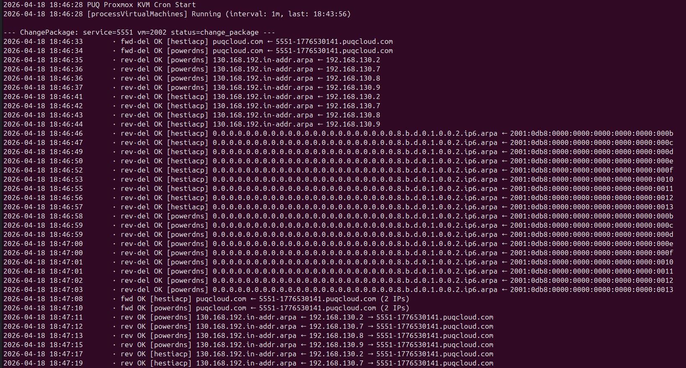
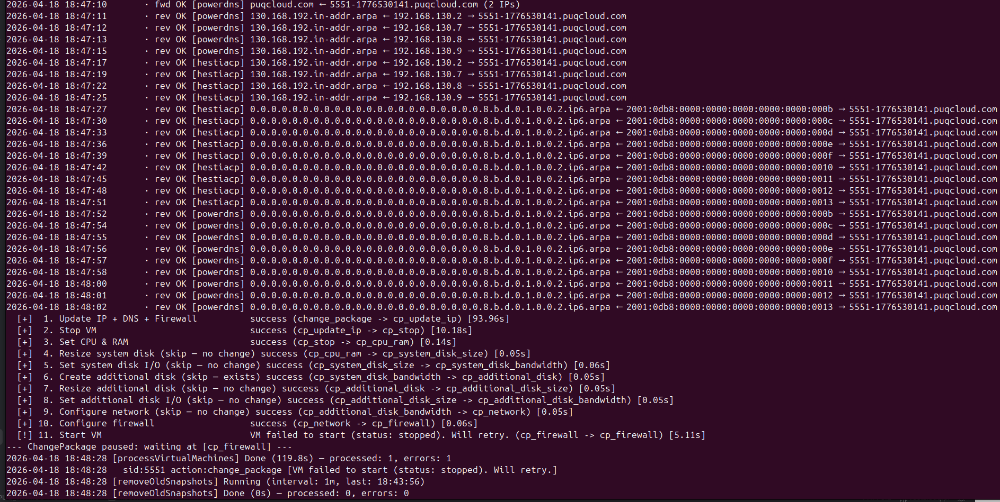

# Change Package

### Proxmox KVM module **[WHMCS](https://puqcloud.com/link.php?id=77)**
#####  [Order now](https://puqcloud.com/whmcs-module-proxmox-kvm.php) | [Download](https://download.puqcloud.com/WHMCS/servers/PUQ_WHMCS-Proxmox-KVM/) | [FAQ](https://faq.puqcloud.com/)

## Overview

A package change (upgrade or downgrade) reconfigures a live VM to match a different product plan — new CPU/RAM values, larger disks, different network settings, changed firewall options. Just like [Deploy](01-deploy-process.md), this runs asynchronously as a resumable state machine driven by the cron. The client does not wait for all the Proxmox API calls to finish — WHMCS accepts the upgrade order immediately and the module walks the VM through the change over the next one or two cron ticks.

## Change Package Pipeline

```
change_package → cp_update_ip → cp_stop → cp_cpu_ram →
cp_system_disk_size → cp_system_disk_bandwidth →
cp_additional_disk → cp_additional_disk_size → cp_additional_disk_bandwidth →
cp_network → cp_firewall → cp_start → ready
```

### Step descriptions

| State (done) | Next action | What happens |
|---|---|---|
| `change_package` | Update IP + DNS + firewall | Reload config, reload remote VM data, update IP allocation if the new package changes IP requirements, refresh anti-spoofing IPSet, and refresh forward + reverse DNS records to reflect any IP changes. |
| `cp_update_ip` | Stop VM | Stop the VM. Required because some downstream steps (disk resize, CPU/RAM limits) cannot be applied to a running VM. Polls until the VM reports `stopped`. |
| `cp_stop` | Set CPU & RAM | Apply new CPU cores / sockets / memory from the new package. Skipped if the values are unchanged. |
| `cp_cpu_ram` | Resize system disk | Grow the system disk to the new size (Proxmox cannot shrink disks — a smaller target is silently skipped). |
| `cp_system_disk_size` | System disk I/O | Apply new bandwidth limits to the system disk. |
| `cp_system_disk_bandwidth` | Additional disk | Create an additional disk if the new package includes one and the VM does not have it yet. |
| `cp_additional_disk` | Additional disk size | Grow the additional disk. |
| `cp_additional_disk_size` | Additional disk I/O | Apply new bandwidth limits. |
| `cp_additional_disk_bandwidth` | Network | Update bridge, VLAN and NIC rate limit. |
| `cp_network` | Firewall | Re-apply per-product firewall options and refresh the anti-spoofing IPSet with the current IP list. |
| `cp_firewall` | Start VM | Power the VM back on. |
| `cp_start` | Verify running | Wait up to 5 ticks for the guest to report `running`. |
| `ready` | — | Done. VM is live with the new package. |

### Skip-if-unchanged optimization

Every `cp_*` step first compares the **current** VM configuration with the **target** package configuration. If they match, the step logs `skip (no change)` and advances immediately. A downgrade that only reduces RAM, for example, doesn't touch the disks, network, or firewall — it stops the VM, applies RAM, restarts. In practice most package changes complete in 20-40 seconds real time.

In the log this shows up as lines like `cp_system_disk_size skip → cp_system_disk_bandwidth`. Useful for auditing what actually changed during a given upgrade.

## DNS refresh during change package

The first step (`change_package → cp_update_ip`) triggers a full DNS sync — old records for removed IPs are deleted, new records for added IPs are created. All matching DNS zones are updated. With v3.2 each operation is logged live so admins can watch the refresh happen:



`fwd-del OK` / `rev-del OK` lines are the old records being removed; `fwd OK` / `rev OK` lines below are the new records being created. Failures in one provider do not block the rest — DNS errors are non-blocking exactly like they are during deploy.

## Full change package walkthrough

A complete upgrade in the cron output, including a step that failed to start the VM on the first attempt and was retried on the next tick:



Successful steps show `success`, skipped steps show `skip (no change)`, and the failed `cp_start` step gets retried until it succeeds. At no point is the state machine forced to restart from the beginning — retry only re-runs the step that didn't complete.

## Log viewing

Every change package run writes a structured entry to `vm_last_action_log` on the VM record. In the addon's VM Management the **Log** modal shows each step with its duration, result, and any skip markers:


If the last run had any failures the modal shows a red error banner at the top with the failure reason.

## Retry semantics

Change package uses the same "no retry limit, no time bomb" design as deploy:

- A failed step keeps the VM in its current `cp_*` state.
- The next cron tick retries **only that step**, not the whole pipeline.
- Earlier successful steps are never repeated — disk resizes, for example, are not redone on retry.
- A persistent failure is visible in every cron log entry until an admin addresses the root cause.

During the `cp_stop` → `cp_start` window the VM is offline for as long as the hardware changes take. For most upgrades this is under a minute. For large disk resizes it can be longer — Proxmox needs to finish the storage operation before `cp_start` can proceed.

## What triggers a change package

A package change starts when `vm_status` is set to `change_package`. That happens when:

- A client completes an upgrade/downgrade order in the client area.
- An admin clicks **Change Package** in the service module commands.
- `ChangePackage` is called through the WHMCS API.

The module verifies the current `vm_status` is either `ready` (normal path) or already `change_package` (idempotent) before setting state. An in-progress deploy or terminate will be respected — the change package request waits until the VM returns to `ready`.

## Caveats

- **Disks cannot be shrunk.** Proxmox does not support shrinking virtual disks safely. A downgrade to a smaller disk size logs "skip (new size is smaller)" and keeps the existing larger disk. Billing is unaffected — WHMCS tracks the package, not the disk size on disk.
- **VM must be healthy to stop gracefully.** If the guest OS is unresponsive, `cp_stop` may take longer and eventually force-stop.
- **Cross-node migration during upgrade is not performed.** The VM stays on its current node. If you need to move a VM to a different node during an upgrade, do the migration separately in Proxmox first.

## Related reading

- [Deploy Process](01-deploy-process.md) — first-time provisioning using the same state-machine pattern.
- [Terminate Process](03-terminate-process.md) — async service teardown.
- [DNS Zones & Integration](../04-addon-module/03-dns-zones.md) — how the DNS refresh during `change_package → cp_update_ip` works.
