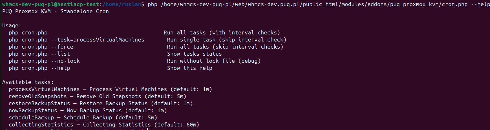

# Scheduled Tasks

### Proxmox KVM module **[WHMCS](https://puqcloud.com/link.php?id=77)**
#####  [Order now](https://puqcloud.com/whmcs-module-proxmox-kvm.php) | [Download](https://download.puqcloud.com/WHMCS/servers/PUQ_WHMCS-Proxmox-KVM/) | [FAQ](https://faq.puqcloud.com/)

## Overview

The module runs six scheduled tasks through the cron system. Each task has a configurable interval and independent lock management to prevent overlapping executions.

## Task List

| Task | Default Interval | Description |
|------|------------------|-------------|
| **Process VMs** | 1 minute | Processes the deploy and change package pipelines. Picks up VMs in non-ready states and executes the next step in their pipeline. Also handles DNS record creation and updates. This is the primary task responsible for VM provisioning and modification. |
| **Remove Snapshots** | 60 minutes | Checks for expired snapshots based on the configured snapshot lifetime setting and automatically removes them from Proxmox. Keeps the snapshot count manageable and frees up storage. |
| **Restore Backup** | 5 minutes | Monitors active backup restore tasks on Proxmox. When a restore operation completes, it updates the VM status and sends the "Backup restored" email notification to the client. |
| **Backup Status** | 5 minutes | Monitors active manual backup tasks on Proxmox. When a backup operation completes, it updates the backup record with the result (success or failure). |
| **Schedule Backup** | 60 minutes | Executes scheduled backups based on per-VM backup schedules. Checks each VM's configured backup days and initiates a backup if one is due. Runs once per day per VM per scheduled day. |
| **Collect Statistics** | 60 minutes | Aggregates network traffic statistics (inbound and outbound bytes) from Proxmox RRD data. Used for WHMCS Metric Billing to enable usage-based network traffic billing. |

## Configuring Task Intervals

Task intervals can be adjusted in the addon settings:

1. Navigate to **Addons > PUQ Proxmox KVM**
2. Go to **Settings > Cron**
3. Adjust the interval for each task as needed
4. Save settings

The interval specifies the minimum time between executions of a task. For example, a 5-minute interval means the task will run no more frequently than once every 5 minutes.

> **Tip:** For faster VM provisioning, keep the **Process VMs** interval low (1-2 minutes). For less time-sensitive tasks like statistics collection, longer intervals reduce system load.

## Lock Management

Each task uses a lock mechanism to prevent concurrent execution:

- When a task starts, it acquires a lock
- If the lock is already held, the task is skipped for that cron cycle
- When the task completes, the lock is released
- Stale locks (from crashed processes) are automatically detected and cleared based on a timeout

If a task appears to be stuck, you can check and manage locks from the addon's Cron settings page.

## CLI Tools

The module provides command-line tools for manual task execution and diagnostics. These can be useful for troubleshooting or for running tasks on demand outside the normal cron schedule.



To see available CLI commands, run:

```bash
php /path/to/whmcs/modules/addons/puq_proxmox_kvm/cron.php --help
```

### Common CLI Operations

| Command | Description |
|---------|-------------|
| `--help` | Display available commands and usage information |
| `--run-task=process_vms` | Manually run the Process VMs task |
| `--clear-locks` | Clear all stale lock files |

## Monitoring

To monitor cron health:

1. Check the **Last Run** timestamp for each task on the Cron settings page
2. Verify no tasks have stale locks
3. Review the WHMCS activity log for any cron-related errors
4. For deploy issues, check the per-VM deploy log in the VM Management section

If tasks are consistently failing or not running, refer to the [Cron Configuration](../03-installation-and-configuration/08-cron-configuration.md) guide to verify your cron setup.
