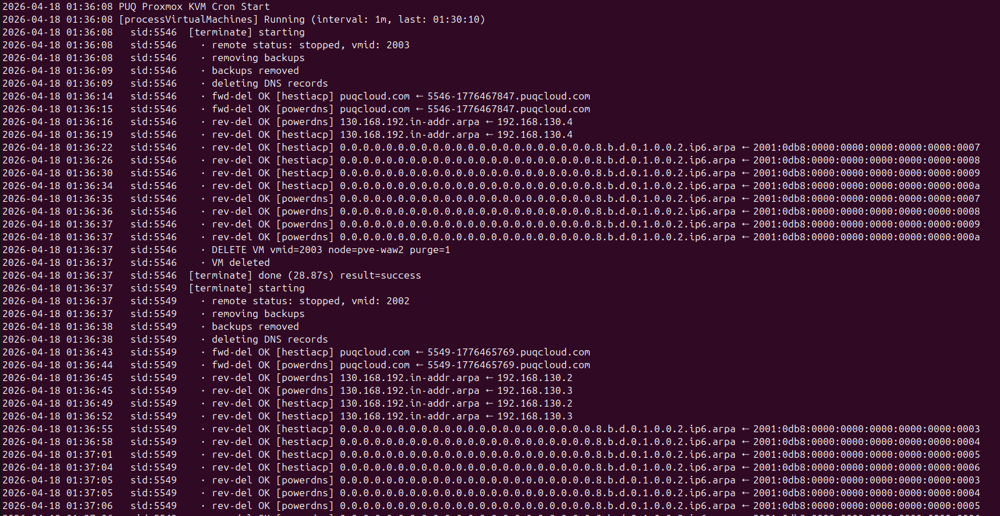
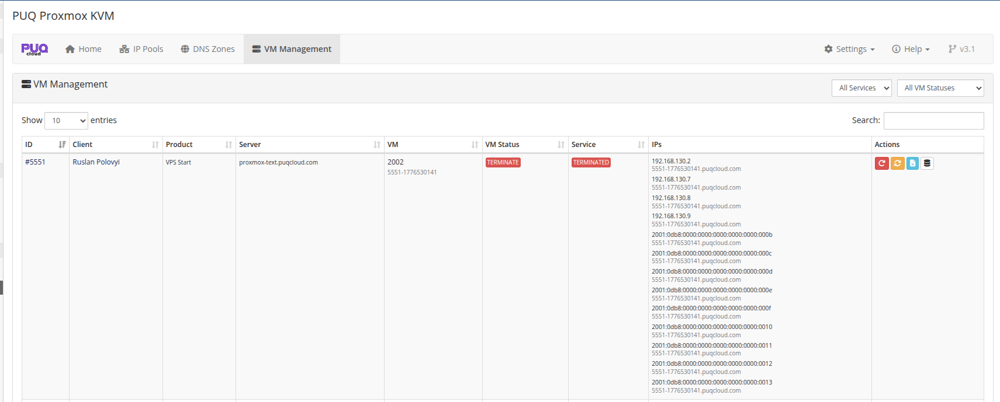
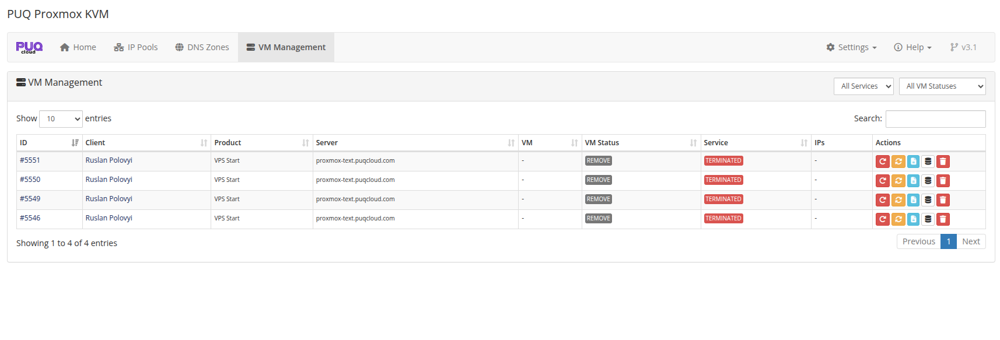

# Terminate Process

### Proxmox KVM module **[WHMCS](https://puqcloud.com/link.php?id=77)**
#####  [Order now](https://puqcloud.com/whmcs-module-proxmox-kvm.php) | [Download](https://download.puqcloud.com/WHMCS/servers/PUQ_WHMCS-Proxmox-KVM/) | [FAQ](https://faq.puqcloud.com/)

## Overview

Terminating a service means destroying the virtual machine on Proxmox, removing its backups, deleting its DNS records across every configured provider, and cleaning up the WHMCS records. On a service with many backups or many DNS entries this easily takes over a minute — more than a typical PHP request limit allows.

**Starting with v3.2 terminate runs asynchronously.** When an admin clicks **Terminate**, the module:

1. Sends a fire-and-forget **stop** request to Proxmox so the VM starts shutting down right away.
2. Sets `vm_status = 'terminate'` on the VM record.
3. Returns `success` to WHMCS.

WHMCS then marks the service **Terminated** immediately — the client loses client-area access within the same request. The heavy work (polling for stop, removing backups, deleting DNS records, the Proxmox DELETE call, clearing `tblhosting` and the VM record) is done by the cron task **Process VMs** on the next tick.

## Terminate Pipeline

The pipeline is a single cron handler, not a multi-step state machine — but each internal phase is logged as a distinct event.

```
terminate → [stop VM] → [remove backups] → [delete DNS] → [DELETE VM] → [clean DB] → remove
                                                              └─ on error → error_terminate
```

### Phases

| Phase | What happens | Failure handling |
|---|---|---|
| **Stop VM** | Single stop request, then poll the remote status every 5 seconds for up to 120 seconds (graceful). If still `running`, send a force-stop and poll another 60 seconds. | If the VM is still running after both windows, proceed to DELETE anyway — `purge=1` can reap a hung VM. |
| **Remove backups** | Best-effort delete of every backup snapshot for the VM across all configured storages. | Backup deletion errors are caught, logged, ignored. |
| **Delete DNS** | For every DNS zone whose name matches the VM's domain or an assigned IP, remove the forward A/AAAA and reverse PTR records. | Per-zone, per-IP errors are non-blocking — caught, logged, the next record continues. |
| **DELETE VM** | The Proxmox `DELETE /nodes/<node>/qemu/<vmid>?purge=1` call. **This is the only phase that can cause failure** — everything else is best-effort. | On error the VM goes to `error_terminate`. The DB is **not** cleaned. |
| **Clean DB** | Only on DELETE success. Wipes `tblhosting.dedicatedip/assignedips/domain` and clears identity fields on the VM record. | — |

## Live cron output

Every phase is streamed to the cron output with timestamps and progress heartbeats. A completed terminate looks like this:



Lines you will see:

- `[terminate] starting` — pipeline began for this service.
- `remote status: running, vmid: 2003` — initial state.
- `stop request sent` — the graceful stop was issued.
- `still running, waited 15s / 120s, status: running` — heartbeat while waiting. Prints every 15 seconds.
- `stopped after ~45s` — the guest acknowledged shutdown.
- `removing backups` / `backups removed` — backup cleanup.
- `deleting DNS records` — beginning of the DNS phase.
- `rev-del OK [hestiacp] 130.168.192.in-addr.arpa ← 192.168.130.6` — individual reverse record deletion.
- `rev-del OK [powerdns] 0.0.0.0….8.b.d.0.1.0.0.2.ip6.arpa ← …` — same, IPv6.
- `fwd-del OK [hestiacp] puqcloud.com ← 5546-1776530141.puqcloud.com` — forward record deletion.
- `DELETE VM vmid=2003 node=pve-wew2 purge=1` — the Proxmox destroy call.
- `VM deleted` — success.
- `[terminate] done (28.67s) result=success` — pipeline finished.

If the cron runs in `--verbose` mode (standalone `php cron.php` does by default) everything is flushed line-by-line in real time.

## What happens on failure

If the **DELETE VM** API call returns an error (node unreachable, lock conflict, auth expired, etc.), the cron handler switches to the failure path:

- `vm_status` is set to **`error_terminate`**.
- The VM record is **not** cleaned. `tblhosting.dedicatedip` / `assignedips` stay populated, the VM ID stays on the record, the domain is preserved.
- The client gets **one** entry in the Activity Log: `Service termination FAILED — admin attention required. Error: <reason>`.
- The VM Log modal in VM Management shows a red banner with the error.
- The cron will **not** automatically retry — `error_*` states are admin-manual.

### Why IPs stay allocated on failure

It is deliberate. If the VM still exists on Proxmox but the WHMCS record has been cleared, those IPs are free to be reassigned — and the IP pool will hand them out to the next client. That new client's VM will then conflict with a "zombie" VM still holding the IPs on Proxmox. Keeping the record intact until Proxmox confirms the VM is gone avoids this class of bug entirely.

## Admin actions after `error_terminate`

Open **Addons → PUQ Proxmox KVM → VM Management**. Rows in `error_terminate` show a red status badge and a trash icon in the Actions column:



After the cron finishes:



### Reset VM Status modal

Clicking the Reset button opens a modal with a full reference of available target statuses and when to use each:

- **`terminate`** — re-queue the termination. Use this after you've fixed whatever made the original attempt fail (restored node connectivity, re-authed with Proxmox, etc.).
- **`remove`** — force-mark the VM record as removed. **Does not touch Proxmox.** Use this only when you've manually deleted the VM from Proxmox and just want WHMCS to stop showing it.
- `ready`, `creation`, `set_ip`, `change_package`, `set_dns_records` — retry other state machines (see the [Deploy](01-deploy-process.md) and [Change Package](02-change-package.md) docs).

### Delete Record button

Visible **only** for rows in `error_terminate` or `remove`. Removes the VM row from `puqProxmoxKVM_vm_info`. Does **not** touch Proxmox or `tblhosting`. Use this when the VM is long gone from Proxmox but you want to clean up leftover database rows. The confirmation dialog repeats this warning explicitly.

## Guarantees

- **Client access revoked instantly.** The service is Terminated in WHMCS the same moment the admin clicks the button. The client cannot log back in while the actual teardown happens in the background.
- **IPs cannot be reassigned before the VM is gone from Proxmox.** A failing terminate preserves the allocation until a human confirms the cleanup.
- **One Activity Log entry per attempt.** Success → one "terminated successfully" entry. Failure → one "termination FAILED" entry. Cron never writes duplicates on skipped `error_terminate` rows.
- **DNS errors never block termination.** A missing or broken DNS provider does not stop the VM from being destroyed.

## Logs

- **Per-VM action log** — in the addon's VM Management → Log modal, every terminate attempt (successful or not) is recorded with duration, phase, and any errors.
- **Client Activity Log** — visible in the WHMCS client area under My Activity Log.
- **Module log** — all Proxmox API calls, DNS provider calls, and non-blocking errors go to WHMCS **Utilities → Logs → Module Log** with identifier `puqProxmoxKVM` and `puq_proxmox_kvm`.
- **Cron output** — when running cron in verbose mode, every step is streamed to stdout in real time.

## Related reading

- [Deploy Process](01-deploy-process.md) — same state-machine pattern applied to provisioning.
- [Change Package](02-change-package.md) — async package changes.
- [VM Management](../04-addon-module/04-vm-management.md) — the admin UI with the Reset and Delete Record actions.
- [DNS Zones & Integration](../04-addon-module/03-dns-zones.md) — what happens in the DNS deletion phase.
