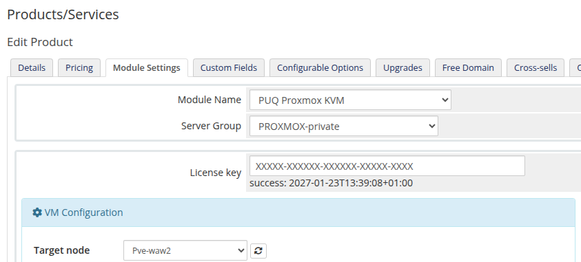

# Server Groups vs. Target Node

### Proxmox KVM module **[WHMCS](https://puqcloud.com/link.php?id=77)**
#####  [Order now](https://puqcloud.com/whmcs-module-proxmox-kvm.php) | [Download](https://download.puqcloud.com/WHMCS/servers/PUQ_WHMCS-Proxmox-KVM/) | [FAQ](https://faq.puqcloud.com/)

## Question

> What is the difference between a WHMCS server group and the **Target Node** parameter in the product configuration? How do I make sure that virtual machines are always deployed on one specific server?

## Answer

Allow us to clarify how WHMCS servers, server groups and the **Target Node** parameter work together.

In WHMCS, a **server** represents a Proxmox host. If that host is part of a Proxmox cluster, then through that single server entry WHMCS has access to all nodes within the cluster. In this case, the **Target Node** parameter allows you to specify exactly which node inside that cluster the virtual machine should be deployed on.

**Server groups** and **Target Node** are two different levels of control:

- **Server group** — this is a WHMCS-level setting. When a VM is being deployed, WHMCS selects a server from the group based on the rules you have configured for that group (e.g. fill, round-robin, etc.).
- **Target Node** — this is a module-level setting. Once WHMCS has selected a server (or cluster), the module then deploys the virtual machine on the specific node defined by the **Target Node** parameter on that server.

If you want to ensure that virtual machines are always created on one specific standalone server (not part of a cluster), the correct approach is to create a dedicated server group containing only that one server. WHMCS will then always select it for deployment, and **Target Node** will simply resolve to its single node.

## Where the Target Node parameter lives

The **Target Node** parameter is configured per product in the **VM Configuration** section of the Module Settings tab (**Setup > Products/Services > Products/Services > [product] > Module Settings**):

The dropdown is populated via AJAX from the Proxmox server (or cluster) selected by WHMCS. Leave the value as **automatically** to let the module pick the node with the most free resources, or choose a specific node to pin all deployments of this product to it.

## Summary

| Level | Setting | Controls |
|-------|---------|----------|
| WHMCS | Server group | Which **server** (or cluster entry) is chosen for deployment |
| Module | Target Node | Which **node** inside the chosen Proxmox cluster receives the VM |

To always deploy on one specific standalone host: put that host alone in a dedicated server group, assign the group to the product, and the **Target Node** will naturally resolve to its only node.